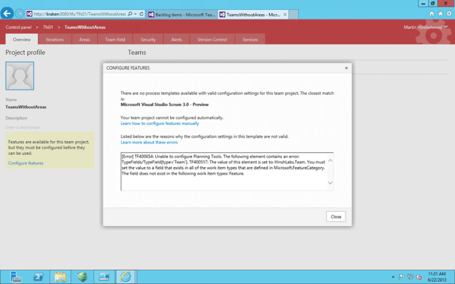

If you have the ‘team field’ enabled you will receive a “TF400654: Unable to configure Planning Tools” when you try to use the automatic configuration.

> \[Error\] TF400654: Unable to configure Planning Tools. The following element contains an error: TypeFields/TypeField\[type='Team'\]. TF400517: The value of this element is set to: HinshLabs.Team. You must set the value to a field that exists in all of the work item types that are defined in Microsoft.FeatureCategory. The field does not exist in the following work item types: Feature.

  
{ .post-img }
Figure: TF400654 Unable to configure Planning Tools

## Applies to

- Team Foundation Server 2013 Preview

## Findings

When you get a “TF400654 Unable to configure Planning Tools” error after an upgrade and you are trying to ‘configure’ the new features that have been added to TFS it is because you have customised the Process Template. The “Configure Features” wizard does a really good job of figuring out which process template and

- Changed to use ‘team field’
- Modifying the States

In the case of the ‘team field’ I am really hoping that they will be able to fix this for the RTM. The Field ‘HinshLabs.Team’ is already there in the Collection and if the wizard could just add it to the fields of the vanilla Feature and then pick a known UI point to add it. The customer can always move it later but this would give them a much slicker experience…

## Solution

You need to manually update your process template by following the instructions on the link provides or you can follow [Upgrading to Visual Studio Scrum 3.0 process template in TFS 2013](http://nkdagility.com/upgrading-to-visual-studio-scrum-3-0-process-template-in-tfs-2013/).

1. Download the Visual Studio Scrum 3.0 Process Template
2. Edit Task, Bug, Product Backlog Item, Issue and Feature to have the same custom field… in this case “HinshLabs.Team”
3. Re-implement any other customisations that you had
4. Import the work items

This process is much easier and less time consuming if you have only [One Team Project](http://nkdagility.com/one-team-project-collection-to-rule-them-allconsolidating-team-projects/) or use the same Process Template across all of your Team Projects.
