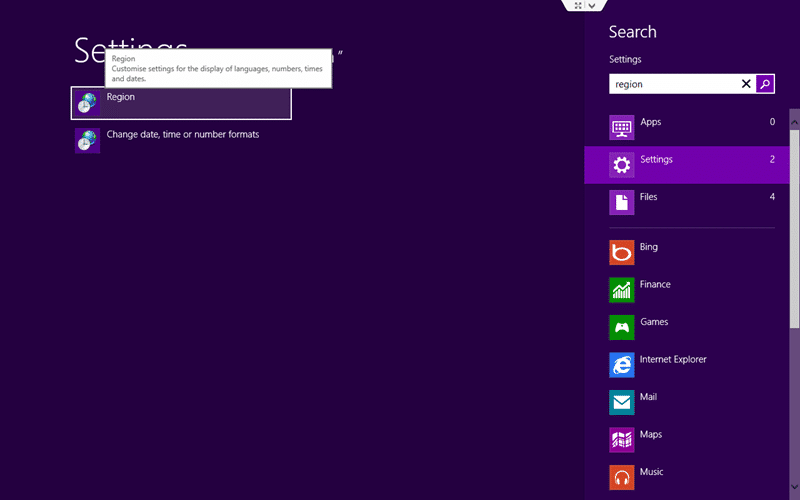
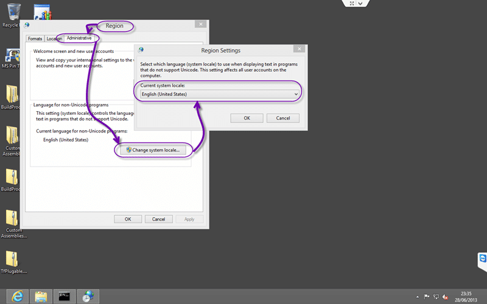
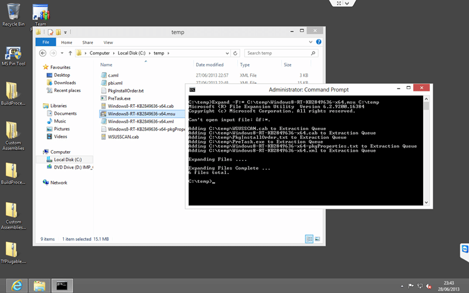
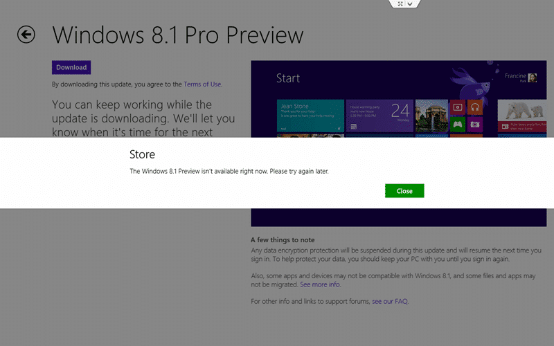

Some system are receiving an error when trying to install the Windows 8.1 Update patch (“Windows8-RT-KB2849636-x64.msu”) and they get a “The update is not applicable to your computer” error.

  
{ .post-img }
Figure: Windows 8.1 Preview - The update is not applicable to your computer

## Applies to

- Windows 8.1 Preview
- Windows 8

## Findings

Unfortunately Microsoft looks to have done a poor job of detecting the region of the user. This update is supposed to be for US customers only and has some checks to make sure that you have the correct region set. If you have a “en-us” copy of windows (installed from “en_windows_8_x64_dvd_915440.iso”) you can easily bypass this protection by either changing your windows regional settings to “United States”, rebooting and retrying. If however you have installed another language   (installed perhaps from “en-gb_windows_8_x64_dvd_915412.iso”) then you may need to install a fresh copy of Windows.

There are a couple of tricks to try first though:

## Solution #1 – Change your region to get Windows 8.1 Preview update to work

Most likely is that you have a US OS that has been set to a different region. If this is the case you can probably get away with changing your region to “United States” until the update is done.

  
{ .post-img }
Figure: Start | Search:”Region” | Region

Open your regional settings by typing “region” when you are at the start menu and selecting “Settings”. You should then see Region on the left.

  
{ .post-img }
Figure: “Region | Administrative | Change local settings | Current System Local”

Temporarily set your region to “United States” and this may fix your issue. If like me it does not then goto #2…

## Solution #2 – Manually unpack the Windows 8.1 Preview update

You can bypass this check here by unpacking KB2849636 manually and applying the update directly.

### **#1 Place and rename the MSU file in an easily accessible place**

  
{ .post-img }
Figure: Find the file

Here I have used C:tempWindows8-RT-KB2849636-x64.msu as I can easily find this…

### **#2 Open command prompt in administrator mode**

  
{ .post-img }
Figure: You open as administrator by right clicking on the icon

You must be running in administrator mode or you will get lots of undecipherable errors.

### **#3 Unpack the files that you need from Windows8-RT-KB2849636-x64.msu**

  
{ .post-img }
Figure:

To do this you need to execute the following command:

```
Expand –F:* C:tempWindows8-RT-KB2849636-x64.msu C:temp
```

### **#4 Now execute an install of the correct update directly**

  
{ .post-img }
Figure:  Install the KB2849636 Patch manually

Run the following command to install KB2849636 manually making sure that you replace “-x64” with “-x32” or “-arm” depending on the version the file that you have.

```
DISM.exe /Online /Add-Package /PackagePath:c:tempWindows8-RT-KB2849636-x64.cab
```

### **#5 DONE - Reboot**

  
{ .post-img }
Figure: You now get a message to update

#### Problem #2: The Windows 8.1 Preview isn’t available right now. Please try again later.

You may still have a problem if you installed Windows with a non US language version…

  
{ .post-img }
Figure: Go ahead and install

Everything looks fine… but…

  
{ .post-img }
Figure: The Windows 8.1 Preview isn’t available right now. Please try again later.

If you get this message than you will have to install a clean copy of windows… goto #3…

## Solution #3 – Install a clean copy of Windows 8.1 Preview

There are two options for this. If you [download the Windows 8.1 Preview ISO files](http://windows.microsoft.com/en-us/windows-8/preview-iso) and you have Windows 8 you can mount it by just double-clicking the file or  “Right-click | Mount” it. This will add it as if it was a CD ROM and allow you to execute the install.

  
{ .post-img }
Figure: Windows 8.1 Preview install from scratch

You can also burn the ISO to a DVD or [create a bootable USB](http://www.hanselman.com/blog/StepByStepTurningAWindows7DVDOrISOIntoABootableVHDVirtualMachine.aspx), reboot your computer with it in a drive (not USB 3) and press “F12” to enter the boot loader and select USB to boot from.

You can however only keep your personal files this way and you will have to reinstall all of your applications once you are up and running…

## Conclusion

Windows 8.1 is awesome but I was only able to use the Windows 8.1 Store Update option on my Tablet that was a US device. My Desktop and my VM’s had to be done with #3 above and nether #1 or #2 worked with an en-GB version of the OS.
