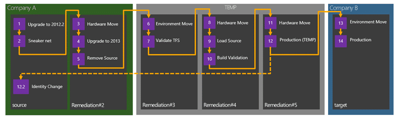

I have been engaging with complexity for a company in Silicon Valley that is doing one of the most complex Team Foundation Server migrations that I think I have ever seen.

When large companies sell parts of themselves there is a complicated ‘remediation’ process that is required to make sure that they only take the assets that have been purchased with them. Developers tend to be very greedy when writing software and your code picks up all kinds of references that you may not even know about. This causes problems within the development process as we may use source code for applications that are not being sold as components within the ones that are. They need to remove all of the assets that they are not taking with them and then reload the thing that have been approved by legal.

  
{ .post-img }
Figure: Proposed Remediation Process

The current home of the data is the corporate IT infrastructure which is shared and inaccessible by the team that I am working with. This means that the corporate IT guys will not let us any where near the server or give us access and we need to rely on them providing backups. As I arrived on this engagement the customer had just received their first backup from the corporate operations team. This team would only do an offline backup and TFS was offline for 20 hours to complete the process. To make matters worse there was some sort of issue that was crippling the network at the same time and they had to put someone on a plane to fly 1000 miles to pick up a hard disk and back. The joys of large databases (2TB).

Unfortunately for the customer they followed their corporate IT teams recommendations for server specifications, load-outs and configuration. This has caused all sorts of issues around moving data round and just a general level of unnecessarily added complexity. For example we have physical data tiers for TFS. If you have access to local storage (direct attached) then I would always recommend using virtual SQL Server instances. It gives you a degree of flexibility that you just can’t get from physical boxes like snapshots and moving boxes around. You can even add large attached storage to your VM Host and get phenomenal speeds copying between VHD’s.

Why are copy speeds so important? Think first about taking a 2TB backup, moving that 2TB backup and then restoring that 2TB backup. And then think about doing that 5 times as we move the TFS instance through the remediation process. With physical boxes and copying the files we are looking at 2-3 days (yes days) per environment and we will have over 500 engineers unable to work until the process is completed. That is not acceptable so we need to get good at this and work the kinks out and to work the kinks our we are running the entire process 3-4 times end to end. Our solution for the speed issue was to use a direct attached storage array that we only had two controllers for. We would then leapfrog the controllers down the chain to reduce the data manipulation process to a few hours instead of days.

This is what I call engaging with complexity and you can see from the diagram above the entire remediation process is rather convoluted and although I have done each piece, sometimes two at a time, the whole process is something I have not done before. I need to understand for myself what is involved and make sure that I have not forgotten anything. The process of writing this post services that purpose… if I don’t write it down I will soon forget…

Engaging with complexity means putting boxes around the chaos to get focus…

- [Step 1: Upgrade to TFS 2012.2](#Step1)
- [Step 2: Sneaker net](#Step2)
- [Step 3: Hardware move of Source to Remediation#2](#Step3)
- [Step 4: Upgrading to Team Foundation Server 2013](#Step4)
- [Step 5: Strip the source](#Step5)
- [Step 6: Environment move from Remediation#2 to Remediation#3](#Step6)
- [Step 6.1: Prep Remediation Domain](#Step6-1)
- [Step 6.2: All in one Environment and Hardware move](#Step6-2)
- [Step 7: Validating TFS in Remediation#3](#Step7)
- [Step 8: Hardware move from Remediation#3 to Remediation#4](#Step8)
- [Step 9: Reload stripped and approved source code](#Step9)
- [Step 10: Validate builds on Remediation#4](#Step10)
- [Step 11: Remediation#4 to Remediation#5 (hardware move)](#Step11)
- [Step 12: Production.. for a while](#Step12)
- [Step 12.1: Maintain user continuity in source](#Step12-1)

We have managed to complete all of the steps up to #8 so far and that has really helped work out the kinks with the process. We are trying to script what we can so I have included them where appropriate. I am a consultant to this process and the real hard work is being done by the awesome TFS remediation team that I am working with: Shu & Kim…

## Step 1: Upgrade to TFS 2012.2

Because this organisation has some ties to Microsoft they have access to some…lets just say less public versions of Team Foundation Server. The first challenge was to get the TFS server to a supportable version. This was handled by the corporate IT department and resulted in significant downtime for the customer but we got onto TFS 2012.2 (the current public release.) This then allows us to at least have that version installed on each of the target servers.

- [Upgrading Team Foundation Server 2012](http://nkdagility.com/upgrading-to-team-foundation-server-2012-update-1/ "http://nkdagility.com/upgrading-to-team-foundation-server-2012-update-1/")

Once you are on a supported version of Team Foundation Server the next step is to get a backup…

## Step 2: Sneaker net or file copy

[Understanding Backing Up Team Foundation Server](http://msdn.microsoft.com/en-us/library/vstudio/ms253151.aspx) is critical to this process working and in most cases you can use the [built in Scheduled Backups tool](http://msdn.microsoft.com/en-us/library/vstudio/hh561429.aspx) to complete them. Unfortunately in this case I have no control or access to the production server and we are relying on an external team to complete the process.

We sent over instruction for [Manually Back Up Team Foundation Server](http://msdn.microsoft.com/en-us/library/vstudio/ms253070.aspx) as we need to backup the entire TFS (Configuration + Collections + Warehouse) as well as Reporting (Databases + Key) so that we can clone the current TFS instance locally in an environment that we control. The corporate operations team should not need to take TFS offline as [Manually Back Up Team Foundation Server](http://msdn.microsoft.com/en-us/library/vstudio/ms253070.aspx) has detailed instructions for creating a _marked transaction log backup_ to remove the likelihood of us getting inconsistencies in the data to be restored.

- [Northwest Cadence cheat sheet for marked transaction logs from Dan Wood](http://blog.nwcadence.com/manually-backing-up-tfs-2012-with-sql-server/)

TFS s a system is made up of multiple interdependent databases ad we need to keep them in sync. If we do a point in time backup we may inadvertently have a complete transaction in one database that is only partially complete (thus would be rolled back) in another; thus we would suffer from a data inconsistency and likely unfortunate consequences for the new TFS instance. However if you CAN take TFS offline to did the backup you do not need to use marked transaction logs, but the downside is no one can access TFS while you are taking the backup. In this case the backup takes around 8 hours to complete and we have users in USA, UK & China so downtime will affect someone somewhere. Marked transactions make the most sense.

Once the backup is complete we would expect to see the following files in the output folder:

- Tfs_Configuration\*.bak
- Tfs_Configuration\*. trn
- Tfs_Collection1\*.bak
- Tfs_Collection1\*. trn
- Tfs_Collection2\*.bak
- Tfs_Collection2 \*. trn
- Tfs_Warehouse\*.bak
- Tfs_Warehouse\*. trn
- ReportServerKey\*.snk
- ReportServer\*.bak
- ReportServer\*.trn

The lack of \*.trn files is a good indication that marked transaction logs were not done and you likely need to ask them to do over… and once you have everything you are ready to restore to your new local (and more importantly, under your control) environment.

## Step 3: Hardware move of Source to Remediation#2

This is probably the simplest transition and apart from the data sneaker net process to retrieve the data it is fairly well documented on MSDN.

- [Move Team Foundation Server from One Hardware Configuration to Another](http://msdn.microsoft.com/en-us/library/ms404869.aspx "http://msdn.microsoft.com/en-us/library/ms404869.aspx")

However make sure that when you are practicing the process that you change the server ID each time. Each TFS instance and each Team Project Collection (TPC) has  unique GUID that allows the client computers to identify it even if you move hardware. When a client connects to a new TFS server that has a GUID that matches an existing server of a different name it remaps everything over to that new server. So if you do not change the name on your practice runs then everyone that has connected to the new server but then reconnects to the old one all get very confused clients. This is not fun to debug and is confusing as heck… so change the server ID for everything short of a production move.

You may have noticed that I have TFS 2013 in the checklist below. We moved to Team Foundation Server 2013 preview ostensibly to fix a couple of issues we were experiencing that have been fixed post 2012 Qu3 (2012.3) and with  Team Foundation Server 2013 having a go-live licence (fully supported in production) we had no issues with this move.

- [Get Visual Studio 2013 Team Foundation Server while its hot!](http://nkdagility.com/get-visual-studio-2013-team-foundation-server-while-its-hot/ "Get Visual Studio 2013 Team Foundation Server while its hot!")

After we have completed this process a bunch of pre-prepared scripts get run against the servers to strip out all of the source of CompanyA that should not be made available to CompanyB… we are still in the CompanyA domain and after we have completed the checklist below we move onto the next stage…

### Checklist

This is a list of the things that have to happen in order and any validation that needs to happen to get this done:

1. Validate Backup contents from Source – Should contain a .bak and a .trn for each database (tfs_configuration, tfs_DefaultCollection, tfs_Warehouse, reports, reportstemp)  
   If it does not contain a .trn files then follow: [http://msdn.microsoft.com/en-us/library/vstudio/ms253070.aspx](http://msdn.microsoft.com/en-us/library/vstudio/ms253070.aspx)
2. Restore Full backup and Transaction backup to Remediation#2
3. Un-configure TFS & drop old databases
4. Verify TFS 2013 is installed
5. ChangeServerId (if practice run)
6. RemapDB
7. ResetOwner
8. Change Service Accounts to Remediation accounts
9. Run Upgrade Wizard
10. Reconfigure Reporting
11. Run remediation process…

#11 is handled by another team that is deciding what can go and what can stay.

## Step 4: Upgrading Remediation#2 to Team Foundation Server 2013

I went back and forth on this one a lot. What got me was that [in order to fix a major issue](http://nkdagility.com/issue-tfs2012-2-tf30063-you-are-not-authorized-to-access/) we had to install Team Foundation Server 2012 QU2 (2012.3) which is in itself Go-Live…

- [Upgrading to Team Foundation Server 2013](http://nkdagility.com/upgrading-to-team-foundation-server-2013/)

So in the end it was a really easy decision. Do you want to be on the old “_not released yet but supported version_”… or the latest one? I don’t know about you, but once I realise that was the choice I made it in but a moment.

What's even better is that, including a reboot, the entire upgrade process for a 2TB TFS instance took less than 10 minutes.

## Step 5: Strip the source from Remediation#2

The process of removing all of the source that had to run through legal was being conducted in parallel by another team. They were scripting out the removal of all of the problem areas so that when the time comes to run through the entire process it is only a script away…

## Step 6: Environment move from Remediation#2 to Remediation#3

This is a little bit of a complicated one. I have done this a bunch of times before but there is really no good documentation for it. This is a cross between moving hardware and moving environment.

- [Move Team Foundation Server from One Hardware Configuration to Another](http://msdn.microsoft.com/en-us/library/ms404869.aspx "http://msdn.microsoft.com/en-us/library/ms404869.aspx")
- [Move Team Foundation Server from One Environment to Another](http://msdn.microsoft.com/en-us/library/ms404883.aspx)

We have two main steps to perform here:

- Step 6.1: Prep Remediation Domain
- Step 6.2: All in one Environment and Hardware move

These together will migrate the servers and 6.1 is an amalgamation of the two documents above.

### Step 6.1: Prep Remediation Domain

We have a temporary domain that have been created to hold the users, data and applications as they move forward. It will probably hang around for a while as new infrastructure and applications get built out in CompanyB’s systems. Little is known about them at this time and we are concentrating on delivering everything into the temporary domain. If you have ever gone through this process you know that it is a mammoth task and I am in awe of the things that the remediation teams have done already.

#### Checklist

1. Create Organisational Unit (OU) to hold users
2. Create accounts for Users in OU

This is a necessary step as we will be unable to have folks login in the remediation domain if they don’t exist. This domain may be ‘production’ for as much as a year before the new CompanyB bits are ready and we need everyone that is moving to be able to login.

#### Scripted: Create accounts for Users in OU

All we did for this was create a CSV file with the existing username and some meta data to make it work. Then add a little PowerShell to automate the process and voila..

```
Param(
       [string] $csvusers = "C:renusers06032013.csv",
       [string] $adpath = "OU=Test,DC=env,DC=nakedalm,DC=com",
       [string] $addomain = "@rendition.env.nakedalmweb.wpengine.com"
       )
# Import list of Users From CSV into $Userlist
$UserList=IMPORT-CSV $csvusers
# Step through Each Item in the List
$people = 0
Foreach ($Person in $UserList) {
    $people++
    $Username=$Person.alias
    # Build the User Principal Name Username with Domain added to it
    $UPN=$Username+"@"+$addomain
    # Create the Displayname
    $Name=$Person.forename+" "+$Person.surname
    # Create User in Active Directory
    $password = ConvertTo-SecureString -AsPlainText 'P2ssw0rd' -Force
    Write-Progress -activity "Adding about $($UserList.Count) users to active directory" -CurrentOperation "Creating user $people of $($UserList.Count) '$Username'" -PercentComplete ((100/$UserList.Count)*$people)
    NEW-ADUSER -path $adpath -GivenName $Person.forename –surname $Person.surname –DisplayName $DisplayName -Name $Username –SamAccountName $Username -AccountPassword $password –UserPrincipalName $UPN
}
Write-Progress -Completed
```

You do need to have the Active Directory bits installed but you can add the AD client bits to any server as a feature.

- [Remote Active Directory Administration with Windows PowerShell](http://technet.microsoft.com/en-us/magazine/gg413289.aspx)

### Step6.2: All in one Environment and Hardware move

When you talk about an environment move in relation to Team Foundation Server we are really talking about changing the domain. We are actually physically moving server at the same time and we need to merge the two MSDN documented processes detailed above.

#### Checklist

1. Validate Backup contents from Remediation#2
2. Restore Full backup and Transaction backup to Remediation#3
3. Un-configure TFS & drop old databases
4. Verify TFS 2013 is installed
5. ChangeServerId (if practice run)
6. RemapDB
7. ResetOwner
8. Add Service Accounts to new domain Remediation#3 accounts
9. Configure Application Tier Only
10. Flip Domain Users ( “TFSConfig Accounts /change” for domain)
11. Create TFS Group and Add All Users
12. Validate Domain Migration

You may run into [TF400998 if you have Scheduled Backups configured](http://nkdagility.com/tfs-2012-3-issue-scheduled-backups-gives-a-tf400998) but there is a simple work around for that.

#### Scripted: Create TFS Group and Add All Users

As all of the security is currently done with AD and we will not have all of the corporate groups we need a temporary Contributors group on the collection that has all of the server that are moving across. It would be fairly boring to add 400+ users manually so…

```
Param(
       [string] $CollectionUrlParam,
       [string] $GroupName = $(Read-Host -prompt "Group"),
       [string] $csvusers = "C:migrateusers06032013.csv"
       )

  # load the required dlls
Add-Type -AssemblyName "Microsoft.TeamFoundation.Client, Version=11.0.0.0, Culture=neutral, PublicKeyToken=b03f5f7f11d50a3a",
                        "Microsoft.TeamFoundation.Common, Version=11.0.0.0, Culture=neutral, PublicKeyToken=b03f5f7f11d50a3a",
                        "Microsoft.TeamFoundation, Version=11.0.0.0, Culture=neutral, PublicKeyToken=b03f5f7f11d50a3a"
$tfs
$projectList = @()

if ($CollectionUrlParam)
{
    #if collection is passed then use it and select all projects
    $tfs = [Microsoft.TeamFoundation.Client.TfsTeamProjectCollectionFactory]::GetTeamProjectCollection($CollectionUrlParam)
    $cssService = $tfs.GetService("Microsoft.TeamFoundation.Server.ICommonStructureService3")
    if ($Projects)
    {
        #validate project names
        foreach ($p in $Projects)
        {
            try
            {
                $projectList += $cssService.GetProjectFromName($p)
            }
            catch
            {
                Write-Error "Invalid project name: $p"
                exit
            }
        }
    }
    else
    {
        $projectList = $cssService.ListAllProjects()
    }
}
else
{
    #if no collection specified, open project picker to select it via gui
    $picker = New-Object Microsoft.TeamFoundation.Client.TeamProjectPicker([Microsoft.TeamFoundation.Client.TeamProjectPickerMode]::NoProject, $false)
    $dialogResult = $picker.ShowDialog()
    if ($dialogResult -ne "OK")
    {
        exit
    }

    $tfs = $picker.SelectedTeamProjectCollection
    $projectList = $picker.SelectedProjects
}

try
{
    $tfs.EnsureAuthenticated()
}
catch
{
    Write-Error "Error occurred trying to connect to project collection: $_ "
    exit 1
}

foreach ($project in $projectList)
{
    Write-Output($project.Name)
}
$ims = $tfs.GetService("Microsoft.TeamFoundation.Framework.Client.IIdentityManagementService")
Write-Progress -activity "Building TFS Groups and Users" -CurrentOperation "Creating Group" -PercentComplete 0
$groupIdent = $ims.ReadIdentity([Microsoft.TeamFoundation.Framework.Common.IdentitySearchFactor]::General,
                               $GroupName,
                               [Microsoft.TeamFoundation.Framework.Common.MembershipQuery]::None,
                               [Microsoft.TeamFoundation.Framework.Common.ReadIdentityOptions]::None)

if ($groupIdent -eq $null)
{
  $groupIdent= $ims.CreateApplicationGroup($null, $GroupName, "All migration users")
  $groupIdent = $ims.ReadIdentity([Microsoft.TeamFoundation.Framework.Common.IdentitySearchFactor]::General,
                                   $GroupName,
                                   [Microsoft.TeamFoundation.Framework.Common.MembershipQuery]::None,
                                   [Microsoft.TeamFoundation.Framework.Common.ReadIdentityOptions]::None)
}
Write-Output $groupIdent
$UserList=IMPORT-CSV $csvusers
$people = 0
Foreach ($Person in $UserList) {
    $people++
    Write-Progress -activity "Building TFS Groups and Users" -CurrentOperation "Adding $($Person.alias) to $GroupName " -PercentComplete  ((100/$UserList.Count)*$people)
    $userIdent = $ims.ReadIdentity([Microsoft.TeamFoundation.Framework.Common.IdentitySearchFactor]::General,
                               $Person.alias,
                               [Microsoft.TeamFoundation.Framework.Common.MembershipQuery]::None,
                               [Microsoft.TeamFoundation.Framework.Common.ReadIdentityOptions]::None)

    Write-Output "Adding $($userIdent.DisplayName)"
    $ims.AddMemberToApplicationGroup($groupIdent.Descriptor, $userIdent.Descriptor)
}

```

You need Team Explorer installed but it works just fine.

Note You will get an error if you try to add a user to the group that does not actually have permission to TFS. As we flipped all of the users this is likely OK as they did not have permission before anyway.

## Step 7: Validating TFS in Remediation#3

Validating TFS means connecting through the Web Access as well as Visual Studio and validating that you can change work items, check in files and that everything looks good.

I have never had an installation say that it was successful and for there to be something actually wrong with the data. There was one customer at Northwest Cadence that was before my time and did not find out that the data was broken for 6 weeks but no amount of validation would have detected the issues that they had.

Like Brian Harry often says… “_\[eventually\] there is no place like production_”. At some point you need to go for it…

## Step 8: Hardware move from Remediation#3 to Remediation#4

Moving to Remediation#4 for may just be another hardware move from there perspective of Team Foundation Server and thus making is something we have done a time of by now but it does have more.

- [Move Team Foundation Server from One Hardware Configuration to Another](http://msdn.microsoft.com/en-us/library/ms404869.aspx "http://msdn.microsoft.com/en-us/library/ms404869.aspx")

But for us… it is just another hardware move.

### Checklist

1. Validate Backup contents from Remediation#3
2. Un-configure TFS & drop old databases
3. Restore Full backup and Transaction backup to Remediation#4
4. Verify TFS 2013 is installed
5. ChangeServerId (if practice run)
6. RemapDB
7. ResetOwner
8. Change Service Accounts to Remediation#4 accounts
9. Configure Application Tier Only
10. Reconfigure Reporting

This is as much as the team I am working with needs to do but that is by no means the end for Remediation#4.

## Step 9: Reload stripped and approved source code

At this point we have a set of checked replacements for the things that we removed in Remediation#2. These need to be load back into Team Foundation Server source control and checked-in. Then the real hard work starts of validating that we still have viable software…

## Step 10: Validate builds on Remediation#4

Now that we have loaded all of the source we need to get it all working again. The development teams will need to validate each and every one of this 1000+ builds on over 250 build servers to make sure that what we have is working software. ComapnyB is obviously buying working software :)

## Step 11: Hardware move from Remediation#4 to Remediation#5

This is the final move for a while and Remediation#5 is configured to support all of the same activities that currently exist in production at CompanyA. We will have separate application and data tiers with lots of build servers.

### References

- MSDN: [Move Team Foundation Server from One Hardware Configuration to Another](http://msdn.microsoft.com/en-us/library/ms404869.aspx "http://msdn.microsoft.com/en-us/library/ms404869.aspx")

### Checklist

1. Validate Backup contents from Remediation#3
2. Restore Full backup and Transaction backup to Remediation#4
3. Un-configure TFS & drop old databases
4. Verify TFS 2013 is installed
5. ChangeServerId (if practice run)
6. RemapDB
7. ResetOwner
8. Change Service Accounts to Remediation#4 accounts
9. Configure Application Tier Only
10. Reconfigure Reporting

## Step 12: Production.. for a while

We are now in temporary production for a year or so. There are a lot more things involved in the transition from CompanyA to CompanyB that does not involve developers and Team Foundation Server. There is customer and users to think about and while ComapnyB takes its time to make a seamless transition our little Team Foundation Server will sit in it temporary home…

## Step 12.1: Maintain user continuity in source

As many of the users that are moving out will still have access to the old domain to create patches and releases where necessary they will be given new  contractor accounts. These accounts will be different from their local full-time accounts and you may want to flip the TFS Identities over so that you maintain the continuity of the users experience.

This will allow you to view history on a users account and see the history of that user regardless of the account. I you do not do this then you have two histories for each user. One for their old account name and another for the new one.Now that would suck a little…

This is because unlike a ‘rename’ of the account in active directory all of the new accounts would have new SID’s. SID’s are the way that a user is uniquely identified in Active Directory and TFS uses this to know which account to sync.

```
Param(
     [string] $csvusers = "C:tempusermapping.csv",
     [string] $domainOld = "MyCompanyDomain",
     [string] $domainNew = "MyCompanyDomain"
    )

$TFSConfig = "${env:ProgramFiles}Microsoft Team Foundation Server 11.0ToolsTFSConfig.exe"

$UserList=IMPORT-CSV $csvusers

Foreach ($Person in $UserList) {
    & $TFSConfig identities /change "/fromdomain:$domainOld" "/todomain:$domainNew" "/account:$csvusers.OldAccount" "/toaccount:$csvusers.NewAccount"
}

```

All you need is a mapping CSV with a column for the old and new account names.

## Conclusion and more to come

This is the first stage of a large complicated move that [involves SharePoint](http://nkdagility.com/engaging-with-complexity-sharepoint-edition/) as well, which I am helping the customer with.  The folks there are awesome and I hope to be back helping them out soon. For now they have lots of practice of this process to do and I wish them lots of luck…

