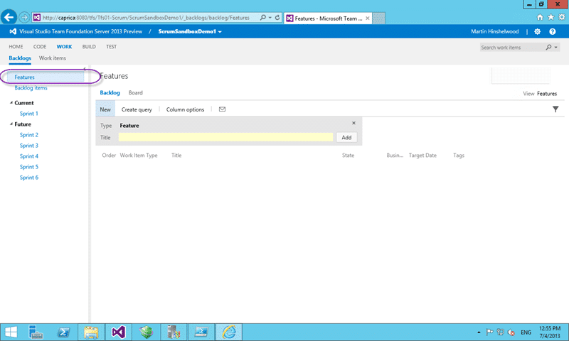
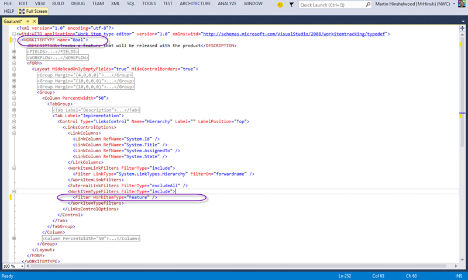
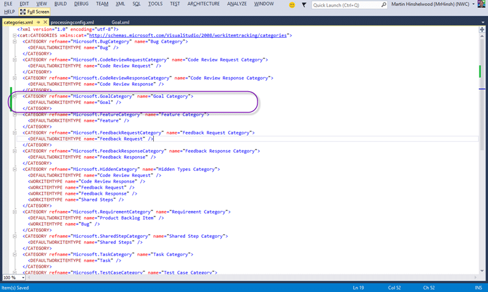
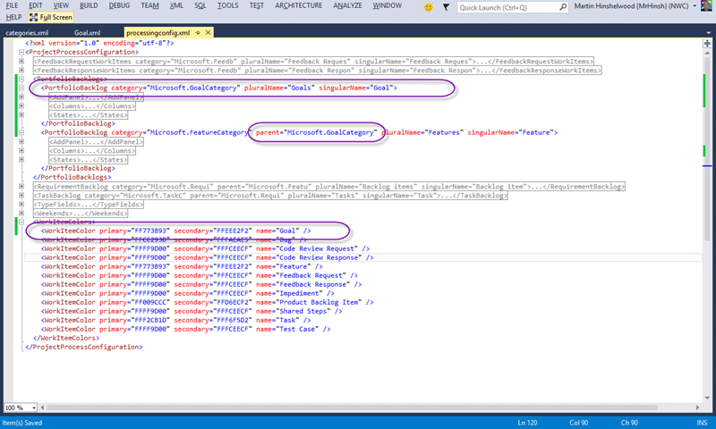

There are many reasons that you would want to Create a Portfolio Backlog hierarchy in Team Foundation Server 2013 not least of which is modelling your existing processes.

You can have a hierarchy five items deep with a parent child relationship between them. You will get a backlog for each one as well as cumulative flow and a board. This is awesome as you may have, for instance, Goals that break down into Feature. These goals would be the company or product goals and the features would be those things that go to achieve them.

  
{ .post-img }
Figure: Only have Features by default

In order to add a level to the hierarchy we need to customise a Work item Type, the Work Item Categories and the Processing Configuration:

1. Export all of the configuration to XML
2. Create Goal work item type definition
3. Update Category's list to include new type and category
4. Add new Portfolio Backlog to the Agile Portfolio Tools
5. Import all of the new configuration to Team Foundation Server

These steps will allow you to create a Portfolio Backlog hierarchy in Team Foundation Server 2013.

## Export all of the configuration to XML

We need access to first export as XML the configurations that we need from our Team Foundation Server:

```
$TeamProjectName = "ScrumSandboxDemo1"
$temp = "C:temp"
$CollectionUrl = "http://caprica:8080/tfs/tfs01-Scrum"
$WitAdmin = "${env:ProgramFiles(x86)}Microsoft Visual Studio 12.0Common7IDEwitadmin.exe"
& $WitAdmin exportwitd /collection:$CollectionUrl /p:$TeamProjectName /n:"Feature" /f:"$tempFeature.xml"
& $WitAdmin exportcategories /collection:$CollectionUrl /p:$TeamProjectName /f:$tempcategories.xml
& $WitAdmin exportprocessconfig /collection:$CollectionUrl /p:$TeamProjectName /f:$tempprocessingconfig.xml
```

These command will create feature.xml, catagories.xml and a processingconfig.xml files that we can edit offline and then upload into Team Foundation Server 2013 to make the changes.

## Create Goal work item type definition

I am going to make things a little bit easy for me and just copy the Feature type and rename it to Goal. The simplest way to create a new work item type is to diff from an existing one and Feature has the layout that I want to start with.

  
{ .post-img }
Figure: Changes to make for Goal

In order to make a new Work Item Type you need only change the name and then import the file. However there in a “Implementation” tab that shows, for Features, the child Product Backlog Items. We need to also change this to load child features instead and feature is going to the be child of Goal.

```
<Tab Label="Implementation">
  <Control Type="LinksControl" Name="Hierarchy" Label="" LabelPosition="Top">
    <LinksControlOptions>
      <LinkColumns>
        <LinkColumn RefName="System.Id" />
        <LinkColumn RefName="System.Title" />
        <LinkColumn RefName="System.AssignedTo" />
        <LinkColumn RefName="System.State" />
      </LinkColumns>
      <WorkItemLinkFilters FilterType="include">
        <Filter LinkType="System.LinkTypes.Hierarchy" FilterOn="forwardname" />
      </WorkItemLinkFilters>
      <ExternalLinkFilters FilterType="excludeAll" />
      <WorkItemTypeFilters FilterType="include">
        <Filter WorkItemType="Feature" />
      </WorkItemTypeFilters>
    </LinksControlOptions>
  </Control>
</Tab>
```

Here you can see the standard implementation tab that you find on many of the work items that come out of the box. It is basically a query box that shows whatever results that you want. Here it is filtered to “Hierarchy” link types which really just means parentchild and for a particular work item type which in this case is “Feature”.

```
<?xml version="1.0" encoding="utf-8"?>
<witd:WITD application="Work item type editor" version="1.0" xmlns:witd="http://schemas.microsoft.com/VisualStudio/2008/workitemtracking/typedef">
  <WORKITEMTYPE name="Goal">
    <DESCRIPTION>Tracks a Goal that will be released with the product</DESCRIPTION>
    ...
    <FORM>
      <Layout HideReadOnlyEmptyFields="true" HideControlBorders="true">
        ...
        <Group>
          <Column PercentWidth="50">
            <TabGroup>
            ...
              <Tab Label="Implementation">
                <Control Type="LinksControl" Name="Hierarchy" Label="" LabelPosition="Top">
                  <LinksControlOptions>
                    <LinkColumns>
                      <LinkColumn RefName="System.Id" />
                      <LinkColumn RefName="System.Title" />
                      <LinkColumn RefName="System.AssignedTo" />
                      <LinkColumn RefName="System.State" />
                    </LinkColumns>
                    <WorkItemLinkFilters FilterType="include">
                      <Filter LinkType="System.LinkTypes.Hierarchy" FilterOn="forwardname" />
                    </WorkItemLinkFilters>
                    <ExternalLinkFilters FilterType="excludeAll" />
                    <WorkItemTypeFilters FilterType="include">
                      <Filter WorkItemType="Feature" />
                    </WorkItemTypeFilters>
                  </LinksControlOptions>
                </Control>
              </Tab>
            </TabGroup>
          </Column>
          ...
        </Group>
      </Layout>
    </FORM>
  </WORKITEMTYPE>
</witd:WITD>
```

You could obviously customise this work item type to your hearts content and now we need to add it to a category.

## Update Category's list to include new type and category

To create a portfolio backlog we need a custom category so that we can use that for the portfolio backlog.

  
{ .post-img }
Figure: Adding a custom category for Goal

A  category can have multiple Work Item Types listed but only one default. This means that you could have multiple Work Item Types for different sorts of Goals. I am however trying to keep this simple…

```
<CATEGORY refname="Microsoft.GoalCategory" name="Goal Category">
  <DEFAULTWORKITEMTYPE name="Goal" />
</CATEGORY>
```

A simple category that holds a single work item type is fairly easy to create. Just add it to the list of categories below.

```
<?xml version="1.0" encoding="utf-8"?>
<cat:CATEGORIES xmlns:cat="http://schemas.microsoft.com/VisualStudio/2008/workitemtracking/categories">
  <CATEGORY refname="Microsoft.BugCategory" name="Bug Category">
    <DEFAULTWORKITEMTYPE name="Bug" />
  </CATEGORY>
  <CATEGORY refname="Microsoft.CodeReviewRequestCategory" name="Code Review Request Category">
    <DEFAULTWORKITEMTYPE name="Code Review Request" />
  </CATEGORY>
  <CATEGORY refname="Microsoft.CodeReviewResponseCategory" name="Code Review Response Category">
    <DEFAULTWORKITEMTYPE name="Code Review Response" />
  </CATEGORY>
<CATEGORY refname="Microsoft.GoalCategory" name="Goal Category">
  <DEFAULTWORKITEMTYPE name="Goal" />
</CATEGORY>
  <CATEGORY refname="Microsoft.FeatureCategory" name="Feature Category">
    <DEFAULTWORKITEMTYPE name="Feature" />
  </CATEGORY>
  <CATEGORY refname="Microsoft.FeedbackRequestCategory" name="Feedback Request Category">
    <DEFAULTWORKITEMTYPE name="Feedback Request" />
  </CATEGORY>
  <CATEGORY refname="Microsoft.FeedbackResponseCategory" name="Feedback Response Category">
    <DEFAULTWORKITEMTYPE name="Feedback Response" />
  </CATEGORY>
  <CATEGORY refname="Microsoft.HiddenCategory" name="Hidden Types Category">
    <DEFAULTWORKITEMTYPE name="Code Review Request" />
    <WORKITEMTYPE name="Code Review Response" />
    <WORKITEMTYPE name="Feedback Request" />
    <WORKITEMTYPE name="Feedback Response" />
    <WORKITEMTYPE name="Shared Steps" />
  </CATEGORY>
  <CATEGORY refname="Microsoft.RequirementCategory" name="Requirement Category">
    <DEFAULTWORKITEMTYPE name="Product Backlog Item" />
    <WORKITEMTYPE name="Bug" />
  </CATEGORY>
  <CATEGORY refname="Microsoft.SharedStepCategory" name="Shared Step Category">
    <DEFAULTWORKITEMTYPE name="Shared Steps" />
  </CATEGORY>
  <CATEGORY refname="Microsoft.TaskCategory" name="Task Category">
    <DEFAULTWORKITEMTYPE name="Task" />
  </CATEGORY>
  <CATEGORY refname="Microsoft.TestCaseCategory" name="Test Case Category">
    <DEFAULTWORKITEMTYPE name="Test Case" />
  </CATEGORY>
</cat:CATEGORIES>
```

Once we have the new category and the new Goal work item type we are ready to use them to create the portfolio backlog.

## Add new Portfolio Backlog to the Agile Portfolio Tools

There are three things that we need to do in order to create the new portfolio backlog for Goals in the Team Web Access site.

  
{ .post-img }
Figure: Customising the Process Configuration for Portfolio Backlogs

We need to not only add the new portfolio backlog above but also set the parent property on child portfolio backlog and optionally set a colour for our Goals cards and lists.

Because I just copied the Feature work item type for this I can just copy the Feature entry in the Portfolio Backlogs section. If you have a more customised work item type you may want to customise the States, Columns and the fields that are available in the Add Panel for that Work Item Type in the web UI. Here I am just going with the simple option of copying.

In addition I need to tell the Feature portfolio backlog that anything in the Goal category that we created is now its parent. This is done simply by adding the category to the parent attribute of the PortfolioBacklog element in question.

Note You can also check out [customise the colours in Team Foundation Server 2013 Agile Planning Tools](http://nkdagility.com/customise-the-colours-in-team-foundation-server-2013-agile-planning-tools/)

```
<?xml version="1.0" encoding="utf-8"?>
<ProjectProcessConfiguration>
  ...
  <PortfolioBacklogs>
    <PortfolioBacklog category="Microsoft.GoalCategory" pluralName="Goals" singularName="Goal">
      <AddPanel>
        <Fields>
          <Field refname="System.Title" />
        </Fields>
      </AddPanel>
      <Columns>
        <Column width="100" refname="System.WorkItemType" />
        <Column width="400" refname="System.Title" />
        <Column width="100" refname="System.State" />
        <Column width="50" refname="Microsoft.VSTS.Common.BusinessValue" />
        <Column width="100" refname="Microsoft.VSTS.Scheduling.TargetDate" />
        <Column width="200" refname="System.Tags" />
      </Columns>
      <States>
        <State type="Proposed" value="New" />
        <State type="InProgress" value="In Progress" />
        <State type="Complete" value="Done" />
      </States>
    </PortfolioBacklog>
    <PortfolioBacklog category="Microsoft.FeatureCategory" parent="Microsoft.GoalCategory" pluralName="Features" singularName="Feature">
      <AddPanel>
        <Fields>
          <Field refname="System.Title" />
        </Fields>
      </AddPanel>
      <Columns>
        <Column width="100" refname="System.WorkItemType" />
        <Column width="400" refname="System.Title" />
        <Column width="100" refname="System.State" />
        <Column width="50" refname="Microsoft.VSTS.Common.BusinessValue" />
        <Column width="100" refname="Microsoft.VSTS.Scheduling.TargetDate" />
        <Column width="200" refname="System.Tags" />
      </Columns>
      <States>
        <State type="Proposed" value="New" />
        <State type="InProgress" value="In Progress" />
        <State type="Complete" value="Done" />
      </States>
    </PortfolioBacklog>
  </PortfolioBacklogs>
  ...
  <WorkItemColors>
    <WorkItemColor primary="FF2CFF07" secondary="FFACFF9E" name="Goal" />
    <WorkItemColor primary="FFCC293D" secondary="FFFAEAE5" name="Bug" />
    <WorkItemColor primary="FFFF9D00" secondary="FFFCEECF" name="Code Review Request" />
    <WorkItemColor primary="FFFF9D00" secondary="FFFCEECF" name="Code Review Response" />
    <WorkItemColor primary="FF773B93" secondary="FFEEE2F2" name="Feature" />
    <WorkItemColor primary="FFFF9D00" secondary="FFFCEECF" name="Feedback Request" />
    <WorkItemColor primary="FFFF9D00" secondary="FFFCEECF" name="Feedback Response" />
    <WorkItemColor primary="FFFF9D00" secondary="FFFCEECF" name="Impediment" />
    <WorkItemColor primary="FF009CCC" secondary="FFD6ECF2" name="Product Backlog Item" />
    <WorkItemColor primary="FFFF9D00" secondary="FFFCEECF" name="Shared Steps" />
    <WorkItemColor primary="FFF2CB1D" secondary="FFF6F5D2" name="Task" />
    <WorkItemColor primary="FFFF9D00" secondary="FFFCEECF" name="Test Case" />
  </WorkItemColors>
</ProjectProcessConfiguration>
```

Simples… now that we have completed all of the changes necessary we are ready for the import.

## Import all of the new configuration to Team Foundation Server

This is really just the revers of the commands used to create the files in the first place.

```
$TeamProjectName = "ScrumSandboxDemo1"
$temp = "C:temp"
$CollectionUrl = "http://caprica:8080/tfs/tfs01-Scrum"
$WitAdmin = "${env:ProgramFiles(x86)}Microsoft Visual Studio 12.0Common7IDEwitadmin.exe"
& $WitAdmin importwitd /collection:$CollectionUrl /p:$TeamProjectName /n:"Feature" /f:"$tempGoal.xml"
& $WitAdmin importcategories /collection:$CollectionUrl /p:$TeamProjectName /f:$tempcategories.xml
& $WitAdmin importprocessconfig /collection:$CollectionUrl /p:$TeamProjectName /f:$tempprocessingconfig.xml

```

We just call them as “import” rather than “export” statements.

DONE

## Conclusion

We now have a lovely green Goal work item type that sits on its own backlog and is ordered above Features.

  
{ .post-img }
Figure: Viewing Tasks from the lofty heights of Goals

Customising the hierarchy for Portfolio Backlogs is easy and the hard part is making sure that you are making the correct change.

> When you are working with any sort of work item tracking customisation in Team Foundation Server it is best to think twice and customise once.  
> \-Me

Make sure you always make the right changes to Team Foundation Server to improve your process and never enshrine dysfunctions…
