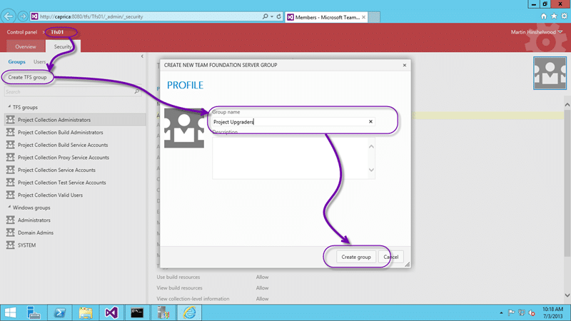
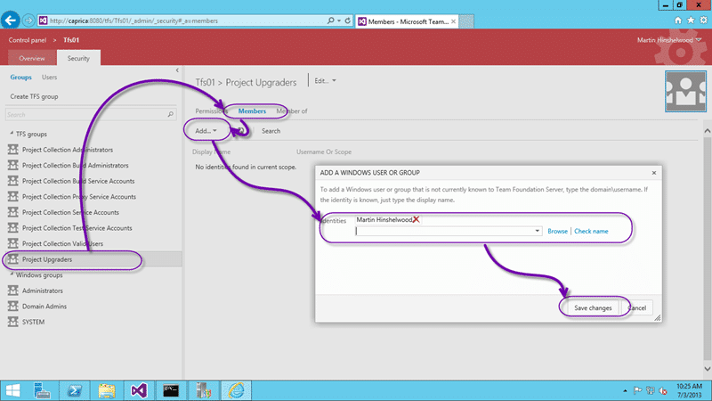

You may get a TF50309 when [configuring features in Team Foundation Server 2013](http://nkdagility.com/configure-features-in-team-foundation-server-2013) and you are unable to complete the configuration.

> TF50309: The following account does not have sufficient permissions to complete the operation: The following permissions are needed to perform this operation: Manage process template.

## Applies to

- Team Foundation Server 2012
- Team Foundation Server 2013

## Findings

If you are an Team Project Administrator you would expect to be able to configure the new features for your Team Project but you are prompted for the ‘Manage process template’ permission. This permission is a collection level permission and is grated automatically to Project Collection Administrators but not to Project Admins.

  
{ .post-img }
Figure: Manage process template permission

You need to [configuring features in Team Foundation Server 2013](http://nkdagility.com/configure-features-in-team-foundation-server-2013) with an account that has this permission.

## Solution #1 – Give one user access and configure all projects

The first solution is to have someone who is a Project Collection Administrator do the configuration. This would be awkward and boring if you have 200 Team Projects, but for one a few this is the simplest and least invasive solution.

## Solution #2 – Create a new Group to give Project Admins permission

If however you have tens or hundreds of Team Project and you need to liaise with each group of users for training for the new features you may want to take a slower approach. I want to be able to delegate this permission out so that I can send an email too each of the Project owners and have them do the training and upgrade at a time that suits them.

  
{ .post-img }
Figure: Create a Project Upgraders TFS Group

You need to create a new TFS Group at the Team Collection level that will contain each of the “owners” or “upgraders” for the individual Team Projects.

  
{ .post-img }
Figure: Set the Manage process template permission only

Now that we have a group we can select it and set individual permissions. In this case we only need the manage process template permission that will allow this user to complete the configuration of the Team Project to enable the new features.

  
{ .post-img }
Figure: Add users to the new group

Now we need to add each user that we want to have this permission. It would be awesome if we could add a Team Project group in here… you know.. like the “Project Administrators” group but “\[ScrumSandbox\]Project Administrators” fails to resolve. Sad, but the workaround is to just add the users we want to have permission..
