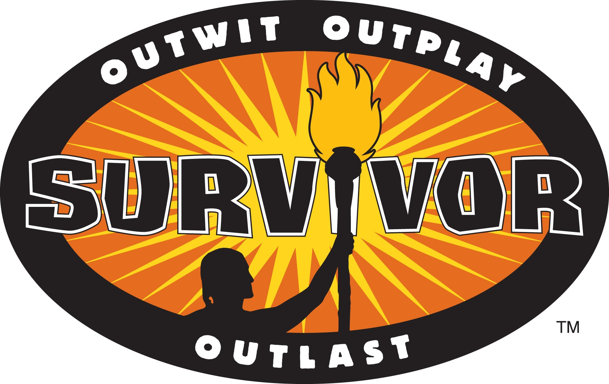

Does your company culture resemble Survivor? Do you have a culture in your organisation where individuals that help others are considered slackers for not getting their own assignments complete?

If you are trying to achieve agility it is imperative that your team members work together to solve problems. I am not saying that you have to do pair programming but you have to have a culture where collaboration and working together is the norm. This is one of the two main roadblocks to agility ( the other one being requirements management) that companies hit time and time again early in their agile adoptions.

{ .post-img }

Changing this part of your culture is something that has much wider implications than just improving your teams ability to deliver value. It is a harbinger of changes to come and if you can change this one thing, you will be more able, and committed, to making more changes to your culture going forward. The goal is to have a culture of change where each of your teams are running small low risk experiments in processes, practices and tools every iteration. It is the catalyst to wider company adoption and buy-in and it requires a certain amount of courage and discipline to achieve.

- [Release planning and predictable delivery](http://nkdagility.com/release-planning-and-predictable-delivery/)

As with most impediments to the path to agility this is an issue of culture. To change culture you need commitment and courage not just from those at the coal face but from executive leadership on down. If you are trying to adopt agility from the bottom up you will have limited success and ultimately you are doomed to failure.

The problem is in how individuals see their work and treat the work done by others. Over many years the US, and in some industries the UK, have moved towards the Survivor model. This is where each individual is measured and encouraged to look out only for themselves. They work in an isolated bubble where they are force fed activities and they are solely responsible for activities in their queue and those individuals are often stack ranked each year. This process only services to isolate not just individual but also their skills and their knowledge.

Ask yourself this: If you won the lottery and never returned to the office what would be the impact?

## You need to foster unit mentality

If you have see the Mel Gibson movie “We were soldiers” there is a really memorable phrase that has value in the software space. “Learn the job of the man above you, and the man below you”. Software development is a collaborative effort of a Unit (Development Team) working together to achieve a goal. We need to understand each others knowledge, skills and even quirks in order to be effective.

It is critical to instill a sense of Team and not Individual within your organisation. If you are going to get anywhere on the path to agility you need to let go of the matrix. You need to realise that allowing team members to work on more than one project at a time only creates the illusion that there is more work underway. The reality is simple…individuals that switch between projects lose at least 20% of their time per project that you add.

## The loss of the 100% worker

There is even a greater loss of not working in dedicated Teams; you lose most of your peoples individual ability to solve problems. Software development is all about problem solving, its about puzzles and developers excel at solving them. Remember that software development it is always product development. However if you give your Development Team members the wrong puzzles you will not be utilising them for the thing that you actually employed them for…solving the puzzles.

Its the background processing power of a developers subconscious that you can utilise to solve the most complicated of problems. Developers will figure things out in the bath, or while playing with the kids or driving home from work. Unfortunately if you give a developer many projects to work on and they have to switch often ( you know… to show progress on many things at once) then what is the greatest problem in their world? You should have guessed it by now: its the problem of juggling their workload. So the problem that their subconscious is trying to solve is how to juggle that work more effectively.

This has the effect of stretching the amount of time that each thing takes as it takes many more cycles for the developer to figure out the problems and thus your software takes many more months to deliver than it should.

## Conclusion

Don’t have a company culture that resembles Survivor and instead opt for one of Teams. These Teams will be a force multiplier to your ability to deliver software and this will give you a competitive advantage. Don’t wait until your competition figure this out!
