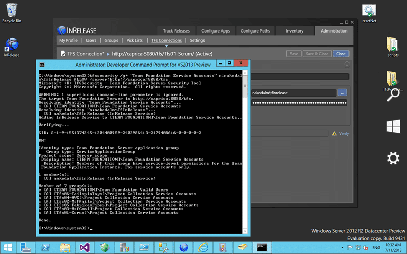

When you try to configure InRelease to connect to your Team Foundation Server 2013 Team Project Collection you get an error message saying that you are unable to connect because you need to be able to requires make requests on behalf of others.

  
{ .post-img }
Figure: Unable to connect to Team Foundation Server

If you check the event log you get:

```
Timestamp: 7/11/2013 10:09:16 AM
Message: Unable to connect to this Team Foundation Server: http://caprica:8080/tfs/Tfs01-Scrum/.

Possible reasons for failure include:
- The name, port number, or protocol for the Team Foundation Server is incorrect.
- The Team Foundation Server is offline.
- The password has expired or is incorrect.

Technical information (for administrator):
Access Denied: Martin Hinshelwood needs the following permission(s) to perform this action: Make requests on behalf of others.
Category: General
Priority: -1
EventId: 0
Severity: Error
Title:
Machine: CAPRICA
Application Domain: InCycle.InRelease.Console.exe
Process Id: 1468
Process Name: C:Program Files (x86)InCycle SoftwareInReleasebinInCycle.InRelease.Console.exe
Win32 Thread Id: 5904
Thread Name:
Extended Properties:
```

## Applies to

- InRelease 3
- Team Foundation Server 2013

## Findings

Just like the TFS Integration Platform if you have a service that requires the “Make requests on behalf of others” then the accounts that it runs under need to be part of the “Team Foundation Service Accounts” group on the Collection. I would think that

  
{ .post-img }
Figure: You can’t edit Team Foundation Service Accounts Group

Unfortunately this group is not editable in the UI as a security precaution and in keeping with TFS tradition those things are relegated to the command line so that it scares off those for whom its not really that important.

Now while in a real server you should have a service account my TFS Server runs under network service and you can’t pick network service in InRelease.

## Solution

Whatever account that you want to run InRelease under you need to add it to the Team Foundation Service accounts group to get the “make requests on behalf of others” capability.

  
{ .post-img }
Figure: Add permission with TFSSercurity command

```
tfssecurity /g+ "Team Foundation Service Accounts" n:nakedalmTfInRelease ALLOW /server:http://caprica:8080/tfs
```

When you execute the command TFS will go off and add the account to the group. You could do this per collection, but I am just giving it access to every collection on the server.

  
{ .post-img }
Figure: Green tick for account that now has make requests on behalf of others

I could have given explicit permission to that account or even created a special group with just that permission but this is the recommended option to solving the problem.
