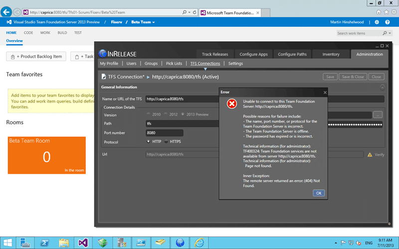

If you follow the documentation for the new InRelease 3 for Team Foundation Server 2013 “TF400324: Team Foundation Services are not available from server” with a remote server error of 404.

- Update 2013-07-12 Removed Solution #1 as it causes more problems down the line
- Update 2013-07-12 Added Solution #2 from InCycle but DO NOT do what their documentation suggests or you might end up with an unstable TFS Server.
- Update 2013-07-12 Added Solution #3 which solves the problem in a supported manor with the TFS API.

  
{ .post-img }
Figure: TF400324: Team Foundation Services are not available from server

## Applies to

- InRelease 3
- Team Foundation Server 2013

## Findings

This looks  to be a mistake in the documentation for the product. When they say “Enter the URL for the TFS Server” you think that you should enter [http://caprica:8080/tfs](http://caprica:8080/tfs) when in fact you should be entering the full path to the collection that you want to connect to.

## Solution #1

You need to enter [http://caprica:8080/tfs/\[collection](http://caprica:8080/tfs/[collection)\] which you can get by copying it from the web access.

  
{ .post-img }
Figure: Use the full collection URL instead of the server

Now when you connect with [http://caprica:8080/tfs/tfs01-scrum/](http://caprica:8080/tfs/tfs01-scrum/) you should not get a 404 any more…

## Solution #2 - Call Support

_Warning Never update the database without explicit instructions from a member of the product team. You will likely end up with an unsupported instance if you much with the database._

At this time there is no solution for this. The solution provided on the InCycle page listed below will work but it will leave your TFS server in an unsupported state and may result in instabilities in your TFS instance down the road.

- [Connection to TFS does not work with the error message: The request failed with HTTP status 404: Not Found](http://support.inreleasesoftware.com/entries/24792942)

Raise a ticket with MSFT customer services and get your server into a supported state…

## Solution #3 - Use PowerShell to update the TFS registery

I knew that if I worked at this long enough that I would find a solution that does not require that you edit the database. Here is a handy dandy PowerShell script that you can save as Set-DefaultCollection.ps1, double click to copy, and then execute.

```
 Param(
       [string] $tfscollection
       )
Add-Type -AssemblyName "Microsoft.TeamFoundation.Client, Version=11.0.0.0, Culture=neutral, PublicKeyToken=b03f5f7f11d50a3a"
Add-Type -AssemblyName "Microsoft.TeamFoundation.Common, Version=11.0.0.0, Culture=neutral, PublicKeyToken=b03f5f7f11d50a3a"
Add-Type -AssemblyName "Microsoft.TeamFoundation, Version=11.0.0.0, Culture=neutral, PublicKeyToken=b03f5f7f11d50a3a"
if ($tfscollection)
{
    #if collection is passed then use it and select all projects
    $tfs = [Microsoft.TeamFoundation.Client.TfsTeamProjectCollectionFactory]::GetTeamProjectCollection($CollectionUrlParam)
    $project = $(Read-Host -prompt "Project")
}
else
{
    #if no collection specified, open project picker to select it via gui
    $picker = New-Object Microsoft.TeamFoundation.Client.TeamProjectPicker([Microsoft.TeamFoundation.Client.TeamProjectPickerMode]::NoProject, $false)
    $dialogResult = $picker.ShowDialog()
    if ($dialogResult -ne "OK")
    {
        exit
    }
    $tfs = $picker.SelectedTeamProjectCollection
}
try
{
    $tfs.EnsureAuthenticated()
}
catch
{
    Write-Error "Error occurred trying to connect to project collection: $_ "
    exit 1
}
$regsvc = $tfs.ConfigurationServer.GetService("Microsoft.TeamFoundation.Framework.Client.ITeamFoundationRegistry");
Write-Host "Setting DefaultCollection to $($tfs.InstanceId)($($tfs.Name)) on $($tfs.ConfigurationServer.Uri)" -ForegroundColor Yellow
$regsvc.SetValue("/Configuration/DefaultCollection", $tfs.InstanceId)
```

This PowerShell will first ask you to select the collection that you would like to be the default and then apply that to TFS. You should then be able to connect InRelease correctly to TFS.

I still think that this is a silly requirement of the product and at the very least it should ask which collection that you want to be the default and set it for you...
