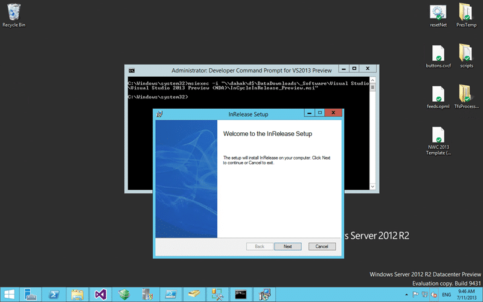

Installing InRelease 3 fails as you need elevated privileges to install InRelease

When you try to install InRelease as part of your Team Foundation Server 2013 infrastructure you are allowed to fill out all of the fields and then you get a “you need elevated privileges to perform this installation. You can achieve this by running a command prompt”.

[![image[14]](images/image14_thumb-1-1.png "image[14]")](http://nkdagility.com/files/2013/07/image14.png)  
{ .post-img }
Figure: For InRelease you need elevated privileges to perform this installation

## Applies to

- InRelease 3
- Team Foundation Server 2013

## Findings

I don’t know how this got past the testers but even though you are asked to elevate the privileges during the installation the installation will fail with the message that “you need elevated privileges to perform this installation”. It looks like this was built with user account control turned off! Never a good idea…

In order to bypass this you have two options. You can follow the instructions that are presented, open an elevated command prompt and then execute the MSI installer from there using the msiexec command.

## Solution

Forts we need to open a command prompt

  
{ .post-img }
Figure: Execute MSIEXEC from an elevated command prompt

Once you have the command prompt open you need to execute the following command replacing your location to the MSI. You may want to put it in C:temp to make things easyer but I just copied the UNC path from a file explorer window.

```
msiexec -i "\dahakd$DataDownloads_SoftwareVisual StudioVisual Studio 2013 Preview (NDA)InCycleInRelease_Preview.msi"

```

Now that I have the installer running entirely elevated I can install with no problems…
