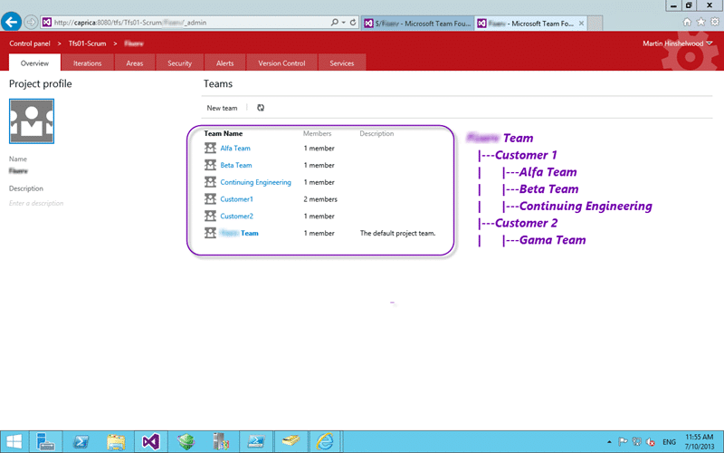
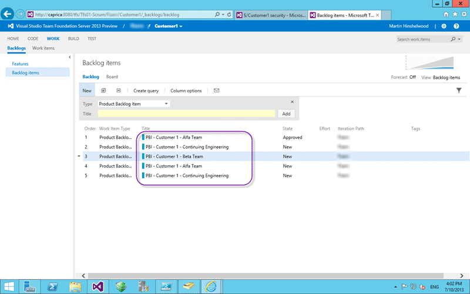
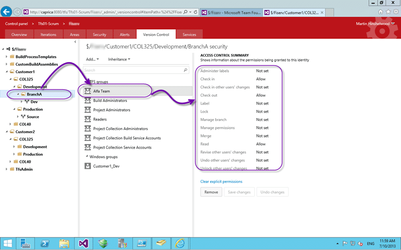

Do you know what to do with Areas, Iteration, Teams, Source Control, and Security when modelling Teams in Team Foundation Server 2013?

There are a number of things that we need to take into consideration when modelling Teams in Team Foundation Server 2013 and enabling a method of work that supports all of our activities. Lets say that I have a single core product that is then further customised for many customers.  In this circumstance, I have a number of Projects that are run against a single Customer that may have one or more teams. Each of these Projects exists on a single branch off of the Production branch for that customer and all work on that Project is completed against that branch.

## Assumptions & Constraints

I want to detail some of the constraints and then the solutions within Team Foundation Server. Remember that TFS is not purely a source control system and has many moving gears that all need to slot into place to get access to the power that it provides. That power is represented in the relationships between the components that is reflected in the data and reporting that is made available.

- **Project -** Body of work completed in a single Branch for a single customer.
- **Team** - Group of individuals that completes work
- **Team Member** - An individual that works full or part time against one or more projects.

## Solution for Teams

Teams here will be used as both containers for individuals (leaf nodes) and to roll-up the work for reporting and management purposes. We may want to order work, plan and report for the entire boxy of work, for a single Customer, a single Team or even a single Team irrespective of Customer. It just depends on how complicated that our organisational structure is.

  
{ .post-img }
Figure: Team structure when modelling teams

Here we have for example an “Alfa Team” entity that provides a container for planning with a Backlog, Sprint Backlog, Capacity Planning and Boards. This allows a Team to focus on the work that has been assigned to them more effectively. In addition a Team is a security group that can be used to secure any area within the bounds of Team Foundation Server. If we want to work outside the bounds of Team Foundation Server then we can make an Active Directory group that also represents that entity.

  
{ .post-img }
Figure: Role-up backlogs for modelling teams

In this example I have created roll-up Teams that aggregate both content and functionality  so that someone can maintain and manage the “Customer 1” backlog above. That “Customer 1” backlog will show work from both “Alfa Team”, “Beta Team”, and the “Continuing Engineering” Team that exist under Customer 1 only. The owner of “Customer 1” will then be able to prioritise the work irrespective of Team and have that order reflected in each of the teams individual backlogs. You can see that I have added both the customer and team to the PBI title but this is only for illustrative purposes.

## Solution for Source Control

Although there is no requirement for your source control model to mirror your Area hierarchy it does make things a little easier to understand and to work with.

  
{ .post-img }
Figure: Simple source control layout

The layout above reflects the needs of the organisation as well as the facilities in TFS. TFS secures folders in the same way that Windows folder permissions work and you can change the settings at any level.

  
{ .post-img }
Figure: Remove Contributor

The first step is to remove Contributor permissions as we are going to give explicit access for each Team to the appropriate Project and thus give them implicit permission to the Source Code under that project. If you go to the web administration section of TFS you can use the Version Control tab to set security permission on the Source Control components. Here we are selecting the root, Contributors and then setting all permissions to “not set” at this level.

  
{ .post-img }
Figure: Giving Teams access to Folders

If you then select the individual Branch folder you can then give explicit contributor permission \[Check in, Check out, Label, Lock, Merge, and Read\] for a specific Team. In this case it is the “Alfa Team” that we are adding that will give them access and no other teams.

## Solution for Areas

Areas are used in TFS to compartmentalise work items and is used by Teams to identify what bodies of work are shown on their dashboards. A Team will own one or more areas and may or may not show sub items. This is how we can create hierarchical Teams from a flat list.

  
{ .post-img }
Figure: Teams under Projects

We may need to represent both work by multiple Teams under a single Project and a single Team under multiple Projects. This allows us to get versatility of reporting and ease of use for the individuals doing work. To achieve that we may have multiple Area paths that represent the same Team but in a different context.

## Automation

All of the configuration necessary for all of the above can be automated and there are only a finite number of actions:

- Create Customer \[Create SC folder, create customer team, create area & iteration paths\]
- Create Project (AKA Branch) \[Create Branch, Create area and iteration path, (optional) create team, _create builds_\]
- Create Team \[Create team, create ad group\]
- Add Team to Project \[Create area path, add path to team, Add permission to SC, add permission to area\]
- Add usergroup to Team \[integrate with AD\]

Each of these actions has a number of identified steps and all steps can be orchestrated using PowerShell. I plan on creating a bunch of PowerShell’s for this as customers demand but for now these actions can be completed manually.

## Conclusion

Creating structure in Team Foundation Server 2013 that model not only your organisation but your ideal structure within your organisation is what makes Team Foundation Server my preferred tool for Application Lifecycle Management. These are things that I have been doing in TFS since TFS 205 but now the product team have added features that directly provide those capabilities.

Are you getting the most our of your Team Foundation Server deployment?
