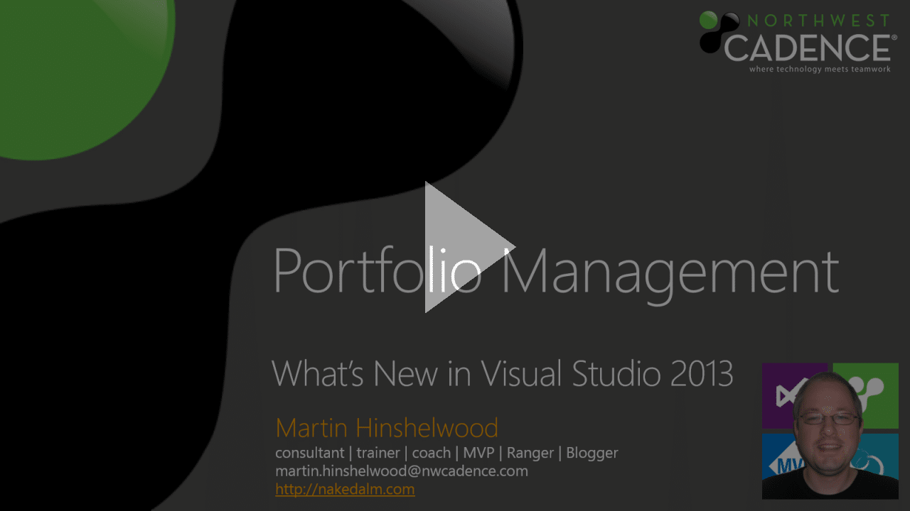

New with Visual Studio 2013 is the ability to manage portfolio backlogs to help you understand the scope of work that you have to do.

In order to organise our work a little better we tend to create something called “Epics” that are representative of things that are too big for any single sprint and may be broken down into smaller items. However these ‘Epics” do not really continue to exist as all we really care about is the leaf nodes. We still need to understand things that are maybe always larger, like Features and Goals.

  
{ .post-img }
Video: Portfolio Management in Visual Studio 2013

This video should have given you an introduction to the new Portfolio Management tools. These tools represent only the first taster from Microsoft on what they are doing for Portfolio Management in Visual Studio 2013.

Don’t forget to [Get Visual Studio 2013 Team Foundation Server while its hot!](http://nkdagility.com/get-visual-studio-2013-team-foundation-server-while-its-hot/) The current Preview of Visual Studio 2013 and Team Foundation Server 2013 comes with a go-live licence meaning that it is fully supported in production.

Go on.. be a kid again…

_Originally published at Where Technology Meets Teamwork by [Martin Hinshelwood](http://nkdagility.com/about), Senior ALM Consultant. ([source](http://blog.nwcadence.com/video-new-with-visual-studio-2013-manage-project-portfolios-to-understand-the-scope-of-work/))_
