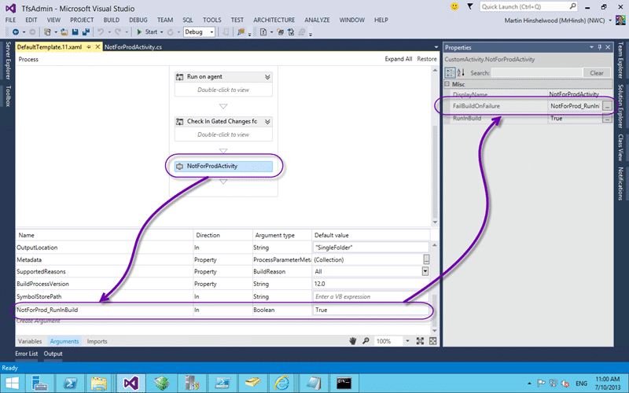
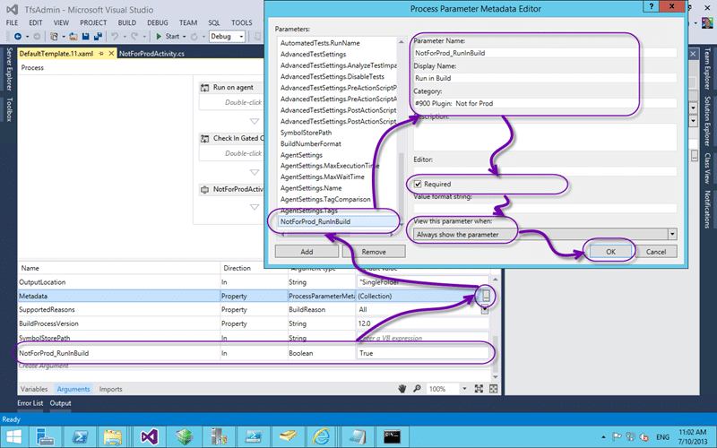
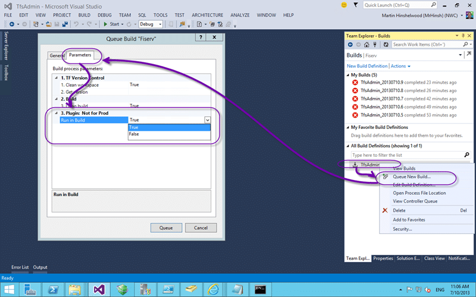

You can be creating a custom activity for Team Foundation Build in a few simple steps. There are always advanced steps but this will get you started.

It is fairly simple to create a custom activity for Team Foundation Server build services. The first thing to do is to create a Class library  and add a reference to “System.Activities.CodeActivity.dll” you will be all set to start creating any build activities that you need. This class library can contain as many activities as you would like to create.

  
{ .post-img }
Figure: Creating the Activity

In this example I am creating a custom activity called “NotForProductionActivity” so we need to create a class of the same name. This class should inherit from “CodeActivity” and override the execute method. ultimately you now have a custom activity for Team Build. There are a couple of extra bits like having an assembly attribute called “BuildActivity” that will allow you to specify for Team Foundation Build where this activity is allowed to run. You can use this to force the activity to only run on the agent if you are doing something in code that requires that context. As for the execute method; you can do whatever you can imagine in there.

  
{ .post-img }
Figure: Design your workflow

Now that we have our custom attribute we need to be able to add it to a workflow. It is a little weird to do this and to avoid having to GAC and update your assembly on every build you can create an additional class library, I usually call it CustomXaml, to which we add ‘links’ to the xaml files that we want to customise. This will allow you to drag from the toolbar on the left to the Workflow design surface.

  
{ .post-img }
Figure:Configure your activity

At the bottom of the Workflow design surface you will see an “Arguments” button that will pop up with a list of scoped “Arguments” that you can use anywhere in your workflow. You can add you own and map the name back to a property that you add to your custom activities. You may want to use the same argument for multiple activities or pass something in from the outside.

  
{ .post-img }
Figure: Passing in arguments

Team Foundation Build allows you to present options to the person that is configuring the build or the person that is queuing the build for execution. This allows you to minimise the number of custom builds that you need and thus minimise your maintainance of them.  To pass in arguments from the outside you need to add the argument that you created to the Metadata argument that already exists. This is the thing that tells the UI how to present options to the users.

  
{ .post-img }
Figure: Runtime setting of arguments

If you set the visibility of the parameter to allow it to be shown on the Queue a Build form then it can be edited at queue time. Otherwise it can only be edited at build configuration time.

## Conclusion

While there are many complex things that we could go into this is a simple example of how to organise your development environment to make it easy to build and test custom build activities for your build workflows.

