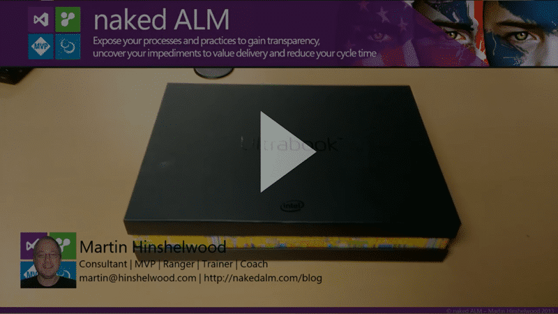

I was contacted just over a week ago and asked if I would like to review the new developer Ultrabook from Intel, a “Harris Beach SDS Ultrabook SDP - PVT2 ISV”. Geek stuff, wohoo… (composure) … Why sure, I would love to review your new device.

- Review Part 1: Harris Beach SDS Ultrabook from Intel with Haswell
- [Review Part 2: Developing with Intel Haswell Harris Beach SDS Ultrabook](http://nkdagility.com/review-developing-intel-haswell-harris-beach-sds-ultrabook/)
- [Review Part 3: Two Months with Intel Haswell Harris Beach SDS Ultrabook](http://nkdagility.com/review-two-months-intel-haswell-harris-beach-sds-ultrabook/)

This device comes with a [Haswell i5-4350U processor](http://ark.intel.com/products/75033) and lots of sensors and is part of the [Intel Software Development Platform](http://software.intel.com/en-us/windows). This program provides hardware with all of the sensors and components that a developer needs to make sure that they can take advantage of the cooler attributes of their customers hardware. If you are developing a Windows 8 or 8.1 application then this is a must.

  
{ .post-img }
Video: Unboxing the Harris Beach SDS Ultrabook

The machine is very well made and the touch screen is incredibly responsive. While this is only an i5 (5350U) is is one of the new Haswell chipsets and has 4GB of RAM. I run Visual Studio with no problems on my 2GB Atom tablet so I know it will have no issues on here.

It came with Windows 8 and I immediately upgraded to Windows 8.1. The install was smooth and after I realised that the USB memory stick that came with the machine had some pretty strict and ordered steps to setting up for the first time I even got all of the sensors and other paraphernalia working. As this is a ‘developer platform’ device its not necessarily as simple as those devices that we are used to using that target purely consumers.

  
{ .post-img }
Figure: Left to right; Dell M6600, Harris Beach SDS Ultrabook, Acer W520

Even though my Dell M6600 is a powerhouse it is still a consumer device and we expect it to act like one. However this is a very different beast. It pretends, with its slim profile to be some simple consumer device but it has all of the sensors you would expect in a Tablet or Phone. For communication it has a SIM card slot as well as a Near Field Communication (NFC) Device. It has a 5 point touchscreen that does 1920x1080 and some demo applications for working with games.  
{ .post-img }
Figure: Bottom to top; Dell M6600, Harris Beach SDS Ultrabook, Acer W520

So that you can figure out where you are there are GPS, Gyromiter, Acceleriomiter, Inclinomiter, Compass, Orientation, and Ambient Light sensors as well as some demo code for the different ways of accessing and interpreting the sensor data. This is not a development powerhouse but it is [loaded to the gunnels](http://en.wiktionary.org/wiki/to_the_gunnels) with enough gadgets to make even the most hardened geek OD.

### Pros

- **Touchscreen** – The touchscreen is really responsive, much better than my other ones. Not sure how much that has to do with the processor but I am liking it.
- **Resolution** – At 1920x1080 this screen is awesome. No wanting there.
- **Smaller than my 18” Dell M6600** – I can’ take an 8kg (17pound) laptop everywhere… although I do try.
- **Sensors** – Oh my the sensors.
- **Battery** – I ran for a whole day on one charge of battery! (my M6600 drains in 45 minutes tops.)

### Cons

- **Larger than my Acer W520** – Not only is it larger it is a Ultrabook rather than a Hybrid so no detachable screen.
- **Fan is a little noisy** – This is not anything like my M6600 but it is noticeable as the machine is so quiet most of the time. It seams to change speed a lot which may be due to firmware. After I got all of the right drivers installed in the right order this happens way less.
- **Only 4GB  RAM** – I am not sure if it takes more but 4GB is not really enough for me. My main laptop has a ridicules 32GB but I would settle for a minimum of 8GB. However, that said if I am just developing Windows Store apps then it is likely just fine… time will tell.

It is not going to replace the beast but it is a nice machine to developed Windows 8.1 apps on. Now all I need is ideas….

Disclosure of Material Connection: I received one or more of the products or services mentioned above for free in the hope that I would mention it on my blog. Regardless, I only recommend products or services I use personally and believe my readers will enjoy. I am disclosing this in accordance with the Federal Trade Commission’s 16 CFR, Part 255: "[Guides Concerning the Use of Endorsements and Testimonials in Advertising](http://www.access.gpo.gov/nara/cfr/waisidx_03/16cfr255_03.html)."
