You can integrate SharePoint 2013 with Team Foundation Server 2013 at any time and even link to your corporate SharePoint\*.

Although I use, install, and configure SharePoint often, I have a saying that I have used in relation to that work with SharePoint and I think it is very relevant now.

> First you have a problem, you solve it with SharePoint and now you have two problems\-MrHinsh ([tweet this](http://clicktotweet.com/GZUrd))

While this is only slightly in jest there are some uses that one can put SharePoint to successfully. One of those is to give you dashboards in Team Foundation Server and another is to provide you with somewhere to manage your documents. To be honest I prefer to manage my documents within Version Control but I know that many folks don’t like that as much. And thus we must subject ourselves to SharePoint (sigh)..

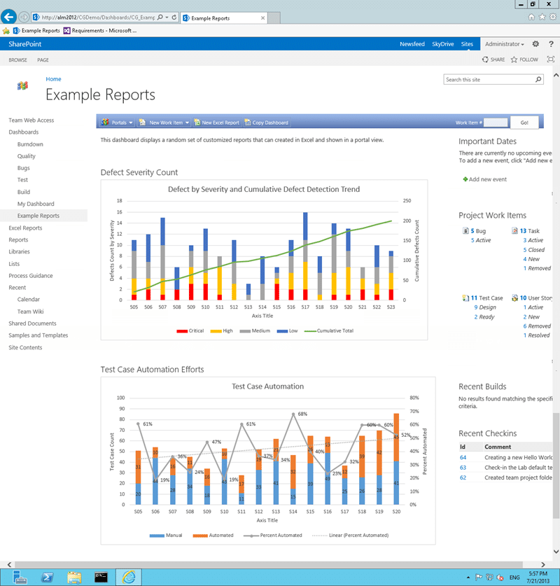
{ .post-img }

Knowing how to integrate SharePoint 2013 with Team Foundation Server 2013 is a staple of any ALM consultant but I usually do everything that I can to dissuade my customer from installing it. Why you might ask… with the awesome capabilities of SharePoint why oh why would you want to cripple your customers experience. Well, its about support. SharePoint is a high maintenance product that is hard to maintain and administer. If it is running OK you might be fine, but that is no guarantee that something is not festering in there… just waiting for you to get complacent. You need full time support personal that specialise in SharePoint to have any hope of a supported instance; most companies just wing it and hope for the best.

My local TFS instance does not currently have SharePoint, and I could have really used it in a demo the other day. So I though that I would rectify the situation. I have previously [Integrate SharePoint 2013 with Team Foundation Server 2012](http://nkdagility.com/integrate-sharepoint-2013-with-team-foundation-server-2012/) and [Integrating SharePoint 2010 with Team Foundation Server 2010](http://nkdagility.com/integrate-sharepoint-2010-with-team-foundation-server-2010/). With TFS 2013 in the mix it is time to dust off my SharePoint knowledge (recently [engaged with complexity with SharePoint](http://nkdagility.com/engaging-with-complexity-sharepoint-edition/)) and tackle this one. I really do try to hide my SharePoint knowledge at all costs, but with SharePoint 2013 they are making the product a little better. Not enough to make me admit to understanding SharePoint, but better.

In my environment I have a single server environment which makes it easy to integrate everything and remove any network issues. I do however run a separate Domain Controller so I have Active Directory on hand. So, what are we going to do, here is a summary:

1. [Install SQL Server 2012 SP1](http://nkdagility.com/installing-tfs-2012-on-server-2012-with-sql-2012/)
2. [Install SharePoint Server 2013 Prerequisites](http://www.avivroth.com/2013/07/09/installing-sharepoint-2013-on-windows-server-2012-r2-preview/) (special if you have Server 2012 R2)
3. [Installing SharePoint Server 2013](http://nkdagility.com/install-sharepoint-2013-on-windows-server-2012-without-a-domain/) (but use a Domain Account and do not create a Site Collection)
4. Configure Extensions for SharePoint Products
5. Configure SharePoint Web Applications
6. Configure SharePoint sites
    1. Configure SharePoint site for a new Team Project
    2. Configure SharePoint site for an existing Team Project

If you get to [Installing SharePoint Server 2013](http://nkdagility.com/install-sharepoint-2013-on-windows-server-2012-without-a-domain/) and end up with the message that “Windows Server AppFabric is not configured correctly” then you will need to reinstall it following the instructions on [Install SharePoint Server 2013 Prerequisites](http://www.avivroth.com/2013/07/09/installing-sharepoint-2013-on-windows-server-2012-r2-preview/). This is a work around until the SharePoint guys release a fix for the installer.

Note: If you cant figure out why the AppFabric is not installing from the command line then try running as administrator.

Once you have completed to step #3 above all we need to do is integrate TFS and SharePoint together. This is not hard but can be a little fiddly.

## Configure Extensions for SharePoint Products

We need to install the extensions for SharePoint products that are part of the TFS 2013 ISO onto all of the SharePoint 2013 front end servers. In this case I only have one and it already has TFS installed so I have everything that I need. You will find the stand alone installer in the root of the TFS ISO under “Extensions for SharePoint” if you need them.

  
{ .post-img }
Figure: Configure the SharePoint extensions

If you have an all in one configuration like mine you can just open the Team Foundation Server Administration Console and head to the Extensions for SharePoint Products to configure them. If you are on a SharePoint front end server that does not have TFS installed you will still launch the Team Foundation Server Administration Console but you will not have all of the nodes.

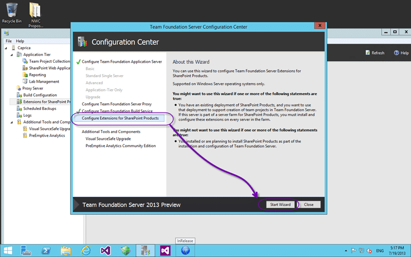  
{ .post-img }
Figure: Start the Wizard

Once you click the link to install the feature you will automatically get sent to the appropriate Wizard node to let you Start the Wizard.

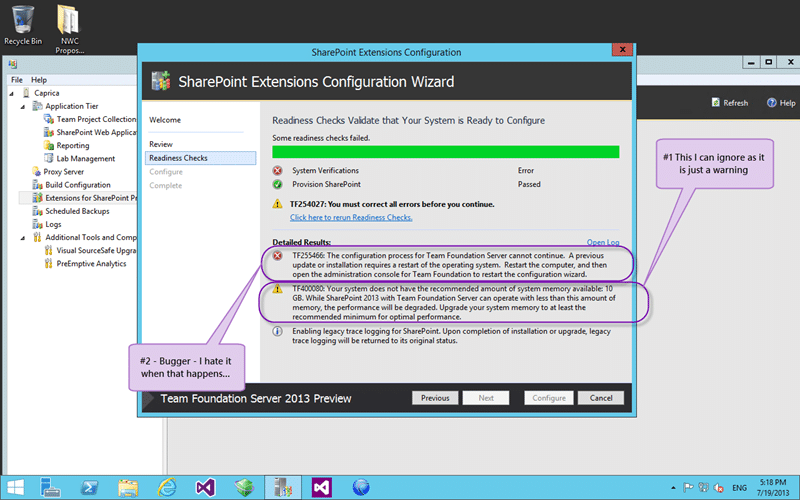  
{ .post-img }
Figure: Validate your configuration

There is really no configuration for the install. You just need to run it through for it to register the bits it needs. At this point it is going to do a bunch of checks and especially for a pending reboot which you can see that I have above… drat… after a reboot I only have the SharePoint warning. This machine is started with 2GB memory but it is set to dynamic. Even if you have 10GB available it will still give you that  warning as SharePoint is a memory hungry beast… you can just ignore the warning.

note: After an install of SharePoint and without actually using it my memory usage jumped from less than 2GB all the way up to 8-10GB after boot. Minimum for SharePoint Foundation is 10GB and 25GB for a single server running SharePoint proper.

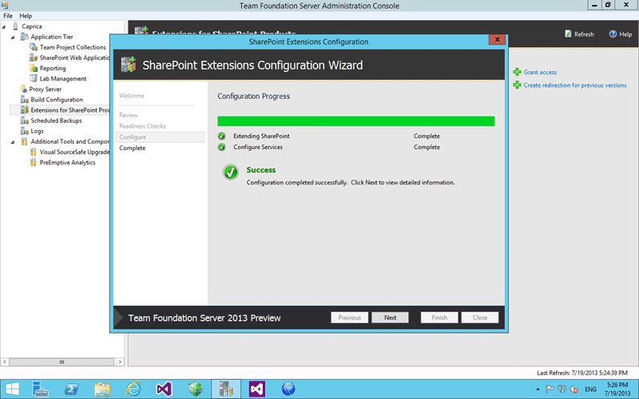  
{ .post-img }
Figure: Successful configuration

All being well you get some beautiful green ticks to let you know that everything is good. Now that we have all of the bits required to install all we need to finalise the SharePoint side is to grant access to a TFS server to where we want it to go in SharePoint.

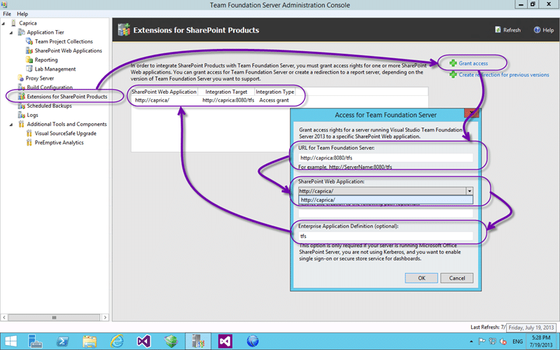  
{ .post-img }
Figure: Enable SharePoint to accept connections

This allows you, as the SharePoint administrator, to specify only certain sites and paths that the TFS Administrators can connect to. Not only can you specify which TFS Server but also the locations that they can connect to and which Secure Store application definition to use.

But first click Refresh!

If you just configured the SharePoint extensions on the TFS Server then it has already decided that since you put SharePoint on the same server as TFS that TFS owns the show. I am good with that…

## Configure SharePoint Web Applications

Now head on over to your Team Foundation Server Administration Console (whatever server it is on) and under the Application Tier node you will see another SharePoint node.

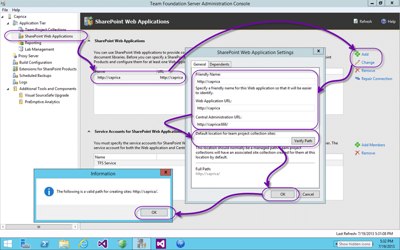  
{ .post-img }
Figure: Enable TFS to talk to SharePoint

This node allows you to configure which SharePoint instances this particular TFS instance can talk to. We need to specify both the application we will be using and the administration url for TFS do do a little orchestration for us. By default, and yes this one was created by default because of the single-server thing, the ‘default location’ is set to “Sites”. I ALWAYS remove this. If you leave it in then TFS will create new site collections for each of your collection. If you remove it you can tell TFS to create sub sites of the root site. Thus your URL for a team project would be [http://caprica/mycollection/myteamproject](http://caprica/mycollection/myteamproject). This is not only cleaner it allows you to create a proper site hierarchy.

  
{ .post-img }
Figure: Configure the Collections

Now that we have told TFS about the SharePoint server to talk to we can head on over to our Collection and tell each of them where to store their sites. You can point every collection to the same location, maybe the root, and all Team Project sites would hang of it. This would give you [http://caprica/myteamproject](http://caprica/myteamproject) which may be advantageous. It will err out if you try to create a team project of the same name as that which exists in another collection. I would say that the risk is worth it and there is no risk if you are having only one Team Project per Collection.

If you do however create a unique path the tool will create a new site on Web Application path. It will be stand alone if you have “Sites” in there or a child of the root if you did not.

  
{ .post-img }
Figure: Validate the collection site

Here you can see the child site that has been created.

Are we there yet?

## Configure SharePoint sites

We have all of out configurations configure and each of our collection had a location that it has been told to create SharePoint portals and link them to the Team Project when it is created. It will however not go and add portals for each of your existing Team Projects. If there were PowerTools for 2013 you could use the “AddTeamProjectPortal” command to create one but for now we need to do it manually.

### Configure SharePoint site for a new Team Project

You will now automatically be asked if you want a SharePoint site to be created as part of the Team Project creation wizard in Visual Studio.

  
{ .post-img }
Figure: New Team Projects

It will default to the location that you specified but you can move it to anywhere on the enabled list.

### Configure SharePoint site for an existing Team Project

But what about if we have existing Team Projects? How do we configure the portals without the nice command line tool? Are we hosed? Well no… here is how…

  
{ .post-img }
Figure: Using the Collection portal

We have our lovely portal for the Team Project Collection but now we need some Team Project sites.

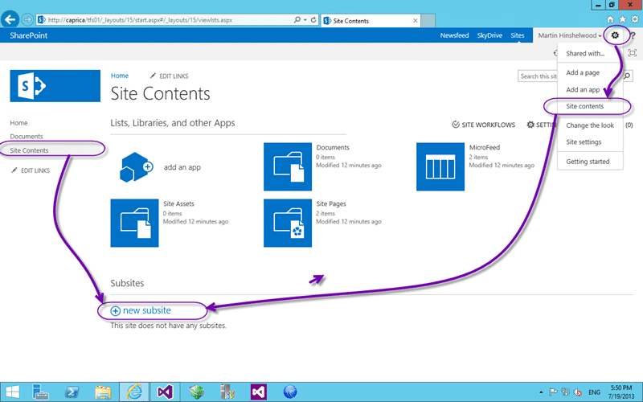  
{ .post-img }
Figure: Create a new Sub site

If you head on over to the “Site Content” age and create a new subsite we can configure it to be for our Team Project.

  
{ .post-img }
Figure: Name it the same as the Team Project

Here I am creating a site using the Team Foundation Server Project Portal site template and really the only things I have to fill out is the name. It does not even have to be the same name as the Team Project, but having it the same will make a little more sense than not. But if you really want to mess with your users heads you could flop names…

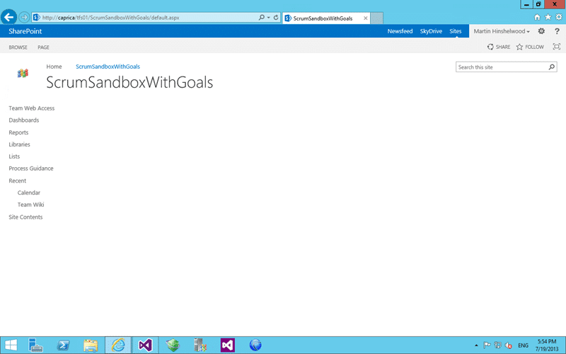  
{ .post-img }
Figure: Whoa… its blank

But that's not what I wanted? When you initially create the site it will not be what you were expecting at all. It will be all empty and non-functional. Well first we need t head over to Visual Studio… and then back..

  
{ .post-img }
Figure: Go to Team Project settings

In Visual Studio we need to tell the Team Project where to find the site. To do this connect to the Team Project that you want to configure for a SharePoint portal and click the “Settings” hub.

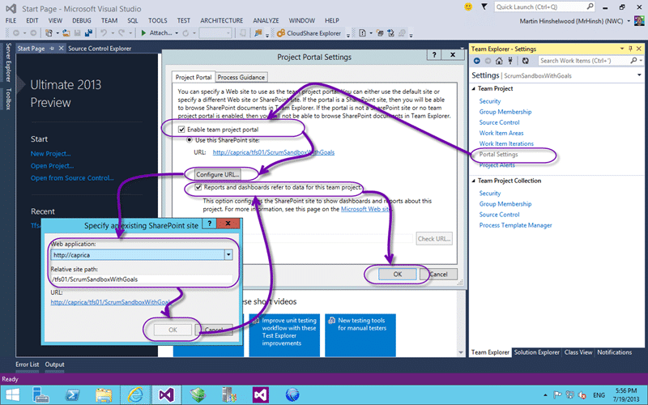  
{ .post-img }
Figure: Connect Team Project to SharePoint

In the settings hub you will see a list of configuration options, the one you want being the “Portal Settings” link. In here we can configure all things portal like. Here we specify that we do indeed want to link to a portal and where that portal is. If you created the SharePoint site at the default location and named it the same as the Team Project then all you will have to do is tick the “Reports and Dashboards” option and click OK to link them up.

Are we done yet? Nope…

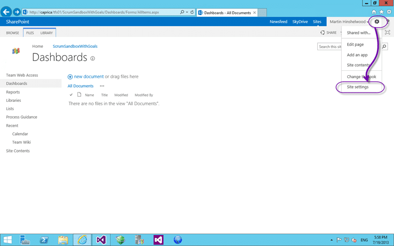  
{ .post-img }
Figure: Go to Site Settings

Head back to your Team Project portal that is now all linked up correctly and head into the “Site Settings”…

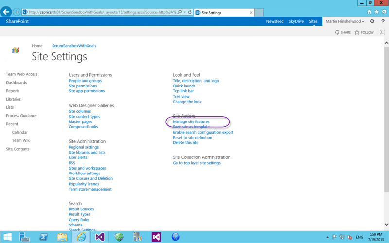  
{ .post-img }
Figure: Manage site features

Here we go to “Manage site feature” so that we can add enable the real meat of the integration.

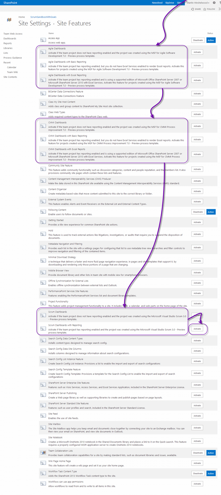  
{ .post-img }
Figure: Enable correct features

Now that's a large list. I have highlighted the only important entries and you will want to select the bottom most option for the Process Template that you created the Team Project with. If you don’t know then here is a rule of thumb:

- **Product Backlog Items** – Visual Studio Scrum
- **User Story** – MSF for Agile
- **Requirement** – MSF for CMMI

My Team Project was created using the Visual Studio Scrum Process Template so I will be enabling “Scrum Dashboard and Reporting”. The feature will automatically try and enable itself and if you can’t run that level it will fall back up the chain until it finds a working one. I have SharePoint proper but I don’t yet have reporting enabled so I will only get the first option. Once I have increased the available functionality I can come back in and upgrade it.

  
{ .post-img }
Figure: No longer blank

Now we have a lovely TFS integrated SharePoint dashboard with first level document integration from Visual Studio.

Phew… Done…

