Did you skip reporting and now you want to integrate reporting and analyses services with Team Foundation Server 2013?

Lets assume for a minute that you did not install Reporting Servers or Analysis Services with your install of Team Foundation Server 2013. I often get asked if you can add it later… and the answer is a resounding yes. This might be the same procedure if you want to have Analysis Services and Reporting Services on separate server for performance or if you just choose not to install it or even if you started with TFS Basic.

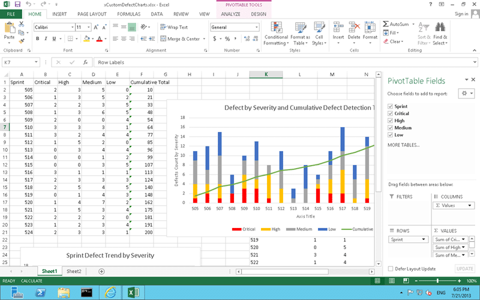  
{ .post-img }
Figure: Creating awesome reports

There are only a few steps to get this working:

1. Install SQL Server 2012 Reporting Services and Analysis Services
2. Configure SQL Server 2012 Reporting Services
3. Enable reporting and analyses services for your Team Foundation Server
   1. Enable reporting and analyses services at the Team Project Collection
   2. Enable reporting and analyses services for your Team Project Collection

## Install SQL Server 2012 Reporting Services and Analysis Services

The very first thing to do is to create your Analysis Services and Reporting Services instance for you to link into Team Foundation Server 2013. In this case I am adding them both to my existing instance of SQL Server so lets fire up the SQL Server installer.

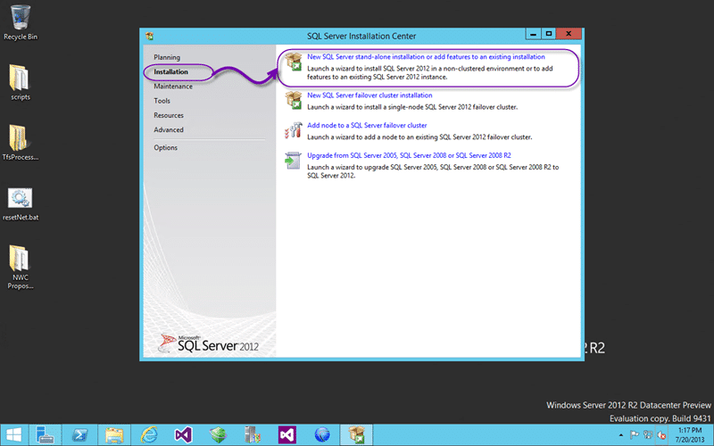  
{ .post-img }
Figure: Add features to an existing implementation

Once you have mounted the ISO and fired off the installer you should select “Install” and then “New SQL Server stand-alone installation or add features to an existing implementation”. We will get to choose later which one we want to do… As you go through the installer it will check for pre-requisites and other shenanigans. I really do wonder why it makes me click next all of the time on screens with no options. It should only stop and tell me when it can’t proceed.

  
{ .post-img }
Figure: Select your existing instance

There is no licence required to use SQL Server Standard with Team Foundation Server but you need to make sure that you are in single or dual server move to take advantage of it. If you scale out to have an Analysis, SharePoint or Reporting farm you will need additional licences for all of the products involved. Here we are choosing to add features to the existing instance specified in the pick-list. There will likely only be one option…

Note: You also can’t add any other databases to the server or you would also require additional licencing. Keep things clean and by the book and you are free and clear.

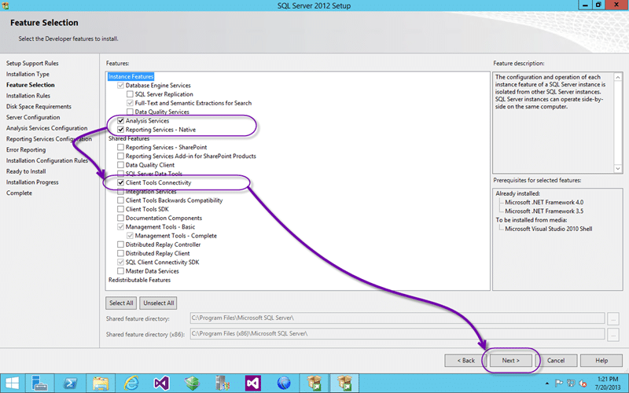  
{ .post-img }
Figure: Add Analysis and Reporting

Although you only need to add “Analysis Services” and “Reporting Services – Native” I have gone ahead and also added the “Client Tools Connectivity” as I always have the impression that is it required and I would not want to have to subject myself to the SQL Server installer a third time.

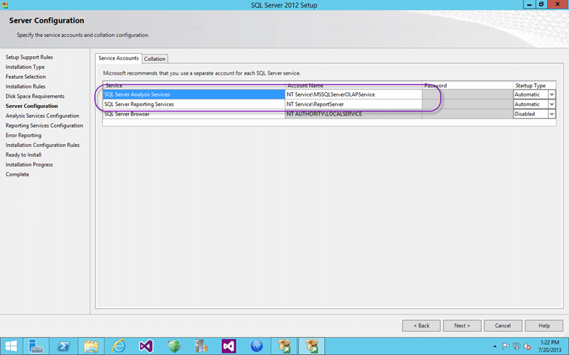  
{ .post-img }
Figure: Using the default credentials is recommended

I would always recommend that you use the default credentials where possible as this minimised customisation and points of failure. When you install application under their default credentials they usually use the machine account in Active Directory. This means that they are automatically granted the correct rights. Did you know that the account that is used for SQL Server required additional privileges in Active Directory to manipulate Service Principal Names (SPN). If it does not have that permission then you could be fumbling around for why something does not work for hours…I know I have before. Default rules…

  
{ .post-img }
Figure: Add administrator permissions

For my demo box I am adding all Domain Admins to have administrator permission to Analysis Services by default. This should stop me from being locked out which I have been on occasion.

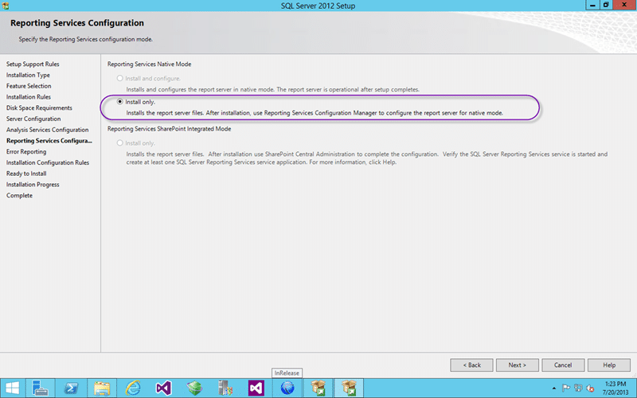  
{ .post-img }
Figure: Reporting Services configuration options

For some reason I am not able to select “Install and Configure”. I can only assume that this is because I am adding features and not installing afresh, but I have no idea why the restriction is there. Would that the SQL Server team would use the TFS installer. We will need to configure it manually later…

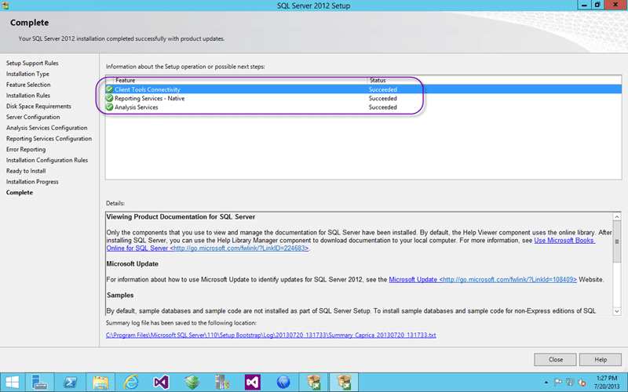  
{ .post-img }
Figure: All installed successfully

Now that we have everything installed we need to pick up the pieces from the deficiencies of the SQL Server installer and configure Reporting Services so that we can use it.

## Configure SQL Server 2012 Reporting Services

Configuring SQL Server 2012 Reporting Services is very strait forward. We need to create the site, the web services and a database to hold the data.

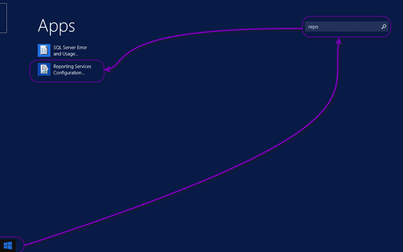  
{ .post-img }
Figure: Reporting Services Configuration

First we need to launch the Reporting Services configuration tool which will have been added to your application links list. Just search for it on your Start page.

  
{ .post-img }
Figure: Connect to your RS instance

You need to specify what instance you are configuring. Here ewe are connecting to the local server’s default instance.

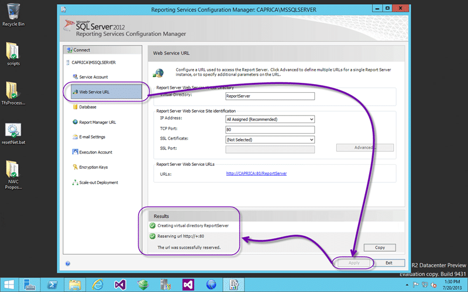  
{ .post-img }
Figure: Create Web Service

First select the Web Service URL node on the left and click “Apply”…

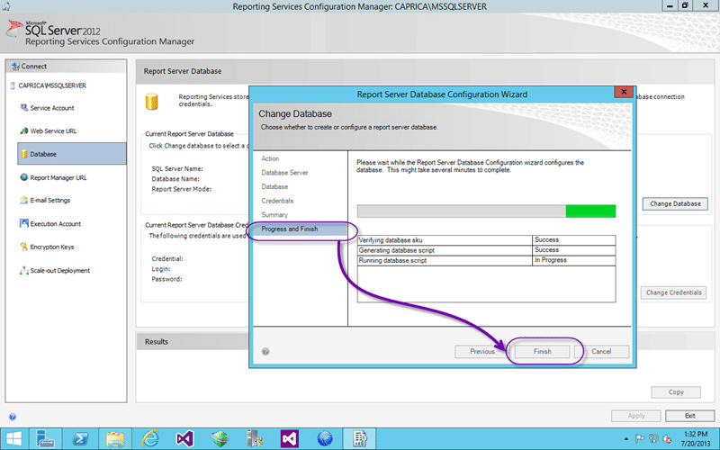  
{ .post-img }
Figure: Create the Database

Second click on the ‘Database” node and take all of the defaults. If you have to enter a database name then pick something custom and cryptic… like “ReportingData”.

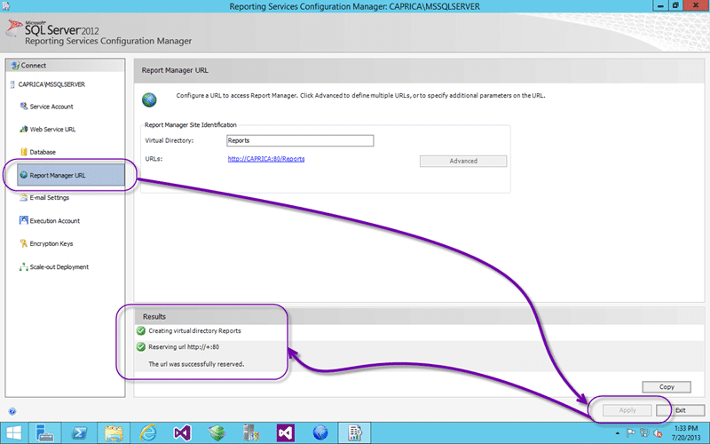  
{ .post-img }
Figure: Configure Website

And the last thing to do is to select “Report Manager URL” on the left and again click Apply.

Do you see why I think it is not outside the realm of possibility for the SQL Team to allow auto configuration.

DONE

## Enable reporting and analyses services for your Team Foundation Server

If all we were doing was installing and configuring Analysis Services and Reporting Services then we would now be done. However we want to have an integrated solution with Team Foundation Server so there eare a few other steps that we need to complete. We need to integrate our new instances into TFS and then enable data services for each of the collections.

### Enable reporting and analyses services at the Application Tier

We need to first tell Team Foundation Server where to store all of that lovely data and reports. So head on over to the Team Foundation Server Administration Console so that we can get started.

  
{ .post-img }
Figure: Enable and configure Warehouse

There are 4 things to configure but the first one is a checkbox. Tick the box to “Use Reporting” first and then fill out the details for where you want your data warehouse stored. I would recommend the default of “Tfs_Warehouse”.

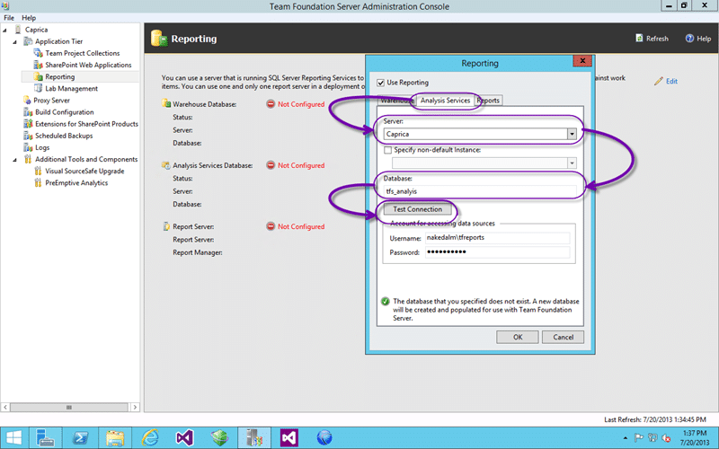  
{ .post-img }
Figure: Configure Analysis Services

Now head over to the second tab and enter the database as “Tfs_Analysis” for your analysis services cube. Here you will also want to specify the credentials to be used for the reporting services data sources to connect to. This will add that account to the “TfsDataReader” group.

  
{ .post-img }
Figure: Configure Reports

If you fill out the server name, the local server should be already in the pick-list, then you should see the URL’s automatically populated. If you need custom URL’s then you should add them to Reporting Services using the Reporting Services Configuration tools and you will then be able to select them from this drop down list.

Again enter the credentials that you want to use for reporting, this time TFS will add this to the data sources and the credentials to use.

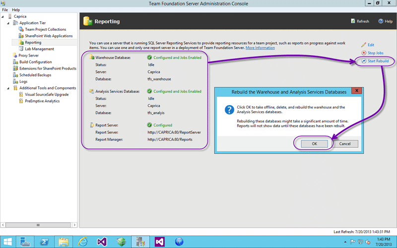  
{ .post-img }
Figure: Rebuild the Warehouse and Cube

I am fairly sure that a rebuild is automatically kicked off when we configured the setting but just for good measure I hit the “Start Rebuild” button.

### Enable reporting and analyses services at the Team Project Collection

And the last little piece is to enable each of your collections to store data in the reports server. You don’t have to enable every collection but you do have to enable the wans that you want to have data in the cube from.

  
{ .post-img }
Figure: Enable Collection for Reporting

This will configure your collection to look for a folder of the name displayed and for a folder for each of the Team Projects under that. Not as versatile as the SharePoint site configuration but enough to get your data  flowing.

## Conclusion

Unfortunately enabling the reporting does not go an add the correct reports to the server. You would need to download the correct reports from the Process Template and import them manually to the location specified above with the addition of the Team Project name. If the power tools for 2013 were available there is a “AddReporting” command line to do this for you.

Give me a shout if you have any questions or get into trouble…
