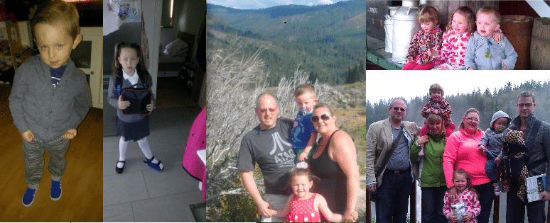

Yet another change for the better as I move in a few months back to Scotland to join my family. My flights are booked.

As a family we decided not to stay in the USA and while we had financial obligation here we also needed to make sure that the kids got back into the right point in School. In the UK School starts just after 4 years old where as in the USA its 5. As our kids are 4 and 6 now they started in the USA and were already a year behind. My wife and I decided that it would be best to get them into the last school year and so in January I sadly bid farewell to them all and have been relegated to Skype since then…

  
{ .post-img }
Figure: Left to right; Kaiden (son), Evangelina (daughter), family vacation in Yosemity, Brothers visit in Washington

All is however not lost as in just a couple of months (31st October 2013 to be precise) I have a one way ticket back to civilisation and family.

Other changes for the better:

- [A change for the better #1 - Merrill Lynch to Aggreko](http://nkdagility.com/a-change-for-the-better-1/)
- [A change for the better #2 - Aggreko to SSW](http://nkdagility.com/a-change-for-the-better-2/)
- [A change for the better #3 - SSW to Northwest Cadence](http://nkdagility.com/a-change-for-the-better-3/)

## What have I been up to?

You might be asking yourself what I have been doing in the heathen backwaters of the pacific northwest?

I have been working for what is arguably the best dedicated ALM Consulting organisation in the world. There are many organisations out there that talk about ALM and maybe have two or three ALM Consultants, but for pure expertise you can’t beat Northwest Cadence.

  
{ .post-img }
Figure: Northwest Cadence

I have gotten to work not only for the best ALM Consultancy but with the best ALM Consultants in the world. I have worked with many **customers in government, finance, manufacturing, health and technology** to help them improve their processes and deliver more. There are different challenges of working with companies that have only a few employees to many thousands and I have experience with both, and everything in between.  Not only that but I have written over 200 blog posts in the three years I have been in the USA. No rest for the wicked…

## What’s next

Although most of my customer base has been **US** based with Northwest Cadence I have worked over the years for customers in **UK** and **Australia** and I plan to **bring my experience to bare on the European market** from that September move. Northwest Cadence, and I did not want to be permanently separated so we decided that I will stay in at 25% time. This will be hard, especially the commute for on site work and with the time zone difference but I think we can make it work. For all my existing customers with Northwest Cadence I will still be available to pop out and help them. Those of you that follow this blog will have noticed my name change from [http://blog.hinshelwood.com](http://blog.hinshelwood.com) to [http://nkdagility.com](http://nkdagility.com) and the subsequent branch change from  Visual Studio ALM to naked ALM. These changes were, at least in part, pre-emptive action to the future state of affairs.

  
{ .post-img }
Figure: naked ALM Consulting

So what will I be doing for the other 75% of my time. First I will be spending time with my family to make up for 8 months of absence. I am sure that having me hanging around all that time will start to grate on my wife and to save her sanity I will be looking for consulting work in the UK, Europe, and the rest of the world. I already have a company, “naked ALM Consulting Limited” that is registered in Scotland (Company No. SC451660 if you are interested) and I have already started reaching out the feelers for new business.

## Conclusion

I want to try and find the bulk of my work in Glasgow and the surrounding area but that may not be realistic. I just don’t know how many companies there are in Scotland that have development teams and how many of them are considering changing their practices. Here is the rough gist of the things I will be doing:

- Agile adoption planning and mentoring
- Agile practice and technique coaching for Management and Teams
- Application Lifecycle Management (ALM) practice improvements
- Install, Migration, Customisation and Adoption of Visual Studio ALM
- Scrum and Agile Training (Scrum.org)

As with my continuing work with Northwest Cadence in the USA I will be providing consulting, coaching, and mentoring around lean-agile, Scrum, and Visual Studio ALM in the United Kingdom and Europe.

**Are you in Scotland? Do you have a need to improve your current practices? Get in touch so that I can start helping you out.**
