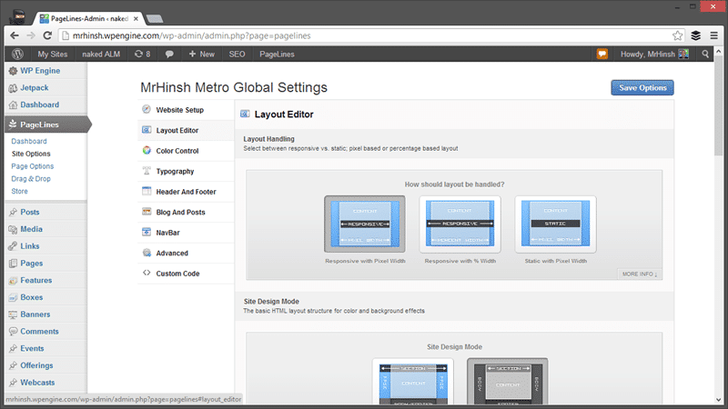
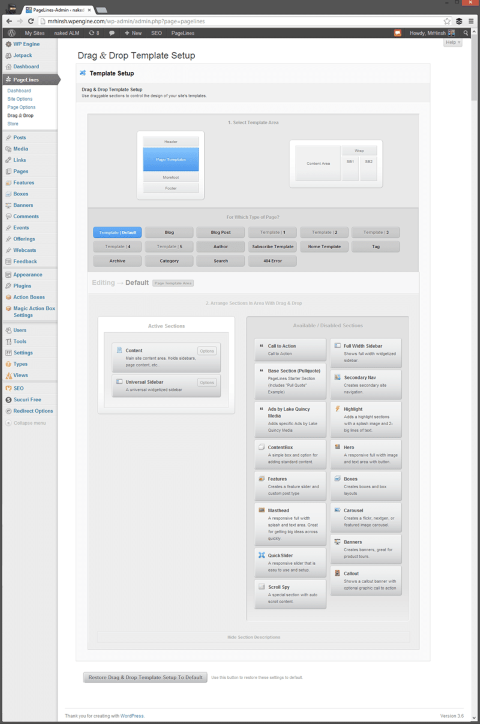
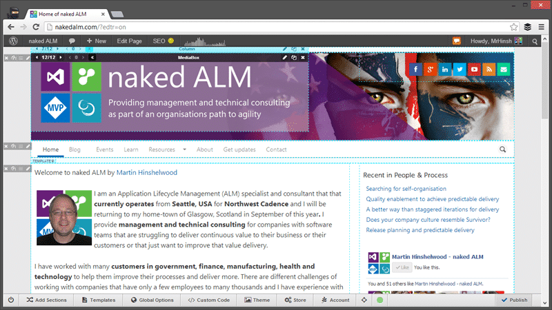
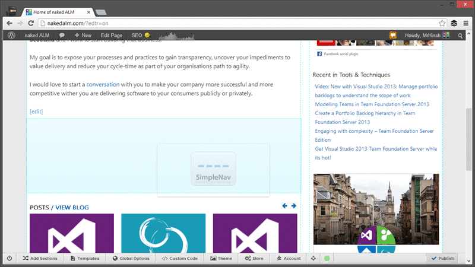
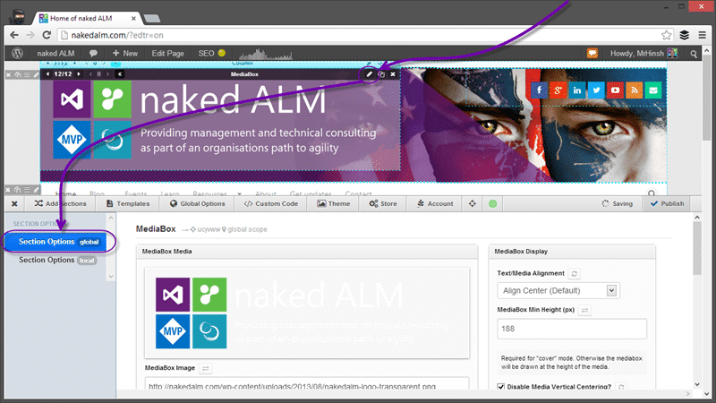
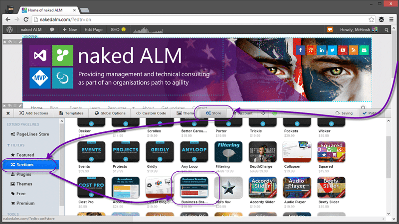
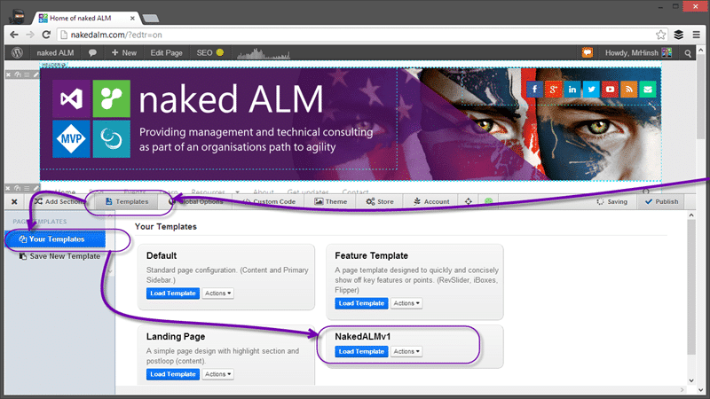
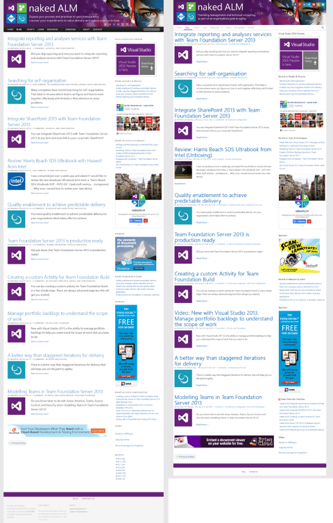

The evolution of naked ALM with Pagelines DMS for Wordpress is a story of successful change. All you have to do is learn to compromise and aspire to the easy 80%.

It has been a long time \[since I moved from geeks with blogs to Wordpress\] and I have been supremely happy with the platform. When Live Spaces wrapped up there was good reason that they moved everyone to Wordpress.  When I first moved to Wordpress I was struck by the simplicity of the platform, but if you are a geek like me you will very quickly want more. You will start with the thousands of plugins that already exist and you will switch theme constantly as you try out new looks feels and features. That is until you find [Pagelines](http://pln.so/dy).

I moved to Pagelines after I notices that Ben Day was using it on [http://benday.com](http://benday.com) and the platform, Pagelines Framework, was amazing. With the [recent changes at home and work](http://nkdagility.com/a-change-for-the-better-4/) some things that I had put off for a while needed to be done.

1. DONE - [Update brand to reflect new philosophy](http://nkdagility.com/naked-alm-starting-with-why-and-getting-naked/)
2. IN PROGRESS - Change the site to be more selling me than just the blog
3. DONE - Move from Wordpress multisite to single site
4. DONE - Upgrade from Pagelines Framework to Pagelines DMS

You may have noticed a few of the changes happening over the last 6-8 months that included #1 and come of #2 above and you can read above the reasons behind them in [naked ALM: Starting with why and getting naked](http://nkdagility.com/naked-alm-starting-with-why-and-getting-naked/). #2 is an incremental progression and more changes were completed this week and over the weekend. So if you do stop something strange on the site please let me know so that I can fix it… (why do all of the browsers still insist in rendering things differently)

## Move from Wordpress multisite to single site

Boy did I procrastinate on this one. In the end I just had too many issues with the added complexity that multisites create. Moving is however not a simple thing and is really a migration. Stand up a new site, export your content and then import to the new site.

- [WordPress WXR File Splitter (RSS XML)](http://www.rangerpretzel.com/content/view/20/1/) – You may need this if your export is big.

It took me one shot to run through the process as a practice run before I was comfortable. I did however still procrastinate and I had a working import for a good week before I decided to flip the switch…

## Pagelines Framework – The old way

On the old site, even before I [moved to WP-Engine](http://nkdagility.com/the-evolution-of-a-blog-the-race-for-responsiveness-and-even-a-little-support-from-wp-engine/), I have made many small tweaks over the last couple of years. But this is what I ended up with as of last week.

  
{ .post-img }
Figure: naked ALM as of 13th August 2013 with Pagelines Framework

Like I said this was built up over the last few years and I have lots of customisations. Luckily Pagelines Framework is the king of customisations.

  
{ .post-img }
Figure: Customising layout and global settings with Pagelines Framework

With Pagelines Framework there is an administration section added to your Wordpress backend that lets you customise things like the layout and colours to your hearts content without having to edit CSS or PHP (shiver). There is a “custom code” section that allows me to add some custom CSS or JavaScript, but it is optional. I has about 500 lines of CSS in there that just tweaked things on my site. Things like the bullets, fonts and heading sizes that I wanted just so. This was not a thing that I did in an afternoon but neither did I spend days working on it in any one sitting. I just tweaked as I fancied a change or I was stuck on a train…

  
{ .post-img }
Figure: Drag & Drop layout customisation with Pagelines Framework

The Drag & Drop customisation was awesome. It lets you customise the header and footer above, but also the content area. Just like widgets you can drag a sectio0n from those available to the column on the right. Simple, but way more control than anything out of the box in Wordpress. The Pagelines folks don’t like it when you call it a theme even though that is how you enable it, and you can see why.

I even created a couple of custom Sections. The adverts that I added to my site use the “ Ads by Lake Quincy Media:” section that I created but the other two were abortions and I never really finished them. These were noting complex, a couple of settings (yes in PHP) and some HTML and CSS. Simples…

Even with this I was always frustrated with the lack of actual customisation that you could do out-of-the-box and I had over 500 lines of CSS as well as the custom sections. Then Pagelines announced DMS…

## Pagelines DMS – The new highness

Pagelines pushed DMS as a paradigm shift in the way that one can configure your site, and you know what… it is. I can do things that would before have require incredibly fiddly CSS changes if not customisations of the HTML. And that is just yuch!

I am not saying that I did not do any customisation, just that I had to do a lot less. Let me show you want I ended up with…

  
{ .post-img }
Figure: naked ALM as of 15th August 2013 with Pagelines DMS

As you can see I got fairly close very quickly. I have probably spent, all in, about 16 hours on this and that is WAY less than I spent getting my site to look like it did before. I made some compromises and got plenty of new capabilities. I had to raise a few things with the Pagelines Developers, but they are very responsive and fixes I need are in the next version coming down the line.

  
{ .post-img }
Figure: Customising Pagelines DMS

[Pagelines DMS](http://pln.so/dy) brings inline editing to Wordpress. Its like a WYSIWYG editor built right into your production site. It supports preview and publish so you can see what you are up to before you go live and is eminently customisable one you get the hang of it. You have to figure out a few things first though.

it may be a little difficult to see but those little tabs on the left represent a template area. I have this configured for a ‘boxed’ mode so the template areas are not the full width of the screen, but that is just to my taste. Each of those tabs has a Delete, Move, Clone, and a Edit buttons that let you customise each one.You can add sections as contents and you can move them around.

  
{ .post-img }
Figure: Build in Sections for Pagelines DMS

If you go to “Add sections | Your Sections” you will find a large list of the built in controls. You get a few more with a “pro” account and most are available as part of the open source project. I would expect more sections to be added over time for Pro account holders.

  
{ .post-img }
Figure: Drag & Drop in Pagelines DMS

To get the SimpleNav, for example, onto the page you just drag it from the sections list onto the page and Pagelines will do all of the hard work of where it goes and how it will look once it is there.

  
{ .post-img }
Figure: Customise MediaBox in Pagelines DMS

Once you have your Section added you can hit the edit button and customise it how you like. The minimum edit options include the ability to add a custom CSS Class so that you can easily, directly and reusable target a specific area. The MediaBox control allows you to add background and foreground images as well as some text, title and display options. It even includes something called “Viewport Animation” that fades in the content once the page has finished loading. While I am just using the MediaBox for an image you can add video’s as well.

  
{ .post-img }
Figure: Custom LESS\\CSS with Pagelines DMS

If you need to add a custom CSS class to get more configuration you can head on over to the Custom LESS\\CSS location and add some customisations or overrides. This gives you a huge amount of flexibility and it not only support pure CSS but also LESS. For those that don’t know what LESS is it is kinda like a programming language for CSS. You get to script your CSS with both variables and If clauses to create a much more sophisticated display.

  
{ .post-img }
Figure: Section in the Pagelines DMS Store

If you really can’t get what you want out of the built in Sections you can head to the Store and purchase loads of extras. There are only a few in there just now, but Pagelines DMS was launched less than a month ago. Not only are there Sections but there are Plugins and more importantly Themes. If you want to just buy a look and feel you can.

  
{ .post-img }
Figure: Save and Apply templates

You can even create Templates based on how you have configured the pages with all of the settings for the controls. Most controls have both “Global” settings which are templatable and “local” settings which are page specific. This gives you the flexibility to to have one page slightly different without having to work around the defaults.

## Conclusion

With the new Pagelines DMS platform you get some awesome capabilities that makes it ridiculously simple to create and customise each of your pages. Here are my before (Pagelines Framework) and after (Pagelines DMS) shots.

{ .post-img }

I got really close in just a few days of tinkering and I will pick up the rest as they become important to me. Just looking at these two side by side I prefer the smaller headings and the greater amount of white space on the left of the posts. Simple to fix and by the time you read this it probably will be.

If you are building a website or blog you will be hard pushed to do better than Wordpress and if you add Pagelines DMS into the mix you enter into a world of whatever you want….

- [Get Pagelines DMS - Open Source or Pro](http://pln.so/dy "http://pln.so/dy")

**What blogging platform do you use?**

**How would you compare it to Pagelines on Wordpress?**
