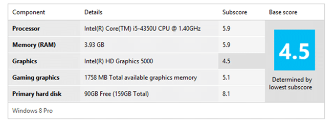
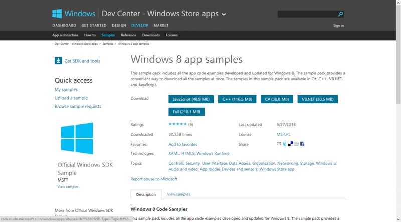
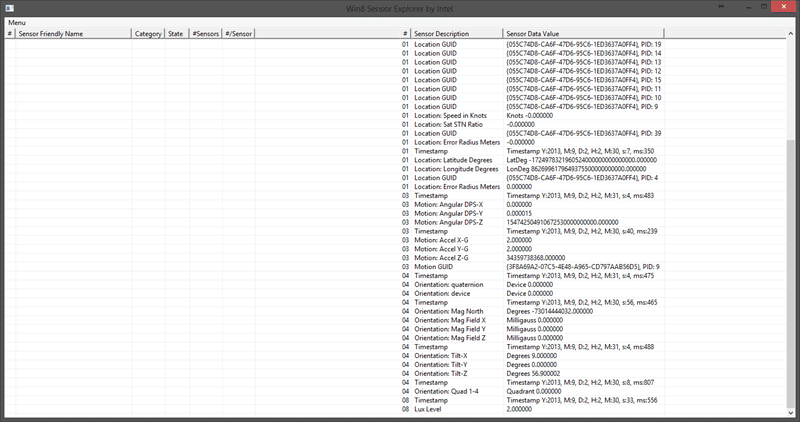
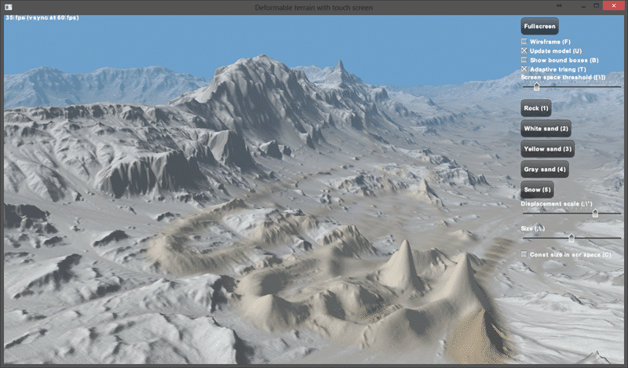

It has just over a month since I received my Intel Haswell Harris Beach SDS Ultrabook from Intel to review and I have to say that I love this little laptop. I have been trying to use it exclusively and have done pretty well.

- [Review Part 1: Harris Beach SDS Ultrabook from Intel with Haswell](http://nkdagility.com/review-harris-beach-sds-ultrabook-from-intel-unboxing/)
- Review Part 2: Developing with Intel Haswell Harris Beach SDS Ultrabook
- [Review Part 3: Two Months with Intel Haswell Harris Beach SDS Ultrabook](http://nkdagility.com/review-two-months-intel-haswell-harris-beach-sds-ultrabook/)

There has however been some trouble and strife. This is a Developer Prototype and in my infinite wisdom I decided to go straight to Windows 8.1. This it turns out was a mistake as neither the Drivers not the Bios configuration works well with Windows 8.1. My advice if you are using one of these computers is to avoid 8.1 until the drivers are more mature. I had problems with Sleep, resume as well as touch in a variety of applications. That was however the risk that I took installing a preview version of Windows and I only have myself to blame.

Now that I am back on Windows 8 everything is good again.

[](http://nkdagility.com/wp-content/uploads/2013/09/image-11-11.png)  
{ .post-img }
Figure: Experience Index is high

The first thing that you will want to do is download the Windows 8 sample apps. While the Intel ones are good they are all written in C++. When I asked them for .NET versions I got a .NET UI that called a C++ assembly that used the sensors. Not what I was after….

[](http://nkdagility.com/wp-content/uploads/2013/09/image1-12-12.png)  
{ .post-img }
Figure: Online samples help you get familiar with the capabilities

If you download the “Full” samples list there are over 270 applications to explore. As I [mentioned in part 1](http://nkdagility.com/review-harris-beach-sds-ultrabook-from-intel-unboxing/) this laptop is all decked out with all of the sensors that you might want to develop Windows 8 or Windows 8.1 apps. I have noticed with this laptop that even with a significant code base this laptop performs very well with Visual Studio 2012 and Visual Studio 2013. The performance is unbelievable and I think owe a lot to the HDD ratting an 8.1; Visual Studio has always been very hard disk intensive with builds, code sense and other cool features that usually take there toll. The laptop eats up all that Visual Studio can throw at it.

The first thing I wanted to look at was the GPS capability. Now there are not many laptops that have GPS but this one does.

[](http://nkdagility.com/wp-content/uploads/2013/09/image2-13-13.png)  
{ .post-img }
Figure: Visual Studio runs a dream

There are many different ways to identify your location and the OS obfuse that a little so that you can use a single API through the Geolocator. Even if you don’t have GPS it will do a little two-step and use Wi-Fi or other methods to get an approximate location.

[](http://nkdagility.com/wp-content/uploads/2013/09/image3-14-14.png)  
{ .post-img }
Figure: Even developers need to give permission

When you fire up the demo application you will have to allow,just like any app, the use of the data.

[](http://nkdagility.com/wp-content/uploads/2013/09/image4-15-15.png)  
{ .post-img }
Figure: Geolocation demo application

However once you have allowed it you can have live relocation data piped into your application. Although the accuracy here is 100 (I have no idea what the measurement is in, probably 100 meters) I saw it as low as 50 indoors.

In the sample code you can see the simplicity and ease of attaching to the sensor data, and all of the Windows 8 demo application demonstrate that.

```
private Geolocator _geolocator = null;

public Scenario1()
{
    this.InitializeComponent();

    _geolocator = new Geolocator();
}

///
/// Invoked when this page is about to be displayed in a Frame.
///
///Event data that describes how this page was reached. The Parameter
/// property is typically used to configure the page.
protected override void OnNavigatedTo(NavigationEventArgs e)
{
    StartTrackingButton.IsEnabled = true;
    StopTrackingButton.IsEnabled = false;
}

///
/// Invoked immediately before the Page is unloaded and is no longer the current source of a parent Frame.
///
///
/// Event data that can be examined by overriding code. The event data is representative
/// of the navigation that will unload the current Page unless canceled. The
/// navigation can potentially be canceled by setting e.Cancel to true.
///
protected override void OnNavigatingFrom(NavigatingCancelEventArgs e)
{
    if (StopTrackingButton.IsEnabled)
    {
        _geolocator.PositionChanged -= new TypedEventHandler(OnPositionChanged);
        _geolocator.StatusChanged -= new TypedEventHandler(OnStatusChanged);
    }

    base.OnNavigatingFrom(e);
}

///
/// This is the event handler for PositionChanged events.
///
///
///
async private void OnPositionChanged(Geolocator sender, PositionChangedEventArgs e)
{
    await Dispatcher.RunAsync(CoreDispatcherPriority.Normal, () =>
    {
        Geoposition pos = e.Position;

        rootPage.NotifyUser("Updated", NotifyType.StatusMessage);

        ScenarioOutput_Latitude.Text = pos.Coordinate.Latitude.ToString();
        ScenarioOutput_Longitude.Text = pos.Coordinate.Longitude.ToString();
        ScenarioOutput_Accuracy.Text = pos.Coordinate.Accuracy.ToString();
    });
}
```

You can see a simple object, a couple of events and an async process  to update the UI. This is so ridiculously simple even I can figure it out…

While the Microsoft samples have breadth and show us how to interact with each individual component the Intel samples give us some complete scenarios to look at. There is a simple RTS demo as well as an app that enumerates all of the sensors that are available. Where the Microsoft samples obscure the details the Intel ones revel in them.

[](http://nkdagility.com/wp-content/uploads/2013/09/image5-16-16.png)  
{ .post-img }
Figure: You will need the DirectX SDK

To get everything working you will need both the Windows SDK and the DirectX SDK for either Windows 8 or Windows 8.1 respectively. If you have the latest version of Visual Studio 2013 you may hit the ["S1023" error when you install the DirectX SDK (June 2010)](http://support.microsoft.com/kb/2728613/). If you can, then install the DirectX SDK first, otherwise you will have to do some jiggery pokery to get everything working again.

[](http://nkdagility.com/wp-content/uploads/2013/09/image6-17-17.png)  
{ .post-img }
Figure: Sensor Enumerator

The first application is a list of all of the sensors. If you wiggle the laptop around you can see the numbers changing. In addition there are a number of cool apps that demonstrate real world uses of the API’s and Sensors.

[](http://nkdagility.com/wp-content/uploads/2013/09/image7-18-18.png)  
{ .post-img }
Figure: Terrain Editor

In the Touch folder there is a terrain modification application that lets you paint the landscape with sand.

[](http://nkdagility.com/wp-content/uploads/2013/09/image8-19-19.png)  
{ .post-img }
Figure: Some kind of Tron cycle application

The Tron application is pretty cool. It lets you steer the bike by the horizontal orientation of your laptop. Again all of these applications from Intel are in C++ and I find it very difficult to follow the code from an architecture perspective but you can spelunk it yourself.

[](http://nkdagility.com/wp-content/uploads/2013/09/image9-20-20.png)  
{ .post-img }
Figure: RTS Simulation

The Real Time Strategy application lets you select units by touching them and then give them orders by tapping on the landscape. We almost always forget the most important and most used sensor of them all… the touch screen.

## Conclusion

I am getting a lot of mileage from this laptop. I basically use it as my main computer except when I need to run VM’s or use the Microphone (I seam to have a driver issue there) wherein I switch to my 8KG Dell that has a terabyte of drive space and 24GB RAM. I have not seen a laptop out there that would let me do what I need in the size and weight that I would like so I carry two. This awesome Haswell kicks ass when it comes to battery. It has been 5 hours since I last charged it and I have been writing this post, surfing the web and running through the demo applications. All the while downloading and installing things. And I still have nearly 40% remaining. While I can’t get a full 8 hour day with one charge I get pretty dam close.

How far do you get with yours?

I have basically replaced my Acer Iconia W520 with this laptop and while I would love it to have a detachable screen it is really not an issue. I still use my Iconia but it is on charge in the bathroom.

If you are a developer working on Window 8 or Windows 8.1 apps then I wholeheartedly recommend this laptop for building them on. If you just need an [Ultrabook](http://www.intel.com/content/www/us/en/ultrabook/shop-ultrabook.html) then make really sure that you get a Haswell processor to get the battery life and I would recommend the hybrids that are also tablets.

Disclosure of Material Connection: I received one or more of the products or services mentioned above for free in the hope that I would mention it on my blog. Regardless, I only recommend products or services I use personally and believe my readers will enjoy. I am disclosing this in accordance with the Federal Trade Commission’s 16 CFR, Part 255: "[Guides Concerning the Use of Endorsements and Testimonials in Advertising](http://www.access.gpo.gov/nara/cfr/waisidx_03/16cfr255_03.html)."
