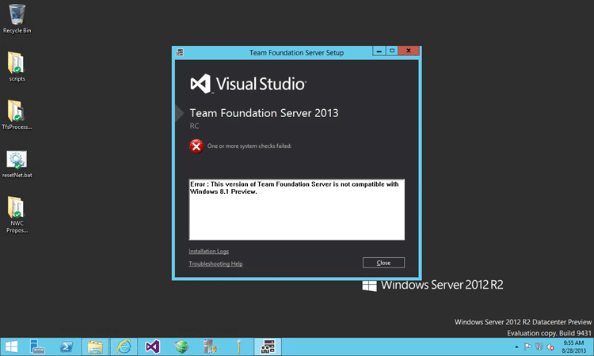

When you try to install Visual Studio 2013 RC (or Visual Studio 2013 RC Team Foundation Server) you get the message “Error: This version of Team Foundation Server is not compatible with Windows 8.1 Preview”

  
{ .post-img }
Figure: This version of Team Foundation Server is not compatible with Windows 8.1 Preview

## Applies to

- Team Foundation Server 2013 Preview on Windows Server 2012 R2 Preview
- Visual Studio on Windows Server 2012 R2 Preview
- Team Foundation Server 2013 Preview on Windows 8.1 Preview
- Visual Studio on Windows 8.1 Preview

## Findings

Unfortunately in order to install the Release Candidate there is a requirement to update the version of .NET that is on the server. As the Preview copies of Windows 8.1 and Windows Server 2012 R2 has .net 4.5.1 Preview baked in you will not be able to install the new version on there.

You can however use Windows Server 2012, Windows 8, Windows Server 2008 R2, and Windows 7 to install the components.

## Conclusion

In order to move forward with the new RC versions of Visual Studio and Team Foundation Server you will need to move to an RTM version of Windows. If you can get the Windows 8.1 or Windows Server 2012 R2 RTM then you are good to go. However you will be unlikely to get them prior to General Availability in October.

You can however use any of the existing version of Windows and Windows Server that are supported.
