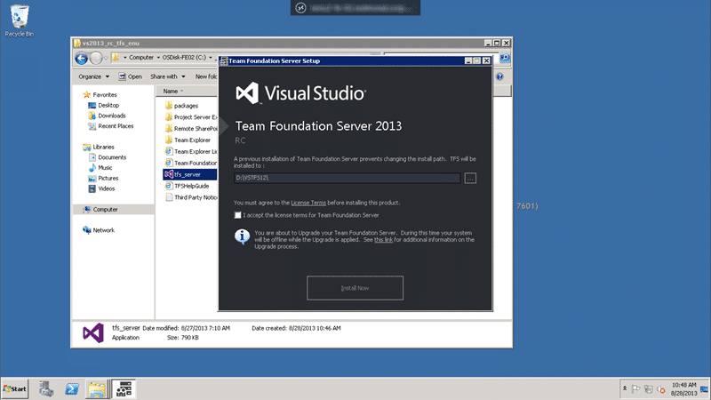
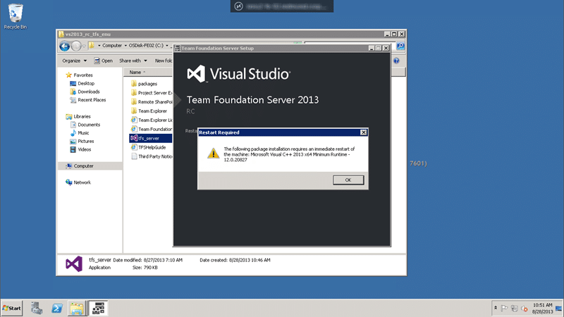
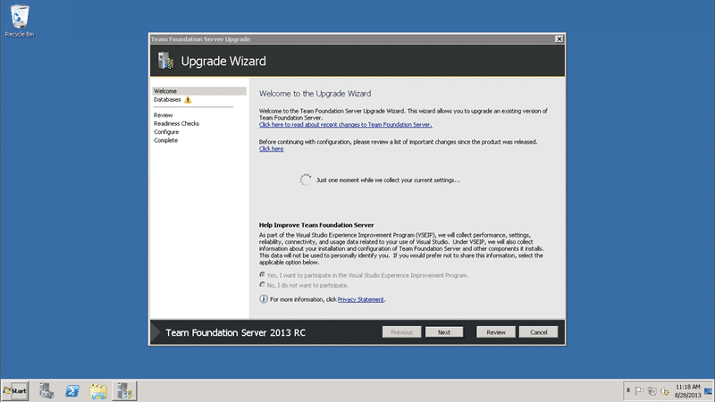
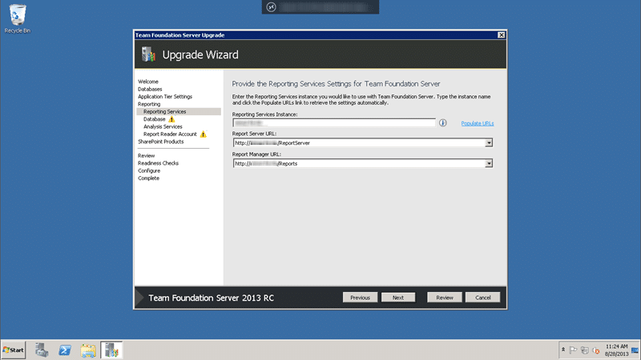
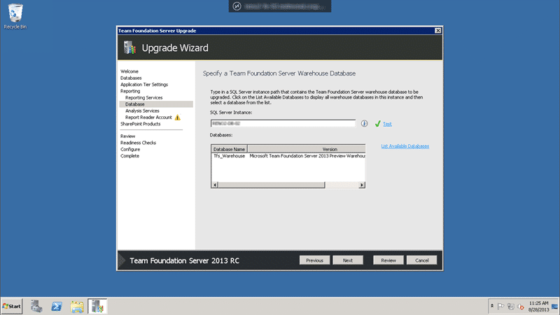
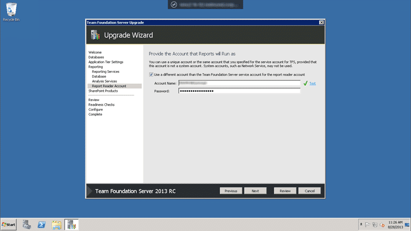
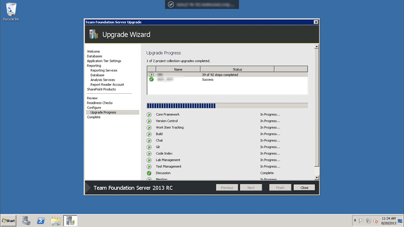
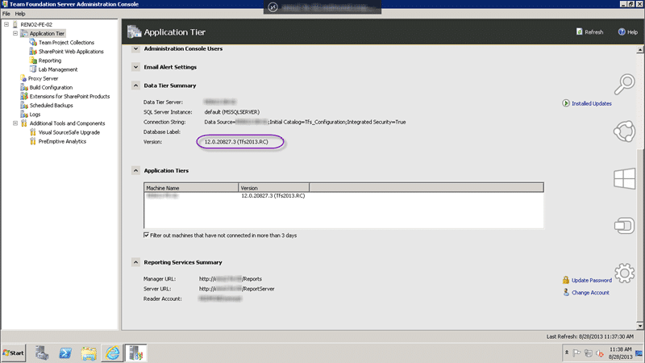
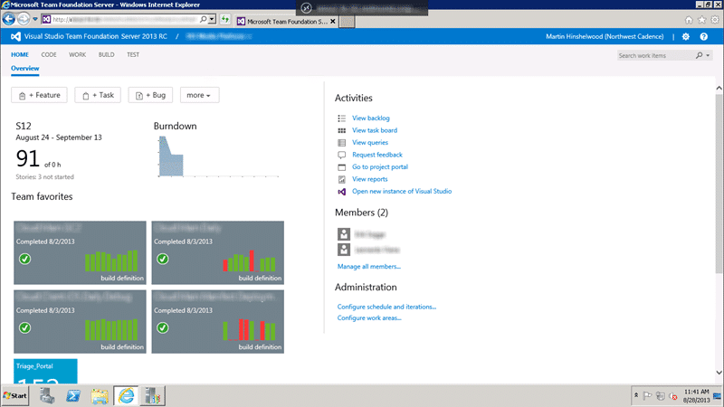

With the [TFS 2013 RC](http://nkdagility.com/whats-new-in-visual-studio-2013-rc-with-team-foundation-server/) being made available I need to upgrade one of my main customers from the TFS 2013 Preview.

I have been working with a fairly progressive customer that has no qualms to using the latest version of any software as long as it is supported. They have around 500 developers in Team Foundation Server and 2-3TB of data. No that was not a typo. Although they have 500 active engineers there are around 9000 user accounts that have permission to TFS. This is the [Engaging with complexity – TFS Edition](http://nkdagility.com/engaging-with-complexity-team-foundation-server-edition/) customer that was moving through many environments. They since managed to streamline their processes and I have been working with them for a while. We have done maybe 10 to 15 upgrades of the 2TB collection across five separate environments over the last few months practicing for the production move. All with Team Foundation Server 2013 Preview. And we have had no problems at all. Indeed when we moved to 2013 many of the issues that we had disappeared.

Now that the RC is available and with production only a week away I needed to do a trial upgrade of their Sandbox environment to make sure that everything will work for Production. In fact it went so well (took around an hour) that we went ahead and upgraded the soon to be production server that very day. I can also confirm that the move to production of the data and users has been completed successfully…

## Upgrading Sandbox 2TB data to Team Foundation Server 2013 RC

Some thing that I can’t stress more is to always do a trial upgrade. If, unlike this customer, you have limited hardware then I would recommend that you create a new virtual environment to replace your current TFS virtual servers. This will allow you to run a trial upgrade without impacting production and your infrastructure teams can reclaim the old VM’s once you are done.

  
{ .post-img }
Figure: Current TFS Environment is Server 2008 R2 with TFS 2013 Preview

I really have no expectation of a long or complicated upgrade form the Preview to the RC however you do want to check that the OS is supported as Windows Server 2012 R2 Preview and Windows 8.1 Preview is not supported by the RC.

## Prerequisites – make sure that you have…

- Passwords for your TF Service & TF Reports accounts
- Windows Server 2008 R2 or Windows Server 2012 (NOT 2012 R2 or 8.1 Preview)
- SQL Server 2012 Service Pack 1

## Installing TFS 2013 RC when you have TFS 2013 Preview (30 minutes)

It has been a long time since you had to manually uninstall the old version of TFS to install the new. The installer will take care of all that clean up for you.

  
{ .post-img }
Figure: Installing Team Foundation Server 2013 RC

The only reason that the install of the new version takes so long is that it requires two reboots and asks you to do so.

> It would make sense to ask if reboots are ok at the start of the install and just go for it. Suggestion for Installer Team

  
{ .post-img }
Figure: Reboot to install the C++ 2013 Runtime

The first forced reboot is the Microsoft Visual C++ 2013 Runtime. Because we are updating from a preview we will have more reboots than a clean install.

  
{ .post-img }
Figure: Reboot to install .NET 4.5.1 RC

The second forced reboot is to get the Microsoft .NET Framework 4.5.1 updated to the RC from the Preview version that you had installed. If you are doing a clean install you will not have to do this one at all..

  
{ .post-img }
Figure: The Upgrade Wizard will launch automatically

To be honest this would have taken less time if I was sitting watching the screen, and pinging the server between boots to see when it was back up. As it was I took a leisurely 30 minutes to install Team Foundation Server 2013 RC over the top of the Preview. But that is not us done, this is just the files on disk and dependencies that have been updated. Now comes the real work of upgrading the instance of TFS 2013 Preview to TFS 2013 RC.

## Upgrading from the TFS 2013 Preview to TFS 2013 RC (16 Minutes)

As with the TFS 2013 preview there is really not anything that new in the installer. Things are a little bit slicker and I have noticed a significant drop in failed upgrades, from a few to none. The experience of the team in delivering working software every 3 weeks in 2012 has set the Product Team in good stead to minimise any issues here. I also expect that the shame of TFS 2012 Update 1 and 2 has resulted in a significantly higher quality bar for Done. Suck are the trials of moving a large product group to agility.

  
{ .post-img }
Figure: make sure that you have a Backup

Its so important there is a yellow triangle and a checkbox! Make sure, and I mean really sure, that you have a backup of your data. One of the reasons that I always recommend moving to new hardware on an upgrade is that you can always roll back to the old hardware. Makes your back-out plan real simple…

  
{ .post-img }
Figure: Renter your credentials

No, the product team don’t store your credentials in reversible encryption. Yes, you will have to enter the passwords again so make sure that you have them, but the username that you used last time will be pre-populated. I tend to try and use the system accounts to negate these issues, but some domain configurations don’t work well with them. Unless you are insane you are likely to be using NTLM. I have no issues with configuring Kerberos but you will need more time and some seriously good AD administrators to get it going.

  
{ .post-img }
Figure: Do you configure reporting?

In this environment we do have reporting as it mirrors production. If you don’t configure it now you will have to manfully integrate it later and upgrade the reports yourself. This way the TFS team take the brunt of the configuration.

  
{ .post-img }
Figure: Select the Reports Server and URL

Here you can select your Reporting Services Server. This is a multi server (dual tier) environment so our Reporting Services runs on the Application Tier and the SQL Server and Analysis Services run on the Data Tier. If you want to have a friendly URL for Reporting Services then you should add it as a host header to the Reporting Services Configuration tool first for both the Web Services and the Web Site nodes. This will allow the URL’s you specify to appear on the pick lists above.

  
{ .post-img }
Figure: Select Warehouse to upgrade

As it takes more than a few hours to create a new warehouse from scratch you can upgrade it. From TFS 2012 onward you should restore the Tfs_Warehouse database as well and the upgrade process will also upgrade the warehouse.

  
{ .post-img }
Figure: Select the Analysis Services instance

You can have Analysis Services on it own server but most people go with the standard and documented Dual-Tier architecture. If you are hitting massive performance problems and it looks like Analysis Services is the cause you can break it off to another server later.

  
{ .post-img }
Figure: The Report Reader Account

Although you can use the same account as the TFS service account this account really only needs reader access to things. It is best to use an Active Directory account that has no other permissions.

  
{ .post-img }
Figure: Readiness Checks to validate your configuration

Gone are the days of TFS 2005 and 2008 where the slightest hiccup would result in a failed and irrecoverable installation. Now the wizard will check everything and anything that it can before giving you the green light to move forward. Maybe it is RAM or maybe it is a reboot required… or maybe…

  
{ .post-img }
Figure: The installer needs SysAdmin

Um… can someone make me a SysAdmin?

Not only does the TFS service account require SysAdmin but all of those people that are registered Team Foundation Console users also require to be SysAdmin. Think of the SQL Server that TFS uses as wholly owned by TFS and it will handle backups and permissions from here on out.

  
{ .post-img }
Figure: Green light… go … go… go…

Now that we have all of the readiness checks passed we can really upgrade…

  
{ .post-img }
Figure: Upgrading the Configuration Database

The wizard will first upgrade the configuration database and satlight data sets and then tackle the collections asynchronously.

  
{ .post-img }
Figure: Upgrading the collections

You may have a number of collections then they will be upgraded asynchronously and there are 92 steps for the Preview to RC. If it gets to 87 and sits there for a while there is nothing to worry about

  
{ .post-img }
Figure: Green tick… i am happy

Although the total time end to end was 45 minutes at least some of that time was taken up with looking for passwords and taking screenshots. I would think that if I really tried I could cut 15 minutes of that time, but hey… its done now.

  
{ .post-img }
Figure: All upgraded to Visual Studio 2013 Team Foundation Server RC

Second last thing to check is that the admin console shows the correct version. I have of course never seen it not 
{ .post-img }

## Conclusion

If you are on the Preview then it is a no brainer and simple task to go to the RC and if you are on 2010 or 2012 I would recommend that you take a look at \[What's new in Team Foundation Server 2013\] and see what's in there for you.

  
{ .post-img }
Figure: Primary Team Dashboard in action

I recommend that you check out this [walkthrough of the ALM features in Team Foundation Server 2013](http://nkdagility.com/video-new-with-visual-studio-2013-manage-portfolio-backlogs-to-understand-the-scope-of-work/). I have never shown users the features of 2013 and not had them immediately upgrade to the Preview. Lets see if I can keep that up with the RC.
