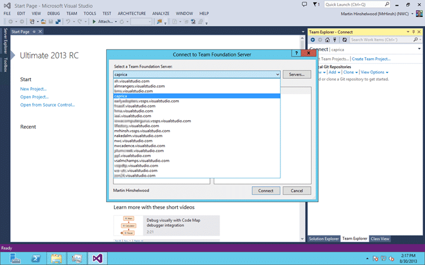
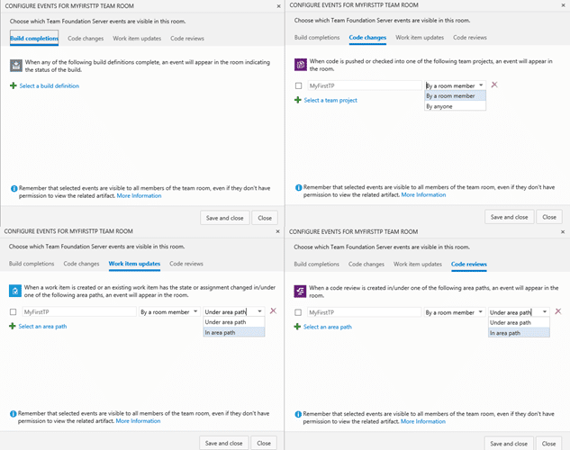
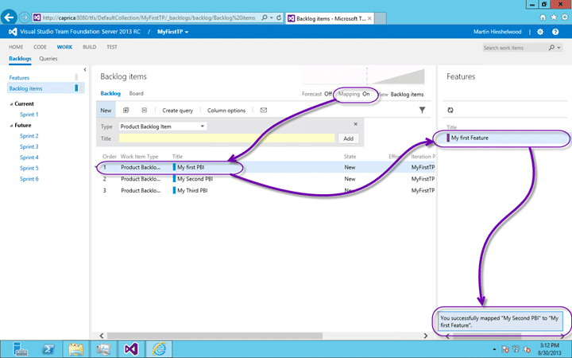
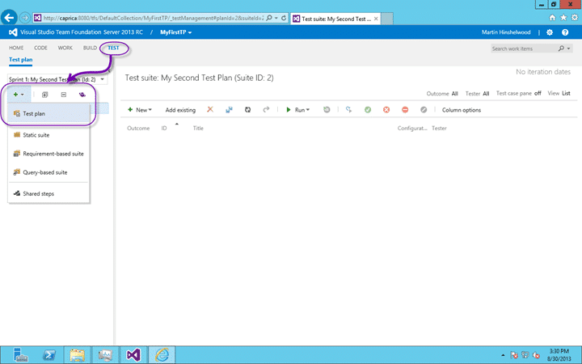
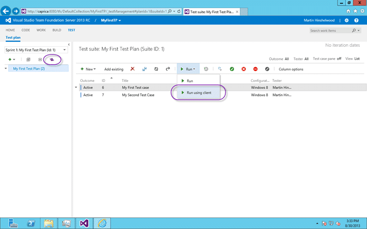

As you may have noticed the Visual Studio team has just put out a Release Candidate to the log awaited Visual Studio 2013 and TFS 2013.

If you have been [unable to install Visual Studio 2013 RC on Windows 8.1 Preview](http://nkdagility.com/unable-to-install-visual-studio-2013-rc-on-windows-8-1-preview/) then you want to immediately get to grips with the new features. I would recommend that you have a look at [What's new in Visual Studio 2013 Team Foundation Server Preview](http://nkdagility.com/get-visual-studio-2013-team-foundation-server-while-its-hot/) for two reasons. I am going to assume that you have seen the aforementioned features and it should give you some idea of the pace of features improvement you get by being on the same cadence as the TFS product team.

These are just my initial observations from conducting a little exploratory testing on features that we saw in the TFS 2013 Preview and those things that I knew and suspected were coming down the line. The best way to get a heads up is still to create an account on [http://tfs.visualstudio.com](http://tfs.visualstudio.com) as it is already ahead of the Release Candidate.

## Visual Studio 2013 Team Explorer Enhancements

There have been repeated and increasing enhancements to the Team Explorer. Some of these enhancements have been small experiments and others have been large. Some have been successful and some result is continuous change as the product team evolve things trying to meet our needs. If only every team building software would innovate as often. If like me you take the latest drop at all times you will see the bounding progression of features and enhancements. If you don’t you will see the usual big leaps.

### Visual Studio 2013 Team Explorer remembers your TFS Servers

I was surprised when I opened the connection dialog on my brand new OS with Visual Studio 2013 RC installed and saw a list of TFS servers that I recognised.

  
{ .post-img }
Figure: Visual Studio 2013 Team Explorer remembers your TFS Servers

It looks like the team has populated my list of servers with all of the instances from [http://tfs.visualstudio.com](http://tfs.visualstudio.com) that I have permission for, and that's a lot. I am not sure what happens when this list gets bigger than my screen but that's for another day. I had forgotten that I had connected to some of these servers. What would be a nice enhancement to this would be to have local servers that are synched as well. That way I can easily select local servers when I go onsite at customers.

### New Team Explorer Home page

The new layout for the Team Explorer homepage is much more flexible and has way better extension points.

  
{ .post-img }
Figure: The new Team Explorer in 2013

Again we have the context of a single Team Project. While administrators may have preferred the old tree view users found it confusing and slow. The new interface added with 2012 has been streamlined and enhanced with a years worth of usability data.

### The Project Section

The project session is topped with a set of useful links:

- **Configure Workspace** – This takes you to the the configuration page for the Workspaces that you have associated with your Team Project.
- **Web Portal** – The Web Portal is THE way to access and work with much of the data in TFS 2013. Even more than in 2010 and in 2012 as we now have Test management right there in the web. In addition to Test Case management there are hubs for Agile Planning, Agile Portfolio Management, Work Item Tracking, Build Management, Code Management and now Reporting.
- **Task Board** – Part of the Agile Planning Tools feature that was introduced in TFS 2012 the Task Board provides you a Scrum style board where Requirement types sit on the left and tasks flow through states associated with the Requirement from left to right. Typical states are To-do –> Doing –> Done.
- **Team Room** – Each Team gets their own persistent chat and notification room where users can interact and be notified of Builds and work item changes dynamically. Way better than email.

Although Web Access is now the preferred way to access much of the data in TFS that does not mean that there are no other options. The following sections have been incrementally updated individually but here each of the important nodes use a flow layout so that they are just as accessible regardless of the size of the window. They are each subtly colour coded but the new piece is that many of them have a little ellipse in the bottom right of the button \\ panel. If you click the ellipse you you get a drop down of menu options for that feature. Indeed these panels dynamically change depending on which source control you selected when you created your Team Project. TFS 2013 supports both TFVC and Git.

- **My Work** – The My Work section gives you access to the up level features like Code Reviews, Suspend Resume and Task switching and focus features that you need to be on Premium or ultimate SKU’s to get. Few of these features yet work of your pick Git as your source control.
- **Pending Changes** – A new view on the standard pending changes with a docked panel instead of a floating model dialog. You can now break it out of the UI and stick it anywhere you want.
- **Source Control Explorer** – Only available for TFVC projects this gives you folder and branch access to your code. I have yet to delve into that UI
- **Work Items** – Gives you access to the standard tree of queries. You can create flat, dependant or tree queries that show whatever columns that you like. There are some Team Explorer only features like opening queries in Excel or MS Project and turning Queries into reports.
- **Build** – Want continuous delivery? This is your stop. Create both compilation, test and deployment builds that execute on demand, timed or triggered. A special feature added way back in 2010 allows you to pre-moderate your builds which lets you build first and reject check-ins for failed builds.
- **Reports** – Your gateway to the Reporting Services reports that are available for your Process Template
- **Settings** – The new settings page now seams like a Launchpad for the Web Portal. I will not miss those model dialog boxes….more power to the web…

These same features, well mostly, are available in Eclipse as well.

### The Solution Section

The solution section, new in 2013, is awesome. It looks at the scope of your currently selected Workspace and lists all of the Solutions available in Source Control to open. Here I have nothing in source yet and I don’t have my workspace configured. I do believe that there is a limit to the number of solutions that will be listed, but I am not sure what that it.

## Visual Studio 2013 Team Foundation Server Enhances

While the new features in Visual Studio are awesome I sometimes forget what they look like these days. Apart from the projects that I work on myself with the other MVP’s, the Rangers and just for fun I rarely get to play in Visual Studio. (sniff)I do miss it, they even (shock) have me coding in c# these days, but I never stop complaining about that.

So where do I play, well… sometimes in PowerShell but mostly in Team Foundation Server when I am doing technical stuff. Helping teams and organisations improve their processes is mostly not about tools. However when I need a tool I always turn to TFS. As the TFS Product Team are moving more and more towards agile themselves the product itself is getting better and better at delivering value in the agile space. Although there are many features that are based on reportability that is no longer the focus of the team and the new features concentrate on making your development process as slick as possible.

### Team Rooms

Team Rooms are brand new in TFS 2013 and provide a kina cross between email notifications and persistent chat.

You can configure notification for various things including Build results and work item changes. The results pop into the window with a little ‘ding’ for other to be notified. If you are unable to get everyone in a physical team room then this is the next best thing. Those of you out there thinking ‘what's the use of that crap’ should give it a try. Find it valuable or don’t as you like but the ability to chat and tag work items just by mentioning #2354 or a person with the usual @Youname mechanism makes the experience much more interactive.

  
{ .post-img }
Figure: Configure events for Team Rooms in 2013

I am looking forward to innovations and experiments here.

### Agile Portfolio Management Enhancements

When I looked at [What's new in Visual Studio 2013 Team Foundation Server Preview](http://nkdagility.com/get-visual-studio-2013-team-foundation-server-while-its-hot/) I spent a lot of time on the Agile Portfolio Management features and even created a [video walkthrough](http://nkdagility.com/video-new-with-visual-studio-2013-manage-portfolio-backlogs-to-understand-the-scope-of-work/). Here I just want to go back and visit some of the areas that  have been improved.

  
{ .post-img }
Figure: Backlog View Pick list

First up is that pick list list that lets you ‘look up’ and ‘look down’. In the earlier version it was not colour coded, it did not have the current level first and the text was just the name of the Work Item in question. The new list is eminently more usable and understandable. Here we get more context; we get the colour of the work item type that we can subconsciously relate. There is also a subtle separator between the ‘current view’ and the alternative views. It was previously easy to forget which level you were at and thus where one had to go to get back to the orderable view. We had the ‘Backlog Items’ highlight on the left, but we had to look way the other side of the screen to figure it out. Now we can easily see where we are and where we are looking. Even the addition of the simple “to \[other work item type\]” test gives us much more of that context.

This to me is an embodiment of a small simple but extremely valuable enhancement to an existing feature that is only really valuable in short release cycles. In a long cycle it would never make it above the cut line.

  
{ .post-img }
Figure: Subtle directional chevron on Backlogs

If you do select another option, in this case I am looking up from ‘Backlog items to Features’ you get a subtle indication on the left as well as to where you are. The little colour coded chevron for "’Backlog items’ narrows at the top to signify that we are looking up. This gives other side of the screen the same information in a subtle enough manor as to not interrupt or clutter the display, but still conveying necessary information.

### Mapping from Backlog Items to Features

Another incremental improvement is the ability to easily associate backlog Items with Feature (or whatever you have above the backlog that you are viewing).

  
{ .post-img }
Figure: Mapping from Backlog to Parent

Here we can turn on Mapping and a list of the parent items are listed on the right. You can then drag and drop your backlog items onto the required feature to create the associations that you want. This makes it way easier and more intuitive to work with the hierarchy.

### Charting from Queries

One of the awesome features in TFS in the reporting, even if it is just incidental reporting when you are not actively trying to get traceability. In Visual Studio you can right click on a Query and select “Generate Report”. This feature would look at the fields that were available on the query and determine what sort of reporting was possible with those options. It would then let you build out both static and trend reporting in Excel using a macro. Well, as we move towards more of a cloud based infrastructure we need the same features but unfortunately, or fortunately, there is no Analysis Services in Azure. So what can we do?

  
{ .post-img }
Figure: Static Analysis reports in TFS 2013

The product team in superb incremental style have implemented the easy part first; Static Charting. They have created the ability to add charts to you query. To find the options head over to your work item queries and when you select a query you will note an extra tab added to the UI. Where we had only Results and Edit we now get Charts. Once on the charts tab you can create a new chart and select the chart type:

- Pie
- Bar
- Column
- Stacked bar
- Pivot table

While this will never have parity with Excel there is much more value in this being just available in the UI. One you have selected your chart type you get to give it a name and then customise the data displayed. You need to first select the Grouping. This is the field (dimension) that you want to display the data by. After that you select the values (metric) to display.  I don’t hold out hopes for getting trend analysis by RTM of 2013 but if we are lucky some future sprint will bring that functionality.

  
{ .post-img }
Figure: Adding lots of charts

You can go ahead and add a bunch of charts giving you different views of the same data and creating a dashboard based on your query data. I love this option…

### Multi-reorder of Column Options

As I was clicking through I notices a little nugget that I have no idea when it was added.

  
{ .post-img }
Figure:

Maybe this was added in 2012 and I never noticed but you can, when ordering columns, select multiple columns and change their order together. I don;t know how many times I have moved each one individually and I hope this is a new feature if only to save face…

### Creating Test Plans from the Web Portal

Although web based Testing was added in one of the updates to 2012 there were some serious limitations. We could not create Test Plans and needed to jump into MTM to perform many of those tasks.

  
{ .post-img }
Figure: Creating Test Plans from the Web Portal

Now with 2013 you can create a Test Plan directly in the web UI. You can add a name and configure the Area Path and Iteration Path that is relevant. If you want to edit the Test Plan you have to jump into MTM but the team have added a little bottom on the far right off the highlight above to jump strait to that page in the application.

### Create Test Cases in a Grid view

Power users of Microsoft Test Manager have always called for productivity improvements. They were always used to working in Excel before MTM came along and some things are just easier there. Well the MTM team has been listening and they have added some new features to the web to make things easier.

  
{ .post-img }
Figure: Create test Cases in Grid View

You can now create Test Cases just like you once did in Excel. You can modify and add new at the same time and save as you go along. If you use to, or currently, create Test Cases in Excel and then port them to MTM you can now copy and paste them into here and save.

### Open the Test Plan or Run Test in Microsoft Test Manager Client from Web

The last feature I want to highlight is the “Run using client” bottom that sends the selected tests to MTM for execution.

  
{ .post-img }
Figure: Launching MTM from the Web UI

In MTM you get data collectors like Video, Intellitrace, Event Log scraping, Code Coverage and Test Impact Analysis. Sometimes you want those things and this lets you jump into the right part of MTM and back to the web access making the integration a little bit more seamless.

## Conclusion

Although I knew where some of them were, or where I expected them to exist these were just the few highlights of features that I feel that are important based on my customer engagements. There are a plethora of features in Visual Studio like Code Sense (kind of a heads up display for coding) that go to ALM productivity but I have not yet used them.

Remember that [Team Foundation Server 2013 is production ready](http://nkdagility.com/team-foundation-server-2013-is-production-ready/).

If you have the Preview you should upgrade and anyone on 2010or 2012 should seriously consider the features available. Remember also that you can still use VS 2010 and VS 2012 with TFS 2013.

Originally posted on The Microsoft Award Program Blog as Visual Studio 2013 RC Released ([source](http://blogs.msdn.com/b/mvpawardprogram/archive/2013/09/09/visual-studio-2013-rc-released.aspx))
