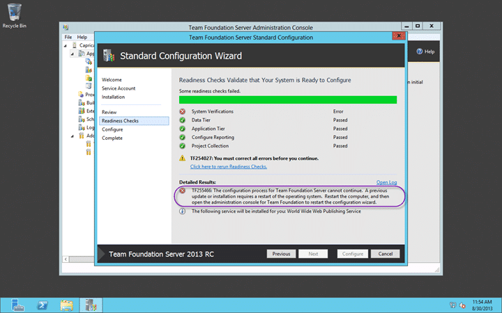
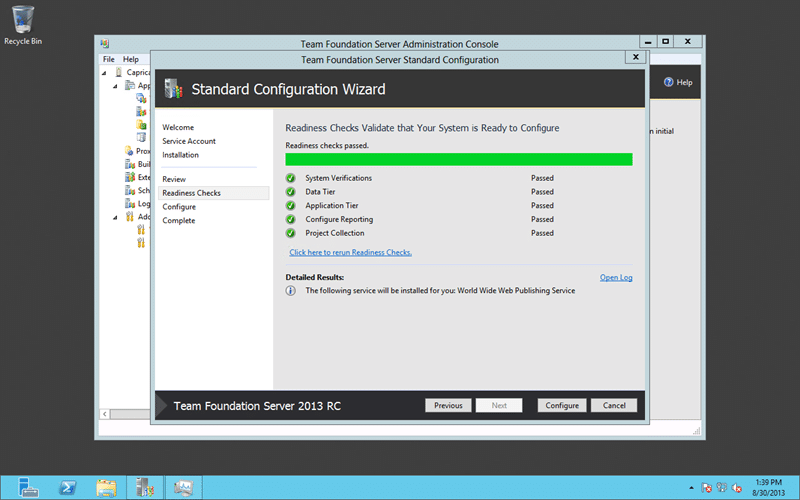

After you have installed SQL Server 2012 Service Pack 1 you may encounter the error “TF255466 A previous update or installation requires a restart” when trying to install TFS 2013.

Even if you install all Windows Updates and reboot you continue to get this message.

MANDATORY SP1 Hotfix _SP1 installations are currently experiencing an issue in certain configurations as described in Knowledge Base article [KB2793634](http://support.microsoft.com/kb/2793634). The article provides a fix for this issue that is currently available for download, and is MANDATORY for application immediately following a Service Pack 1 installation. The fix is also being made available on Microsoft Update._

  
{ .post-img }
Figure: TF255466 A previous update or installation requires a restart

Even if you reboot untill you are pounding on the keyboard....

## Applies to

- Visual Studio 2013 Team Foundation Server Preview
- Visual Studio 2013 Team Foundation Server RC

## Findings

No matter what you do this error continues to occur whenever you try an install TFS 2013. If you have a look at the log you should see that a “PendingFileRenameOperations” flag has been set and does not want to clear.

```
[Info   @18:53:14.576] +-+-+-+-+-| Verifying that the system restart is not required |+-+-+-+-+-
[Info   @18:53:14.576] Starting Node: VPENDINGREBOOT
[Info   @18:53:14.576] NodePath : VINPUTS/Conditional/Progress/VPENDINGREBOOT
[Info   @18:53:14.577] IsPendingSxsRebootRequired() returned False
[Info   @18:53:14.577] The value 'PendingFileRenameOperations' under 'HKEY_LOCALMACHINE\SYSTEM\CurrentControlSet\Control\Session Manager' registry key is not empty
[Info   @18:53:14.577] IsSessionManagerRebootRequired(True, True) returned True
[Error  @18:53:14.577] Found a pending file operation - configuration blocked until reboot
[Info   @18:53:14.577] Node returned: Error
[Error  @18:53:14.577] TF255466: The configuration process for Team Foundation Server cannot continue.  A previous update or installation requires a restart of the operating system.  Restart the computer, and then open the administration console for Team Foundation to restart the configuration wizard.
[Info   @18:53:14.577] Completed NoPendingReboots: Error
[Info   @18:53:14.577] -----------------------------------------------------
```

This is normally cleared when you do a reboot as whatever actions can be taken then. This can continue to happen with a newly installed copy of Windows Server 2012 due to the volume of updates that are available. Effectively every time you reboot it can start installing updates immediately. If this is the case then you can wait until all of the Updates are finished or you can stop the Windows Update service temporarily to get things done.

## Solution: Non Security Update for SQL Server 2012 SP1

However there was a bug with SQL Server 2012 where the [Windows Installer starts repeatedly after you install SQL Server 2012 SP1](http://support.microsoft.com/kb/2793634). Basically there is a mismatch of the version of a file that is installed and the SQL Server installer keep trying to fix it. Thus resulting in a permanent loop of pending reboots…

  
{ .post-img }
Figure: Windows Installer starts repeatedly after you install SQL Server 2012 SP1

If think this is the issue you can head on over here and download the [Non Security Update for SQL Server 2012 SP1 (KB2793634)](http://www.microsoft.com/en-us/download/details.aspx?id=36215) to fix it.

  
{ .post-img }
Figure: All readiness checks complete

For me this fixed my issue…
