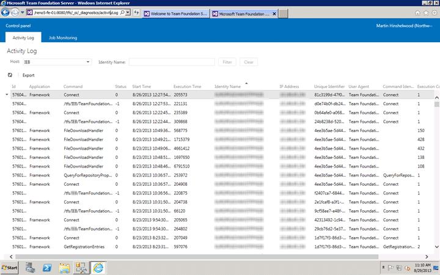
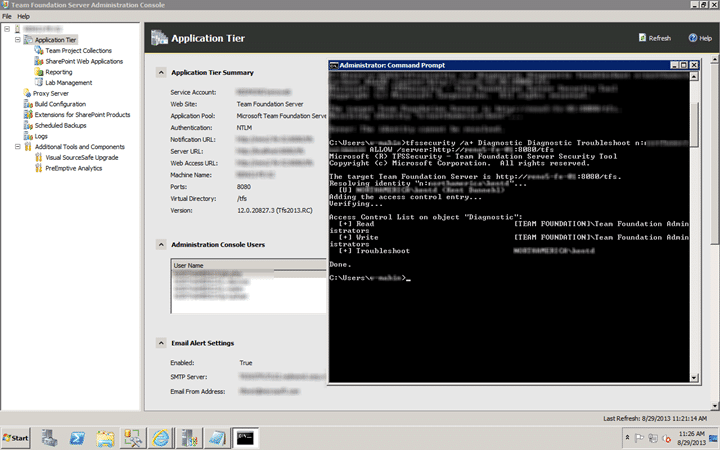

In TFS 2012 the product team added a way to get to the tbl_Command information without needing to connect directly to the SQL Server and having access to the tables. This was an awesome add as being able to diagnose server issues and troubleshoot user reported problems makes us a little more efficient.

  
{ .post-img }
Figure: Viewing the diagnostic activity logs for troubleshooting

However I had always had to give access by adding the user to the “Team Foundation Administrators” group which is a little too much power just to do a little diagnostic spelunking… so my question is:

How do I give permission to the Activity Log without giving TFS Administrator?

Well, it looks like the command line has the answer. Although there is no representative entry in the GUI to give permission for a user only to the diagnostic troubleshooting page you can grant it explicitly:

```
tfssecurity /a+ Diagnostic Diagnostic Troubleshoot n:domain\username ALLOW /server:http://tfsserver:8080

```

This gives that group explicit access.

  
{ .post-img }
Figure: Use the command line to grant diagnostic troubleshooting permission

What might be a better and more manageable solution would be to create a group called “Team Foundation Troubleshooters” and instead grant that group permission to that access control. This is done in exactly the same way, you just need to replace the domain account with the TFS Group.
