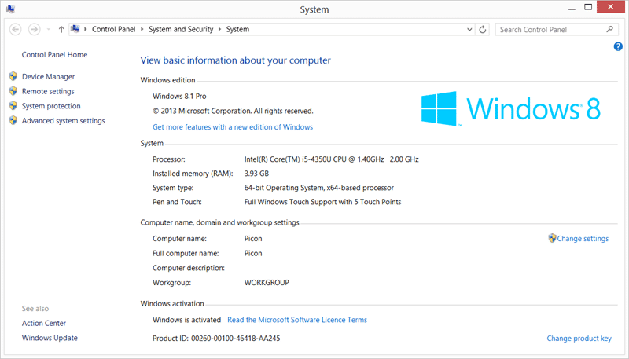

Now that I have had two months with the Intel Haswell Harris Beach SDS Ultrabook I thought that it would be a good idea to give you an update. You can check out Part #1 & #2 below however in this post I want to concentrate on Windows 8.1 with the SDS.

- [Review Part 1: Harris Beach SDS Ultrabook from Intel with Haswell](http://nkdagility.com/review-harris-beach-sds-ultrabook-from-intel-unboxing/)
- [Review Part 2: Developing with Intel Haswell Harris Beach SDS Ultrabook](http://nkdagility.com/review-developing-intel-haswell-harris-beach-sds-ultrabook/)
- Review Part 3: Two Months with Intel Haswell Harris Beach SDS Ultrabook

As you might have noticed from Part #1 I had a whole bunch of issues with Windows 8.1 and the drivers for this model. This is not surprising due to the prototype nature of this laptop but the team at Intel have been hard at work making it work and a few days ago they release a new set of drivers. I was really… hesitant… to again try 8.1 on this laptop but I am a glutton for punishment so…

  
{ .post-img }
Figure: Windows 8.1 System

… it looks like they have solved all of my main issues. They were mainly power and screen based which is detrimental for this sort of laptop. With the old 8.1 drivers I could close the lid and have the the system boot, overheat and the battery drain in my bag. Not good… The only thing that is still a little wired is that on Chrome my gestures end up not where my finger is. Meh… it will get fixed eventually and Internet Explorer with touch is way better than Chrome anyway (If you install the Canary version of Chrome the touch works.)

I have been running Visual Studio 2013 and TFS 2013 on this laptop with no performance issues what so ever. Its slick… I especially like the battery life. When the driver gods are smiling I get a good 6-7 hours of use and as I spend a lot of time traveling without power this is just awesome. I have a Dell M6600 but the battery only lasts for 45 minutes and to be honest its too big to open the lid on a plane anywhere but first class.

  
{ .post-img }
Figure: Visual Studio 2013 on Windows 8.1

Although I have been working with this laptop for a few months I have done very little development and have instead be working extensively on it in Windows Live Writer, Word, Outlook and a little bit of Visual Studio. Almost all of my blog posts in the last few months have been written on this laptop. I also walk a lot and, instead of wondering, I like to have a goal. So I take this laptop and head out for the day to Redmond City Centre or to the Family Pancake House down the road to write blog posts and work on my Book. And you know what… I have never had to worry about the battery, or cut my blogging sessions short. The Haswell chipset provides the power and longevity that I need.

I have also used it on a few engagements where I don’t need virtual machines to get the job done. Oh… don’t get me wrong, this Haswell laptop could handle the VM’s its just that I only have 4GB or RAM and my TFS VM’s need at least 5GB to run effectively… hence why I have the M6600 with 24GB RAM.

If I was looking for a laptop to really work on I would likely go with the top spec Lenovo Helix with a Haswell processor. This would give me i7, 8GB RAM and the hybrid capability to transform it into a tablet. That would replace my actual tablet  (Acer Ionia W520) and this computer in one. However as money does not yet grow on trees this awesome Haswell developer platform will serve the same purpose admirably.

Disclosure of Material Connection: I received one or more of the products or services mentioned above for free in the hope that I would mention it on my blog. Regardless, I only recommend products or services I use personally and believe my readers will enjoy. I am disclosing this in accordance with the Federal Trade Commission’s 16 CFR, Part 255: “[Guides Concerning the Use of Endorsements and Testimonials in Advertising](http://www.access.gpo.gov/nara/cfr/waisidx_03/16cfr255_03.html).”
