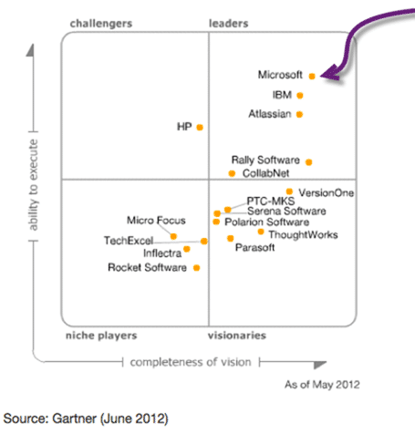

Microsoft just made both Visual Studio 2013 and Windows 8.1 available for download on MSDN and on [http://visualstudio.com](http://visualstudio.com). This release includes [Visual Studio 2013, .NET 4.5.1, and Team Foundation Server 2013](http://go.microsoft.com/fwlink/p/?LinkId=306566) as well as making [Windows 8.1 available on Windows Update](http://blogs.windows.com/windows/b/bloggingwindows/archive/2013/10/17/windows-8-1-now-available.aspx).

Although the launch event will not be until November 13th in New York this is certainly plenty to be getting on with. I have been using Visual Studio for many years and Visual Studio 2013 exclusively for more than 6 months in one pre-release flavoured or another. It is by far the most powerful IDE platform available and Team Foundation Server is the most integrated and best ALM platform available today.

- Update If you have an MSDN Subscription then you already have a licence for VS 2013. If you just have Visual Studio Pro you can [upgrade for $99](http://www.microsoft.com/visualstudio/eng/buy), for a limited time.

  
Figure: Gartner Magic Quadrant

With what Visual Studio & TFS 2013 bring to Visual Studio ALM I don’t see this changing any time soon.

### What's new in the Visual Studio 2013 & TFS 2013 RTM

I have extensive posts on [What’s new in Visual Studio 2013 RC with Team Foundation Server](http://nkdagility.com/whats-new-in-visual-studio-2013-rc-with-team-foundation-server/) and [What’s new in Visual Studio 2013 Team Foundation Server Preview](http://nkdagility.com/get-visual-studio-2013-team-foundation-server-while-its-hot/) that cover these topics very well. Indeed I even did a video on [manage portfolio backlogs to understand the scope of work](http://nkdagility.com/video-new-with-visual-studio-2013-manage-portfolio-backlogs-to-understand-the-scope-of-work/). There are not any additional features in the RTM on-premises so these posts are still good illustrations of what is available.

Ever since the Preview [Team Foundation Server 2013 has been production ready](http://nkdagility.com/team-foundation-server-2013-is-production-ready/) with the TFS product team providing a go-live licence (providing production support and upgrades) but now with the general availability there is no excuse for being on anything less than 2013 RTM. Well, there is one excuse: As the web access no longer supports IE8 you need a minimum of IE9…

So far I have done 8 upgrades for customers in production with TFS 2013 and already have 2 customers running on the RTM. As I have been spending so much time on the sharp end of the stick I have not had as much time as I would like to write posts on my experiences, but here are the few I have managed to crank our on TFS 2013:

### New and Improved

- [What’s new in Visual Studio 2013 RC with Team Foundation Server](http://nkdagility.com/whats-new-in-visual-studio-2013-rc-with-team-foundation-server/)
- [What’s new in Visual Studio 2013 Team Foundation Server Preview](http://nkdagility.com/get-visual-studio-2013-team-foundation-server-while-its-hot/)
- [Team Foundation Server 2013 has been production ready](http://nkdagility.com/team-foundation-server-2013-is-production-ready/)

### Tools and Techniques

- [Create a Portfolio Backlog hierarchy in Team Foundation Server 2013](http://nkdagility.com/create-a-portfolio-backlog-hierarchy-in-team-foundation-server-2013/)
- [Modelling Teams in Team Foundation Server 2013](http://nkdagility.com/modelling-teams-in-team-foundation-server-2013/)
- [Quality enablement with Visual Studio 2012](http://nkdagility.com/quality-enablement-with-visual-studio-2012/)

### Code and Complexity

- [PowerShell TFS 2013 API #1 – Get TfsCollection and TFS Services](http://nkdagility.com/powershell-tfs-2013-api-1-get-tfscollection-and-tfs-services/)
- [Customise the colours in Team Foundation Server 2013 Agile Planning Tools](http://nkdagility.com/customise-the-colours-in-team-foundation-server-2013-agile-planning-tools/)

### Install and Configuration

- [Engaging with complexity – Team Foundation Server Edition](http://nkdagility.com/engaging-with-complexity-team-foundation-server-edition/)
- [Issue \[ TFS 2013 \] TF50309 when configuring features in Team Foundation Server 2013](http://nkdagility.com/issue-tfs-2013-tf50309-when-configuring-features-in-team-foundation-server-2013/)
- [Configure features in Team Foundation Server 2013](http://nkdagility.com/configure-features-in-team-foundation-server-2013/)
- [Installing Visual Studio 2013 on Server 2012](http://nkdagility.com/installing-visual-studio-2013-on-server-2012/)
- [Upgrading to Visual Studio Scrum 3.0 process template in TFS 2013](http://nkdagility.com/upgrading-to-visual-studio-scrum-3-0-process-template-in-tfs-2013/)
- [Unable to install Visual Studio 2013 RC on Windows 8.1 Preview](http://nkdagility.com/unable-to-install-visual-studio-2013-rc-on-windows-8-1-preview/)
- [Integrate SharePoint 2013 with Team Foundation Server 2013](http://nkdagility.com/integrate-sharepoint-2013-with-team-foundation-server-2013/)
- [Upgrading to Team Foundation Server 2013](http://nkdagility.com/upgrading-to-team-foundation-server-2013/)
- [Upgrading from the TFS 2013 Preview to TFS 2013 RC](http://nkdagility.com/upgrading-from-the-tfs-2013-preview-to-tfs-2013-rc/)

I have literally had two issues in ~8 installations, neither of which were of any real import and are described in the posts above. I have had no problems recommending  the upgrade, even to the preview, for even the most conservative of customers. That does not mean that they always listened, but now that the RTM is released I have upgrades to do and I expect many more to come over the next year…

