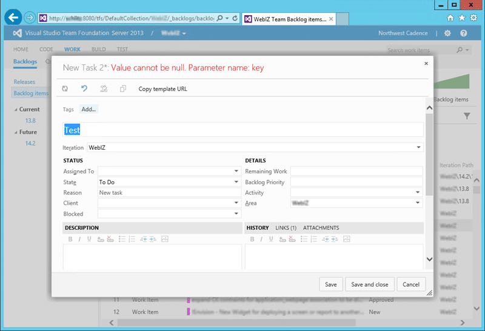

When customising your process template work item tracking gives you an “ArgumentNullException: Value cannot be null. Parameter name: key” exception with no more details.

I have been onsite at a customer creating a custom processes template and migrating their current data into the new format. Because they make extensive use of Area Path for documentation purposes we could not use it for Team. So I dutifully configured their [TFS for ‘team field’](http://nkdagility.com/team-foundation-server-2012-teams-without-areas/) as their client field so that they could create ‘teams’ that represent the work that is done for each client. All looked good for a few hours until the tester tried to edit one of their old work item; 2663.

   
{ .post-img }
Figure: Team Foundation Error: the server operation failed.

At first I though that it was just an isolated issue, so I popped an email off to the product team with this odd error and wen back to my other deliverables. Then this error occurred under other circumstances.

  
{ .post-img }
Figure: Value cannot be null. Parameter name: key

When one of the team was creating sub tasks of an existing work item using the “Tasks” tab on the PBI or Bug then this is what happened. I was then again able to replicate the issue, but only when creating sub work item’s from an existing one. If I used the Agile Planning Tools and clicked the green plus then it would work, wired. I let the product team know and they decided a remote debugging session would be required…

The first thing that they did, which I did not know was even there, was to do a fiddler like session in Internet Explorer.

  
{ .post-img }
Figure: Network diagnostics with Internet Explorer

If you hit F12 to open the developer tools and look for the little router icon on the left. This then has the play/stop that you would expect from a traffic monitor and we can then enable it and try to save the work item. This resulted in a 500 server error and that, if you did not know already, is not a good thing. This immediately made it some sort of bug as that should never be able to happen. However it did and they needed to investigate more…

I gave up control so that could enable some ninja trace capabilities of TFS no I will not be telling you how, and they checked a log of every method enter and every method leave that was recorded as a result. Listening over Lync I overheard a bunch of folks poking at the the event log on my customers server and matching it up to source code I could not see. There was lost of “now we are in this method” and “but there is nothing that can bang there”. At one point the awesome Dennis Habib asked me…

“um… is this team project using Team Field?”

At that point Dennis, Zhenyuan Zhao and Ahmet Akkas, who were scouring the source code, knew exactly what the problem was. As it turns out there is a bugs on the server that effectively assume that you have a value for Team on the work item. Now if you are using the out-of-the-box Area Path for Team then it can never be null and it looks like the code assumed that. But when you use Team Field it can be blank.

There is however an easy fix that can be applied client side to make sure that the field is never null, you can make the field required in the work item definitions. I made the change and the problem was solved.

Obviously there is a server side coding assumption, which is bad, but there is also a UI issue. If you use the Agile Planning tools to create Work Items or child items then it populated the Team that you are currently running as. However if you just open a work item and add a child link, or use the “task” tab it does not. This can be replicated in both the Web and Visual Studio UI and I hope it gets updated to understand the context.

## Conclusion

If you are using Team Field then you need to make sure that you make the field that you use for it a required field in the work item definition. Don’t make my mistake and end up scratching your and the product teams head trying to figure it out.
