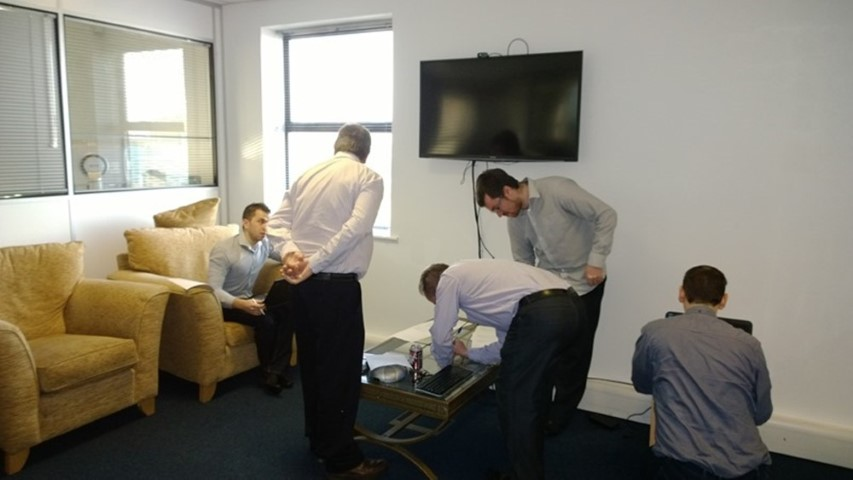
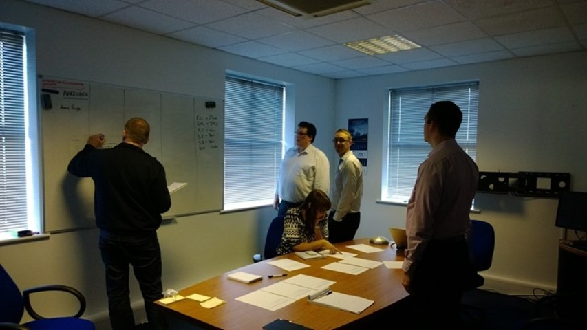
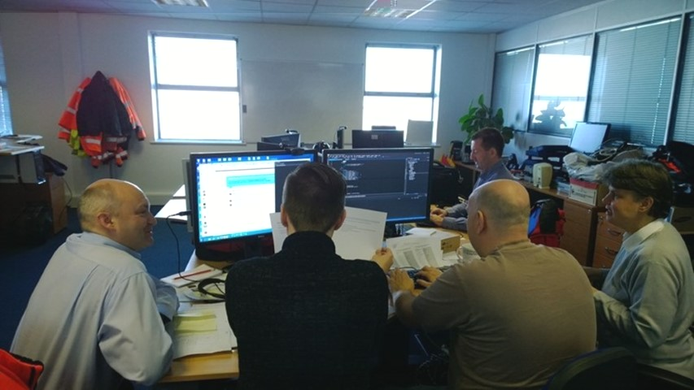
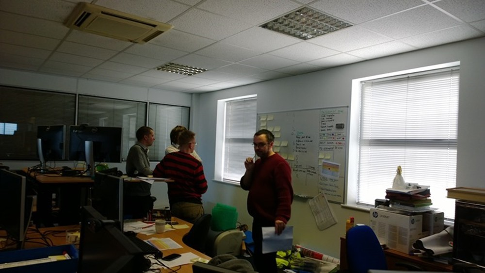
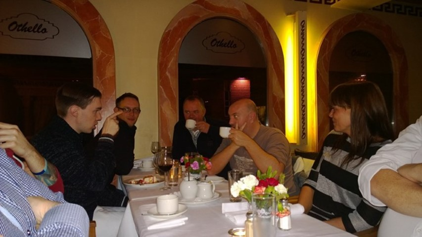

As my first engagement as naked ALM Consulting in the UK I got to work with the fantastic team at DFDS Seaways and teach the Professional Scrum course from Scrum.org.

DFDS Seaways is an organisation that runs ports across Europe and for the PSF training we had folks traveling in from Norway, Sweden and Denmark. We had about 4 physical teams represented, some of which were distributed, and having them all in the one place was unusual.

  
{ .post-img }
Figure: DFDS Seaways teams getting organised

If you work in American you will notice that there are no cubes in the office. In Europe cubes are fairly rare, to the point I have not encountered them, and most organisation have desks organised in little pods of four or so people. As you can imagine this is a little more cognisant of collocated teams, but I did mention that these guys were distributed.

  
{ .post-img }
Figure: Tasmanian devil

If you plan of having your teams participate in team based Scrum training like the Professional Scrum course from Scrum.org then you should consider getting everyone together for one large course (30 max.) This allows all of your teams, or as many as you can get into a room to get value from interacting with each other and cross skilling.

  
{ .post-img }
Figure: Aardvark team working together

With so many usually distributed folks from so many teams I asked them to 'self-organise' into teams of 5-6 with instructions to try and find folks that they did not know and had not worked with before. Here we have Brits and Sweed's working together to understand the backlog…

  
{ .post-img }
Figure: Team Badger figuring out the requirements

One of the huge advantages to co-located teams is that they can work together, and in high-performing teams 'swarm' to solve problems. The Badger team was a good example of that with representatives of two teams from Norway, Netherlands and Britain. Even better, they had representatives from the business who were not in any way technical. Effectively folks that were product owners and stakeholders. There is a lot of value for these types of folks to attend as both sides of the fence learn something.

The Development Team learns how to work with the business and starts to understand, thorough conversation and questions from the business, what is actually important to them.

The Stakeholders and Product Owners learn how valuable their interactions with the Development Team are and start to get an idea of the amount of information that they need to provide to be successful.

  
{ .post-img }
Figure: Team Squirrel looking for direction

The guys at DFDS have been doing Scrum for over 9 months, however this was their first formal training. It was interesting to see which teams picked up the practices more quickly. Indeed the fact that we had 5 teams all working independently on the same work helped those that thought some of the practices, like daily Scrum's, visual boards, and retrospectives provided value. By the end of the first day there was significant improvement in the teams understanding of the framework, and more importantly their ability to orchestrate the delivery of value in a short period of time.

  
{ .post-img }
Figure: Greek dinner with the multi-national group

After a long two days training and interacting the entire group got together for a well-earned meal and interaction. The software teams at DFDS were some of the most capable that I have worked with and their camaraderie was intense. I got a lot of value in training them and it was very refreshing to teach Europeans rather than Americans. There are many cultural differences with language being just one…

I really enjoyed my time with DFDS and hopefully they enjoyed the course as well.
