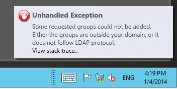
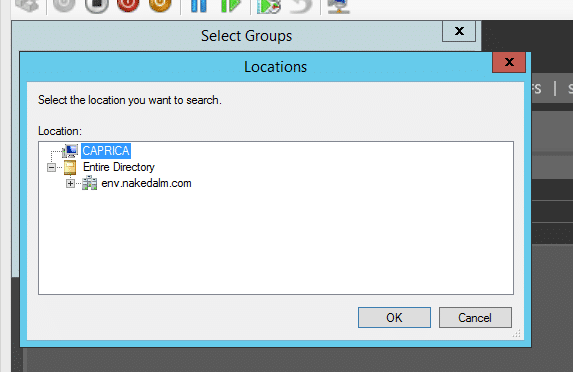
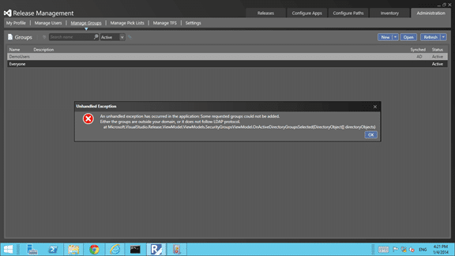
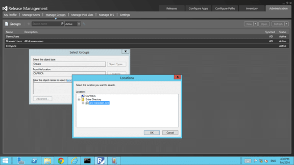

When you try to add a group from Active Directory in the Release Management Client in Visual Studio 2013 you get an unhandled exception.

When trying to add an Active Directory group to release management the other day I saw a little popup after adding the group that disappeared too quickly to action. I noticed that the group that I was trying to add did not end up in the list so I gave it another go.

  
{ .post-img }
Figure: Some requested groups could not be added

> An unhandled exception has occurred in the application: Some requested groups could not be added. Either the groups are outside your domain, or it does not follow the LDAP protocol.

### Applies to

- Release Management Client for Visual Studio 2013

### Findings

The first annoying thing is the poor implementation of the error alerts. The toast notification is very time limited and there is no way to get top a list of errors that I can see. If you miss it its gone...

I tried adding different groups to make sure it was not an AD issue with that group and the error persisted. I don't have multiple Active Directory implementations so I can't try other configurations but it looks to be consistent. When you click "Administration | Manage Groups | New | New from AD" the "Select Groups" box initially has the local computer selected rather than the domain.

  
{ .post-img }
Figure: New from Active Directory

Under normal circumstances you would select "Entire Directory" and enter the entire or partial name of the group, in this case "Domain Users".

Note: Never actually use Domain Users in a production system. I know that I only have 20 or so users in my entire AD system as it is only for testing. TFS has a limit of around 5k users, however I do not know what the Release Management Client has been tested to.

  
{ .post-img }
Figure: Select the scope of the directory search

However if you have "Entire Directory" selected the result will be the Untangled Exception identified above. If you click "View Stack Trace" on that exception then you get the following details.

  
{ .post-img }
Figure: Some requested groups could not be added

> An unhandled exception has occurred in the application: Some requested groups could not be added. Either the groups are outside your domain, or it does not follow the LDAP protocol.

Obviously this is incorrect as I only selected a single group from Active Directory.

### Solution

While this is annoying and should be easy to fix in the original code it obviously slipped through the test matrix and will likely be fixed on the next release. For now you can select the individual domain instead of the "Entire Directory" option.

  
{ .post-img }
Figure: Select exact domain

In this case if I select "env.nakedalmweb.wpengine.com" as the exact domain that the group that I am trying to add exists in then the group is added with no issues.

