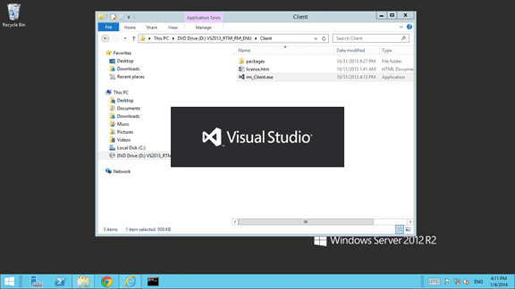
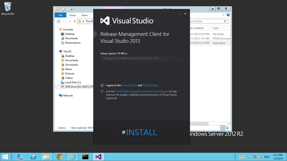
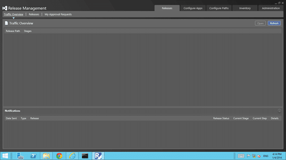

With the addition of the new Release Management Client for Visual Studio 2013 to the Visual Studio ALM roundup many folks are going to be giving it a go. If you might remember some of my post during the preview days of this tool there were some issue with installing it. It looks like Microsoft has gotten most of them sorted out and I can now get everything installed.

The Release Management Client for Visual Studio 2013 allows you to create and configure all aspects of your release pipeline. You can configure environments from servers and stages of binary promotion with workflow and parameters for deployment at each stage to any environment.

  
{ .post-img }
Figure: Running the installer from the ISO

You can either download the web installers from the [public website](http://www.visualstudio.com/en-us/downloads) or you can download the ISO from MSDN if you have an account. If you go with the pubic downloads you will need an active internet connection. If however you want to download the contents for later use you can use the "whatever.exe /layout" option and have the files downloaded locally for later.

  
{ .post-img }
Figure: Installing the Release Management Client

Within a few seconds you will have the client installed. It is a simple SPF application and thus this is an extremely quick install.

I like that the team managed to update the installers. With the early preview releases of Release Management, there were many issues with installation that really needed to be addresses and this was quick and painless. Like it should be.

  
{ .post-img }
Figure: Configured client

When you first launch the Release Management client you will be asked to select the server and port where you installed the server. Once you have done this the client will open easily and quickly. If you get an error at this point it is likely a communication problem between you and the server.

One thing that you should make sure of is that you add users to Release Management as soon as you can. The only user that is added initially is the account of the user that installed the server. This will be under the heading of 'Admin' in "Administration | Users". Don't get caught short and unable to access your server if you used another account to install the Server and the client.

You should now be ready to go...
