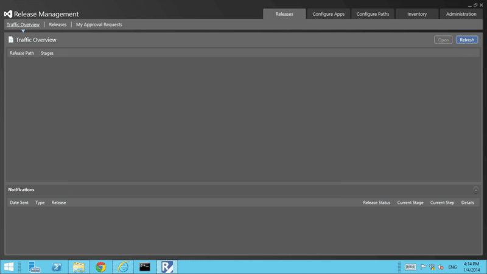
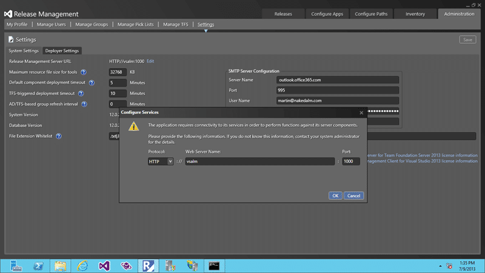
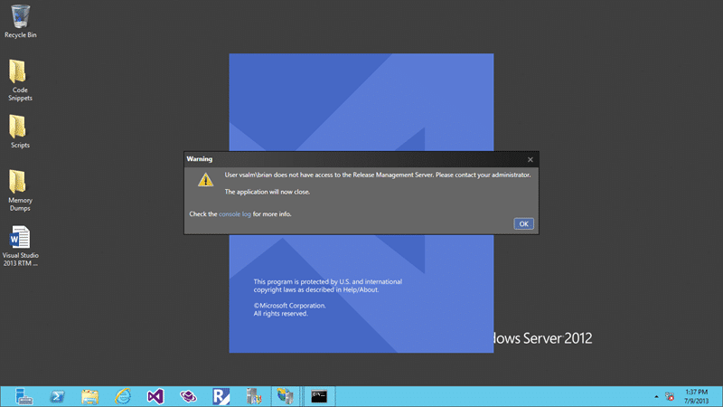

As a consultant I am onsite at a different customer every week and as I use my own laptop for most engagements I need to be able to change the Release Management Server that I connect to from the thick client.

  
{ .post-img }
Figure: The Release Management Client

The Release Management team kindly added a UI to allow us to change which server that we are connected to. Open you RM client ad head over to "Administration | Settings| System Setting" and you can then click the "Edit" button next to the current "Release Management Server URL".

  
{ .post-img }
Figure: Editing the configured Release Management Server

However if you try to open the client without being able to access that server you get an error message and you are unable to get to that screen to change the server URL. It would have been nice if it just asked us if we wanted to reconfigure and launched the original configuration dialog, however that is not the case.

  
{ .post-img }
Figure: Can't open Release Management Client with no Server available

By default the port of your RM server is 1000 but you may have changed it so you need to know both the port and the server. Unfortunately if your correct release management server is unavailable then the client will error our and close.

In order to work around this you need to change the URL that tells the Release Management Client to connect to that specifc server and it is fairly well hidden. You need to head over to the Microsoft.TeamFoundation.Release.Data.dll.config file and update it manually.

The Release Management team however have created a handy utility that may make it a little quicker. You can run ReleaseManagementConsoleAdjustConfigFile.exe and pass in both the configuration that you want to change and the configuration property along with the value.

> C:\\Program Files (x86)\\Microsoft Visual Studio 12.0\\Release Management\\bin\\ReleaseManagementConsoleAdjustConfigFile.exe –configfilename   .\\Microsoft.TeamFoundation.Release.Data.dll.config -newwebserverurl http://bvtirserverpod1:1000

In this way you can update the server when you move from site to site. If you switch between client sites often it might be useful to create batch files on your desktop for launching the client with the right connection. Just call the connection change and then launch the app. Simples...
