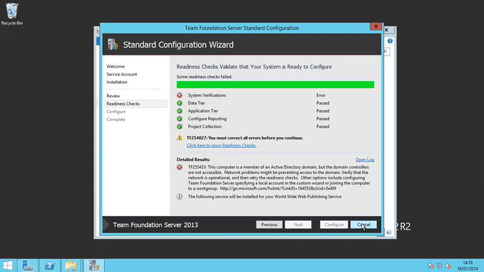

I was trying to install TFS 2013 yesterday and I found that my local demo domain was not working. After a little investigation It looks like I was running Windows Server 2012 R2 Preview and it had just expired.

  
{ .post-img }
Figure: Can’t install TFS if your domain is not working

So for the second time I had to navigate the treacherous jungle that is moving an Active Directory domain from one server to another. Changing your primary domain controller (PDC) is no simple task but if you hunt around ling enough on the internet you can pull together enough information to get it done.

\[youtube=http://www.youtube.com/watch?v=yrpAYB2yIZU\]  
Install & Configure 301 - Move your Active Directory domain to another server

Just so you don’t miss anything you need to move:

- Schema Master
- Domain Naming Master
- The relative identifier (RID) operations master
- The primary domain controller (PDC) emulator operations master
- The infrastructure operations master

And lets not forget the Global Catalogue.

The video documents my journey of moving my demo domain from one server to another and it currently looks like everything is working. Job done…

How did you get on moving your domain?
