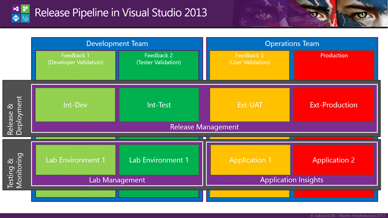
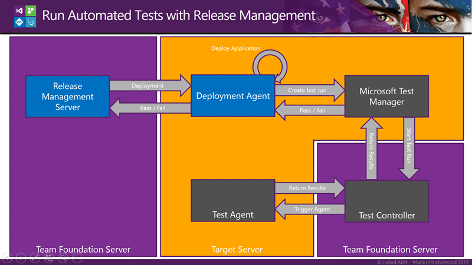
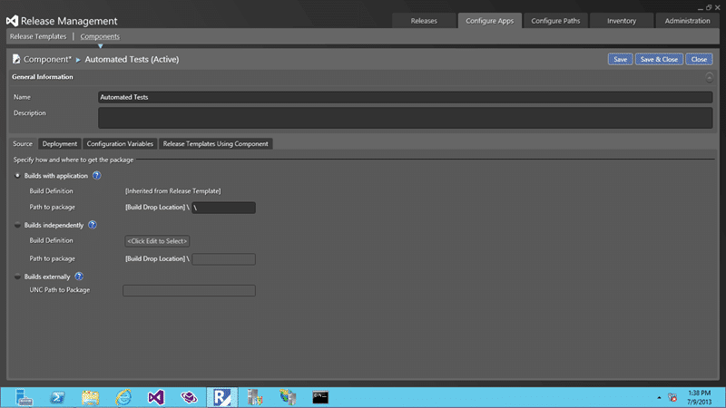
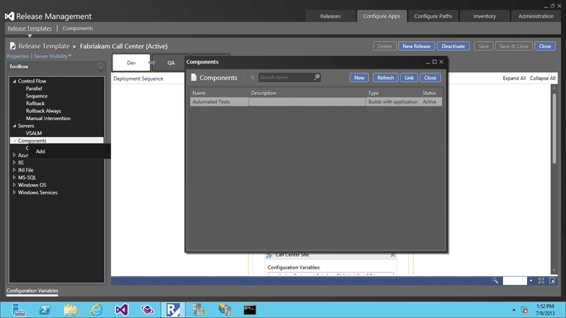

Last week I was onsite with a customer who was trying to do automated release and test with Lab Management. I showed him a better way by execute Tests with Release Management for Visual Studio 2013.

UPDATE Make sure that your build name does not contain any spaces as there is a [bug in the PowerShell script used by Release Management](http://blogs.msdn.com/b/mpeder/archive/2014/03/03/fixing-error-in-release-management-when-using-quot-mtm-automated-tests-manager-quot-build-name-restriction.aspx)

If you have ever used Lab Management to do an automated build and release you will know that you can use the DefaultLabTemplate and select an environment that has been configured in Lab Management to do a deployment to. In TFS 2010 you had to be using Hyper-V before you could do automated deployment and one of the enhancements that was added to TFS 2012 was the ability to use [Standard Environments for automated deployment and testing](http://nkdagility.com/standard-environments-for-automated-deployment-and-testing/).

While this was pretty good it was a little complicated to get working and need a little love care and attention to maintain. On top of that you had to configure environments within Lab Management and this installed 'developer tools' onto the boxes. This made it completely unusable for anything outside of a lab and we really wanted to be doing things the same all of the way through our release pipeline. I wrote a post on [Release Management in TFS 2012](http://nkdagility.com/release-management-with-team-foundation-server-2012/) in which I created a standard Nuget deployment package to unify the deployment while using Lab Management for Development and Testing environments and Octopus Deploy for UAT and Production.

This worked well but ends up being rather convoluted and does not make the best use of the features that are available in both products. With the release of Release Management for Visual Studio 2013 we get some new capabilities and greater standardisation of the process.

  
{ .post-img }
Figure: Release Pipeline in Visual Studio 2013

Back with the customer, we were trying to get the deployment, a simple Xcopy process, to work via the Lab Management tool. If you have ever tried this you will know that it is very difficult to debug and you get lots of weird stuff to deal with. If we flip over to Release Management instead for deployment we can still execute tests but we get a much easier process to debug and create. The only caveat right now is that as Release Management is a bought in tool (it was InRelease) we don’t have compatibility between Lab Management environments and those used by Release Management and we will have to duplicate. I am hoping that in a future version we can configure environments that can be used for Lab, Release or both.

So what do we have to do?

  
{ .post-img }
Figure: Running Automated Tests with Release Management

In this scenario we have to have Microsoft Test Manager (MTM) installed on the target server. It would be nice to not have to have it there but we need to be able to execute TCM.exe and for that we need MTM to be installed. Another one for the test team to look at, but really not a big deal.

Note: If your 'target server' is off domain you will need to use Shadow Accounts. That is you create accounts of the same username and password on all of the computers that need to authenticate and magically they do. There is however a bug in Release Management that means that you not only have to add the "\[rmServer\]\\localAccount" account but also the "\[targetServer\]\\localAccount" as well. All of the Shadow Accounts will need Release Manager and Service Account permissions.

So, the bit that took me a while to figure out is that as there are context specific assets associated with your tests you will need to get them down to the server under test. How this is achieved is to create a component in the Release Management Client so that the bits are specified. That is why there is no "Action" for MTM out of the box… you need a component.

Head on over to "Configure Apps | Components | New" and when you fill out the Component you should make sure that you select he root of the build directory by putting a single "\\" in the 'path to package' and you can simply name it "Automated Tests". This single component will work for any build as they will always be in the same place.

  
{ .post-img }
Figure: Creating a component for your automated tests

After that you need to set the Tool that you want to execute as "MTM Automated Tests Manager" and it will automatically populate the rest with the variables you will need. There are some customisations that you may need to do depending on what you are doing. There are some hidden options of TcmExec.ps1 and the timeout of 5 minutes might be WAY too short for you needs. Very dependent on what you are trying to do, but for your first run I would keep it simple.

  
{ .post-img }
Figure: Setting the MTM Automated Tests Manager tool

Now in "Configuration Apps | Release Templates" you need to open one of your release templates, in this case "Fabriakam Call Centre" and first add the component to your list of components and then to your workflow design surface at the point in time that you want to run the tests.

  
{ .post-img }
Figure: Adding the Automated Tests component to your Release Template

Once you have the Automated Tests component added to the sequence you can fill out the details. If you are executing this deployment as part of a build deployment then you have a few handy short cut variables to use. To get the TFS Collection and Team Project you can use $(TfsUrlWithCollection) and $(TeamProject) respectively. In addition you can get the build directory by using the $(PackageLocation) variable.

  
{ .post-img }
Figure: Configuring the Automated Tests component

One of the final variables that we need to set is that of the Test Environment that you want to execute the tests against. If you pop over to Lab Manager and create a Standard Environment, as noted above, that is actually the same environment that has been configured in Release Management you can fill out the environment name here.

Now you can have automated tests executed as part of your deployment… carry on testing.
