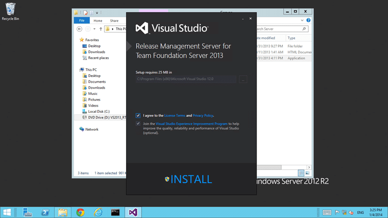
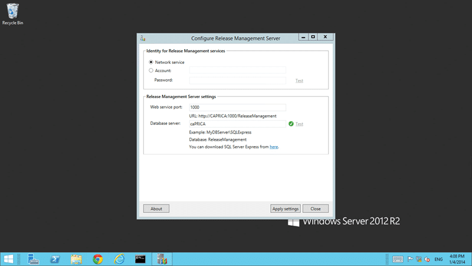
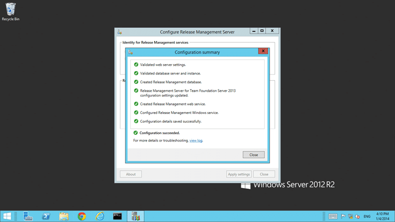

Unless you have been living under a rock you might have noticed that Microsoft has added a Release Management tool to its Visual Studio product line. I have been playing with it for a while now and I think I have it figured out. However as this is a new addition to the product it is extremely poorly documented.

I have just finished writing for the Release Management chapter in Professional Application Lifecycle Management with Visual Studio 2013 \[[Amazon USA](http://www.amazon.com/gp/product/1118836588/ref=as_li_ss_tl?ie=UTF8&camp=1789&creative=390957&creativeASIN=1118836588&linkCode=as2&tag=martinhinshe-20 "Professional Application Lifecycle Management with Visual Studio 2013 on Amazon USA") | [Amazon UK](http://www.amazon.co.uk/gp/product/1118836588/ref=as_li_ss_tl?ie=UTF8&camp=1634&creative=19450&creativeASIN=1118836588&linkCode=as2&tag=marthinssblog-21 "Professional Application Lifecycle Management with Visual Studio 2013 on Amazon UK")\] and while I covered the ALM aspects I did not really cover how to install the components. So here goes...

You can either download the individual components from [the Visual Studio site](http://www.visualstudio.com/en-us/downloads#d-release-management) or if you have an MSDN account you can download an ISO with all three applications inside.

Note: If you want to take the public download offline you can run "setup.exe /layout" and all of the components will be downloaded for offline use. Good for servers not on the internet.

  
{ .post-img }
Figure: ISO for Release Management for Visual Studio 2013

Here I am simply running the rm_server.exe in the 'Server' folder on the ISO.

  
{ .post-img }
Figure: Installing Release Management Server for Team Foundation Server 2013

Selecting the usual licence agreement the only thing of note is the size of the tool. At a mere 25MB this is a ridiculously quick install. Remember this is just putting the files on disk and registering any required DLL's and is not configuring it for use.

  
{ .post-img }
Figure: Install Release Management Server for Team Foundation Server 2013

There is little drama and it’s a small install that I think finished in just a few minutes, despite the long name :). At the end of the install you get a simple Launch button to launch the configuration tool. There is a link on the start menu as well.

  
{ .post-img }
Figure: After install you need to launch the configuration

Unfortunately as I noted with the Client tool the team has modelled the configuration on the old style Test Agent and Controller configuration rather than the more modern and featureful TFS configuration. I am hoping that this will end up as a node in the main Team Foundation Server configuration wizard. I would settle for the same configuration experience as the SharePoint extensions or Build Agents but what we have now is good enough.. Se la vie, however if it has been integrated it would likely have picked up the DB server and Ports if we were installing on our Team Foundation Server, which I believe to be the common case. Hopefully the TFS team will work on this for the next realese, or even better, in an update for 2013. For now, we are just configuring this as if it was a separate thing.

  
{ .post-img }
Figure: Configuring Release Management Server

In my configuration I am keeping the defaults. As I have the Release Management Server installed on the same server as TFS I will be unlikely have locked down communication between servers and can mostly get away with Network Service.

Note You can cheat a little here by creating an Active Directory group and adding all of the machine accounts, that how Network Service authenticates, in it. You can then give permission to that group and remove the need for passwords or password changes of service accounts across many computers.

Now all we have to do is apply the changes..

  
{ .post-img }
Figure: All Configuration tasks have completed successfully

And low… we have a Release Management Server for Team Foundation Server 2013… First configuration is a little tricky and I covered that in [Installing Release Management Client for Visual Studio 2013](http://nkdagility.com/installing-release-management-client-visual-studio-2013/)…
