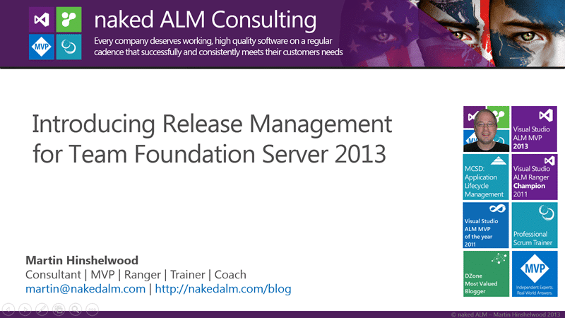
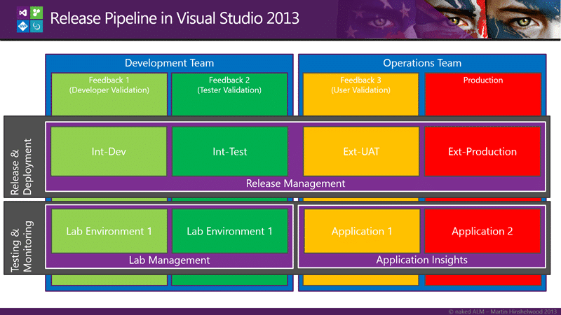

With the release of Visual Studio 2013 we now have release management built right into the product that we can use to build a scalable release pipeline. It's not perfect but it does hit the spot.

Unlike the other Application Lifecycle Management (ALM) tools on the market Visual Studio ALM actually lives up to the name. Most tools out there tend to concentrate on a single angle. Specialising in work item tracking, source control or build. Then there are tools like HP ALM or Rational that have many integrated tools within the Application Development Lifecycle Management (ADLM) world. They in effect concentrate on the development side of the process and don't look at deployment or operations. This i think is a critical gap as we bring DevOps into the fold and integrate the developers and operational work to provide better products. Indeed many of the most successful products out there were developed by the same folk that support it. Why do they continue to be successful? When there is no one else to blame for the mess you end up just cleaning it up.

  
{ .post-img }
Figure: Introduction to Release Management in TFS 2013

Visual Studio ALM has implemented the next level of delivery by incorporating continuous release right into the product. Notice that I said "Continuous Release" and not simply "Continuous Deployment". I was asked recently be a colleague if I had meant deployment, and if not, why release. Well, here was my answer:

Deployment is for those folks that can't get it into Production. Releasing continuously with high quality is the real goal.

Today's world of software delivery is very different from that of even a few years ago. Lean-agile thinkers have been pushing continuous quality, feedback and delivery for quite some time as the only way to really deliver acceptable quality. Now, with the modern application lifecycle even large enterprises are using cloud and delivering to mobile. We are all moving towards that ideal on continuous delivery and for many companies it is already a reality. Even if your organisation is not ready for continuous release you should be releasing continuously even if the only folks that use that environment are within your team.

  
{ .post-img }
Figure: Application lifecycle trends

In the past it has only been the smaller development shops that have been able to deliver continuously, however as larger organisations see those smaller organisations taking their business they also need to change, if only to keep up. This is what happened to the Visual Studio ALM team with the 2010 release, they were behind the curve and they had to aggressively innovate to get ahead of it. With a modern development platform there really is no excuse to not delivering continuously. If your organisation wants any sort of business agility then they will need to be looking at agility in their supporting departments as they can only move at the pace of their slowest part.

One of the most important supporting processes to both your development and operations teams when it comes to your software is something called a release pipeline. Even if you don’t know you have one, you do, you just may not have formalised it. A release pipeline is the process by which you get code from its text based from all the way through all of your environments to production. How long that takes can mean success or failure in the long run for your business. In a typical release pipeline we first compile our code and run unit tests before packaging it for deployment. This package would typically take the form of one or more binaries and this is what we are going to promote through our release pipeline.

Teams have tried for many years to work within a source code promotion model and it just does not scale to agility and indeed is one of the many any-patterns that can make agility harder than it should be. Why should test, QA or even operations need to wait for you to merge and retest your code before they get a copy? More to the point, why are you changing it after it has been tested? Did you run all of your tests again? Your full regression? Really?

Most teams, under pressure to deliver not only cherry-pick the changes that will be promoted between branch lines but almost always cherry-pick the tests that are run again. Your code coverage is only as good as the coverage attained since the last code change.

To combat these many issues you need a solid binary promotion model for your release pipeline.

  
{ .post-img }
Figure: Release Pipeline in Visual Studio ALM

Your release pipeline is usually made up of a number of instances of your application that you need to update between your build and your production systems. I have tended towards call these environments 'Feedback' rather than the traditional Dev, QA, and UAT as the old form pigeonholes them a little to specifically for what I want. All of these intermediary environments have one purpose and one purpose only, to provide the Development Team with feedback. Who the intended target is that you want to retrieve that feedback from is the only thing that really changes between instances.

In the Release Pipeline for Visual Studio 2013 graphic above I have depicted four environments, the first two of which are owned and managed traditionally by the development team. The one constant we have through the flow is the tooling for deployment. We are using Release Management for Visual Studio 2013 for all of our environments however we are using different tooling to gather data from these environments. Feedback comes in many forms and while feedback from people provides the most value we sometimes need feedback from systems as well.

## Development Realm

When we are within the realm of the Development Teams I am looking for feedback that will help the development team understand defects and usability issues. The team needs to understand if they have met the business requirements . They need data that tells them things about their test coverage as well as which tests are most impacted by the changes that my team had delivered since the last change. I want to know how much and often the code is changing as rapidly changing areas of my code may be problem areas as well as identifying where I my need my team to spend time refactoring.

Here under the gaze of the Development Team we are mostly interested in functionality and quality:

- **Test Impact** - Looking at how the changes that are being made to your system affect your tests is key to reducing the number of tests that you need to run and increasing your agility.
- **Unit Test Coverage** - As a key quality indicator test coverage still needs to be taken with a pinch of salt. Look at test courage in conjunction with other metrics like code churn.
- **Code Churn** - Code churn helps us understand how much or codebase is changing over time. Greater change is greater risk but again it is only an indicator.
- **Acceptance Coverage** - Based on my acceptance criteria that I have pre-agreed with the business I need to know how good I am at meeting those criteria and when I am not how important it is to the product owner.

These are all things that we need to look at as our software travels down our release pipeline. We need to be seeing an increase in maturity as our software makes it further towards production. The more often your push an increment of your software through the pipeline the more data points that you get. The more data points you get the more accurate your measure.

While in the development realm we should be using Lab Management environments configured to execute our tests. The deployment capabilities of Lab Management were never that mature with the team that created it focusing more on vitalization than deployment. To relive this deficiency we can create dual environments so that we can [execute test automation as part of our release pipeline](http://nkdagility.com/execute-tests-release-management-visual-studio-2013/) with the new Release Management tools.

## Operational Realm

As we get closer to production we start to need a different set of data we need operational data. This data is about what matters to those that are going to support your application even if it is the same folks as those that built it. Here we need to look at scalability and stability rather than meeting functional requirements. We need to monitor server performance, perhaps under load, and look at where there are gaps between support and action. All of this needs fed back to the Product Owner so that they can prioritise as needed to achieve the desired level of quality that meets the business needs.

In the world of Operations and DevOps we need information on performance and stability:

- **Performance Counters** - Within your operating system there are a plethora of capture able metrics that allow you to identify where you might have problems. Getting access to this data in a way that you can slice it across multiple servers will allow you to scale quickly.
- **Load Test Results** - to really get good metrics we need to be able to exercise our applications. While it is hard to scale UI testing it is easy to scale up the calls that are a result of that testing. You can create recordings from scratch or intercept examples using Fiddler and turn them into parameterised and scalable tests that you can use to exercise your application to the brink.
- **Incidents** \- how many incidents are required to be responded to by the team

Hopefully you are in the process of merging your operations and development teams but that does not mean that terms like operations and devops go away. It only means that they become more designations of types of work rather than of who will perform that work.

## Conclusion

When you put these together, sometimes with a little overlap depending on how progressive your teams are, you get a release pipeline that is, and should be, a challenging gauntlet for your software. Software that makes it through the trial by fire should be stable, and scalable as well as functional.

In other words… Quality.
