I was recently asked to speak at ALM Days in Dusseldorf and more specifically to create a talk on Metrics and KPI’s for Quality. As I have been working a lot recently with evidence-based management. I am pretty sure that my session title translates as “Test management and reporting – KIP’s for better decisions” so I am going to concentrate on reporting and KPI's as the session before mine is on Agile Testing.

- slideshare [Metrics that matter with evidence-based management @ ALM Days in Dusseldorf](http://nkdalm.net/1eVh1UP)
- slideshare [The pursuit of Agility @ Agile into Finance in London](http://nkdalm.net/1q4ZM7R)

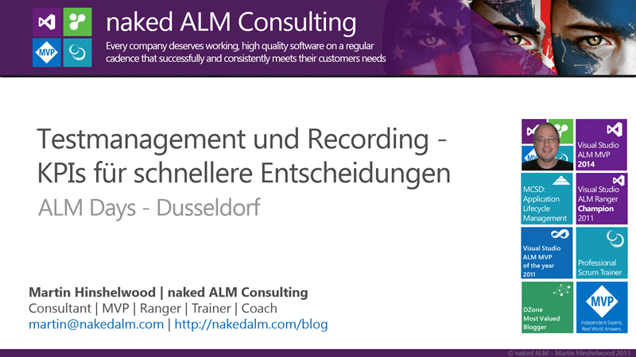 Figure: Testmanagement und Recording - KPIs für schnellere Entscheidungen
{ .post-img }

There are really  two levels of metrics that I want to talk about, the first being at the team level and the second being the organisation level. If we are making decisions on the metrics that are being presented then we had better have the right metrics. I have recently been learning a lot about Evidence based Management and I think that it holds somewhat of the answer to which metrics we should be looking at and that we can consistently trend over time.

Evidence-based Management (EBM) comes out of Evidence Based Practices that have been used extensively in medical fields. Where we have life and death being the result of our decisions we want to make very sure that our metrics are being accurate. What I think that we forget is that while not strictly life threatening the executive leadership of an organisation is making critical decisions based on the information that they get from their subordinates. If these metrics are not the right ones or totally the wrong ones then you could find a company plunged into a critical state. So what is EBM all about?

In order to be using EBM we need to be:

- Evaluate the current outcomes in the organisation
- Carefully analyse the most likely contributors to these outcomes
- Implement improvements in short cycles
- Evaluate outcomes based on solid evidence.

If we were to apply these principals to organisations that deliver software what might these metrics look like?

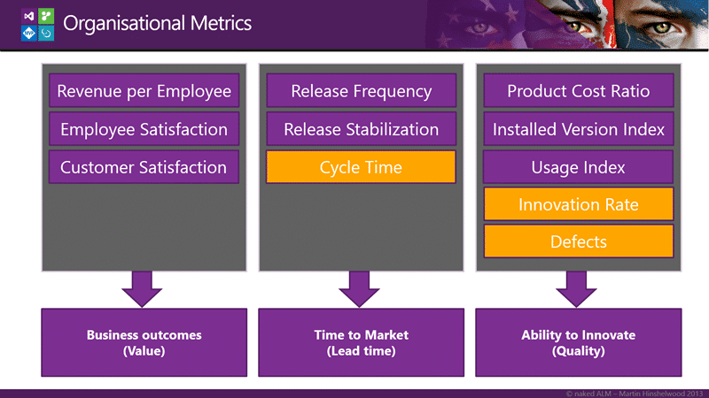 Figure: Overview of Organisational Metrics
{ .post-img }

Out of these metrics there are really only three that I can hope to calculate at the team level and the rest are organisational or product based. The three for the team are Cycle Time, Innovation Rate and Defects which are all data points that I can get from Team Foundation Server. There is also a whole host of circumstantial evidence that we can get from TFS.

## Data, Data, Everywhere

Circumstantial evidence is data that we use to support our analysis and with Team Foundation Server we get a plethora of options. We still need to make sure that we are not looking at the wrong metrics and at least TFS metrics are much more difficult to game as they come from an auditable system. However…

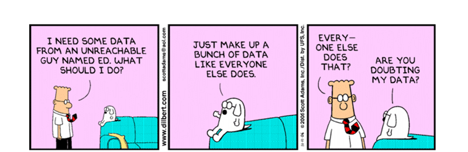
{ .post-img }

…always check the data with the source.

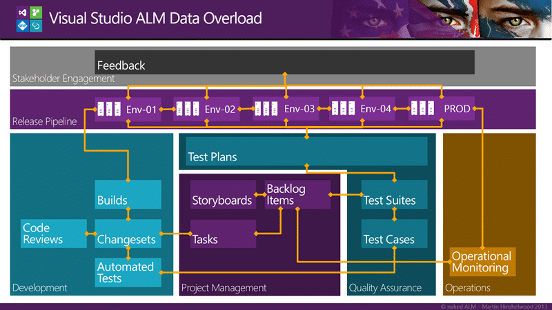 Figure: Data relationships in Visual Studio ALM
{ .post-img }

There tends to be so much data in TFS that it can be difficult to sort out the information that can be useful from a project managers wet dream of exceptionally bad metrics. I bet every developer has seen metric used for the wrong results. Have you ever been measured on the number of lines of code that you have written? Or a tester by the number of bugs found? The result is people gaming the system.

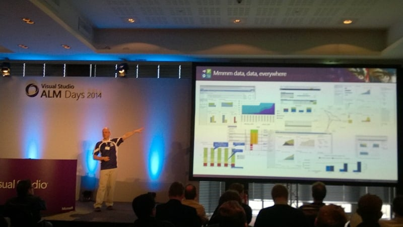 Figure: Reports in Visual Studio ALM
{ .post-img }

There is so much data available that it can be difficult to know where to start and indeed this is the reason that there are only a few reports out of the box with TFS. Not only can it be dangerous to provide to many reports that “generically” apply, you would invariable be wrong and have angry teams at your door with pitchforks and torches. And above all we need to avoid vanity metrics…

I worked at Meryl Lynch back in the day as a developer we had to provide some data in a spread sheet up the chain. It amazed me that my box, the Lead Developer for my Team, would massage the statistics a little to make them slightly more favourable. Turning the KPI’s from just a little to many red to a little more green and orange. Not only that but his boss would take those massaged figures, merge it with all his lead developers, and then proceed to massage them himself… Can you imagine the total fiction that the person at the top of the chain gets? And what decisions are they making based on that fiction?

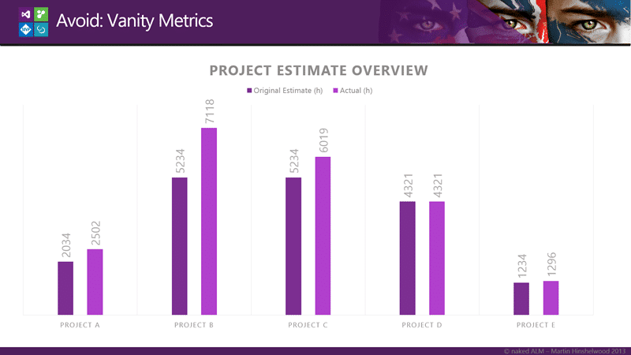 Figure: Project Estimate Overview from the Project Overview Report
{ .post-img }

At one of my customers I was presented with the “Project Overview Report” that consisted of a ring bound book of data that was viewed all the way at the 3C’s level.  The keystone report was the “Project Estimate Overview” report with which the lead BA and owner of the report was very proud. The report showed the original estimate versus the actual time taken to deliver a project. I looked at the report for all of 30 seconds before I turned to him and said:

> “Two of these projects have original estimates that are within 20%, one is within 10% and the other two are exact or almost exact matches. I call bull shit.” -MrHinsh on being presented with the report above

The answer I got was interesting to say the least. He said:

> “Well Martin, we were so far off with our estimates that we had to come up with a solution. We created a system that allowed the a project manager to submit a change to the original estimate. Its all recorded and above board.” -Customer

Wait what? Where in the graph above is that reflected… well of course it is not. The whole purpose is to legalize a fake report and cover their asses should someone challenge them on it, which no one did until an external consultant came along. I just hope that no one made any decisions at the executive level that resulted in the loss of jobs based on this fiction.

SO what data can we look at?

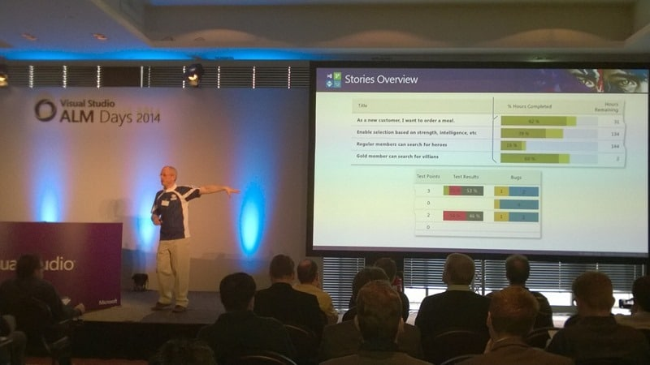 Figure: Stories Overview report
{ .post-img }

One of the key reports in TFS for quality indicators is the overview report. The overview report comes in different flavours depending on the process template that you choose. You get the Requirements Overview, Backlog Overview, and the Stories overview pictured above. Whatever the format you get to see the maturity of each of the pieces of work that your team currently has underway. You can see the number of Tests that are passing and failing as well as he outstanding bugs.

You should generally see more completeness at the top as these are displayed in backlog priority. I would also expect to see more passing tests the more ‘complete’ the feature. If you see something that is marked as very complete but has lots of outstanding bugs, few successful test results, or no test then you can be sure that the quality will not be high.

 Figure: Build Quality Indicators
{ .post-img }

The automated build that you all obviously have on your software is another point of inspect and adaption for your code. You cant look at all of your codebase so trending some key build metrics will help us gain some general insight into the trends of your quality.

- **Active Bugs** – This is the number of bugs that are active at the time of the build
- **Code Churn** – The cumulative number of lines of code that have been touched between the last build and this one.
- **Code Coverage** – The total percentage of your codebase that is covered by the tests that are executed as part of the build
- **Test Status** – The number of unit tests and their status

When pulled together the representation of the Build Quality above shows that while code churn has been increasing the coverage has been dropping. While circumstantial, this would likely result in a reduction in quality and technical debt that will need to be paid back later. Indeed couple that with the reduction in bug count and increase in tests passing and you could construe that the wrong tests might also be being written. This signifies something to look into…

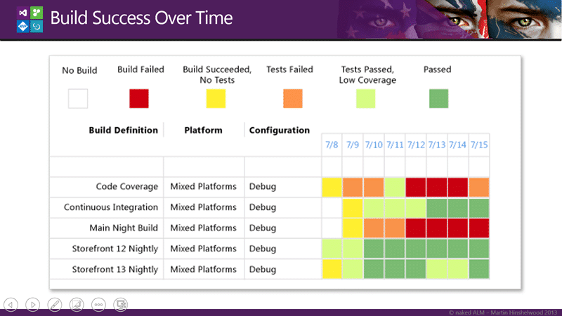 Figure: Build Success over Time
{ .post-img }

If however I have many build I may not want to monitor each one in that level of detail. I can use the Build Success Over Time reports to figure out which ones I might want to delve into. Having some form of KPI’s for my builds allows me to see at a glance something that I might want to investigate and you can see above that both the Code Coverage and the Main Nightly Build are having issues. However the Continuous Integration build was doing poorly and now now improving.

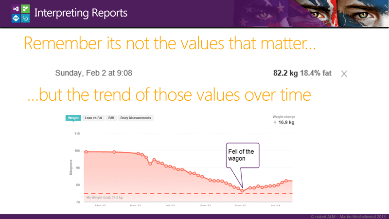 Figure: Martin’s Fitbit Status
{ .post-img }

It is important to be less concerned with individual values and instead be more focused on trends. You need to know when the team has fallen off the waggon.

## Creating custom reports

Being able to create custom reports is a mixed blessing. It is incredibly powerful however you then have to create custom reports…

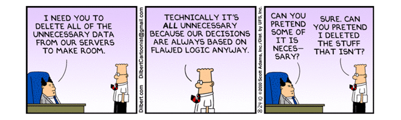
{ .post-img }

With TFS you get a complete Data Warehouse and Cube. The Data Warehouse is updated every 5 minutes and the cube once every few hours. This data has everything described above and more. It has data on Source Code, Work Item Tracking, Build, and Tests that is all related.

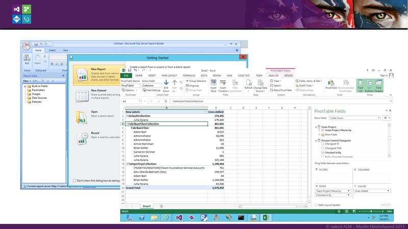 Figure: Report Builder & Excel
{ .post-img }

You can use Report Build to create reports in Reporting Services that you can render in the web and schedule. You can also just simply create reports in Excel and either run them locally or put them on Excel Services.

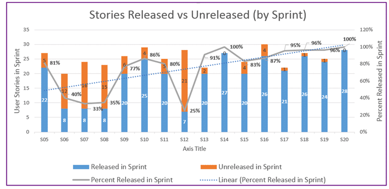 Figure: Stories Released vs Unreleased
{ .post-img }

I am no Excel reporting expert so I asked my colleague Steven Borg from Northwest Cadence for a few Excel TFS reports and he sent me this…

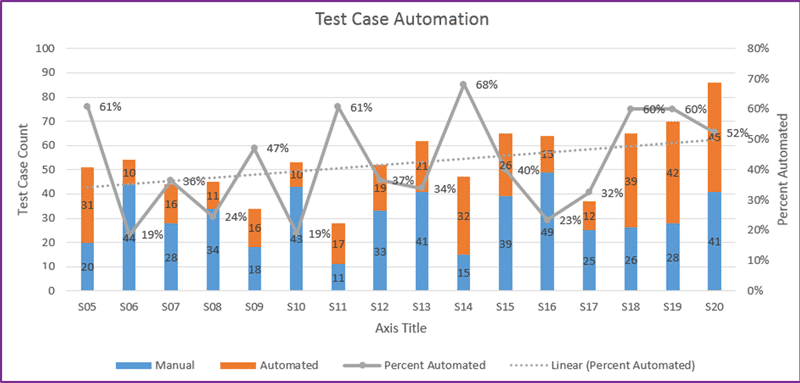 Figure: Test Case Automation
{ .post-img }

…And this…

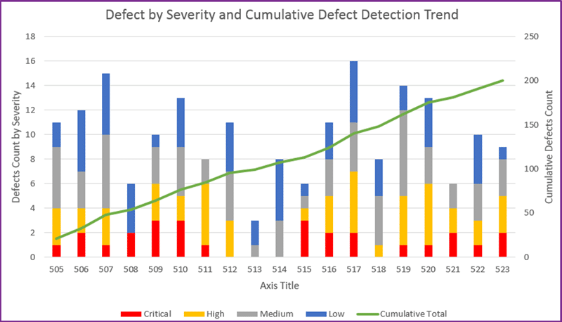 Figure: Defect by Severity and Cumulative Defect Detection Trend
{ .post-img }

…mmmm data… and this one…

However we do need to remember one thing….

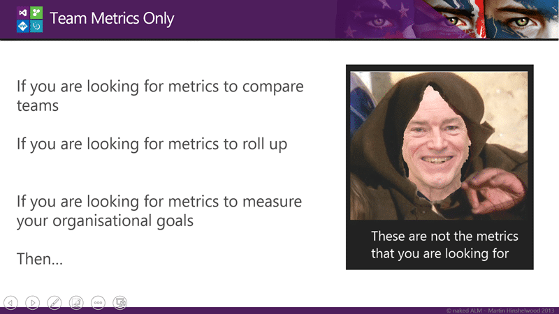 Figure: Team Metrics only
{ .post-img }

These may not be the metrics that you are looking for!

## Beyond the team, metrics that really matter

If we look beyond the team we need metrics that scale a little better. The team metrics of code, code coverage, test coverage, and velocity are fine for a single team, however they do not work well for multiple teams.

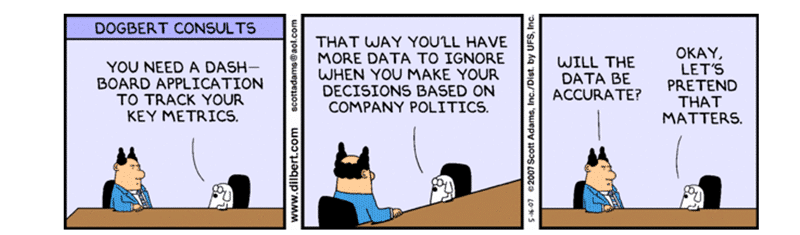
{ .post-img }

What about that division you want to measure and create KPI’s for?

There are two things to note before we get started on which KIP’s I am going to propose that we look at…

First is some extensive Forrester analysis on metrics that saw that we often use the wrong metrics or focus on the wrong goal, also resulting in the wrong metrics. Effectively that metrics should match the goal and the goal, if we are going to be measuring an organisation, should be the delivery of value.

The second is that The Sandish Group while re-examining the 50k some projects that they have listed in their analysis data base found an inverse relationship between projects deemed a success under PMI, and value delivered. So your goal should be delivering value and you better not use PMI to measure success…

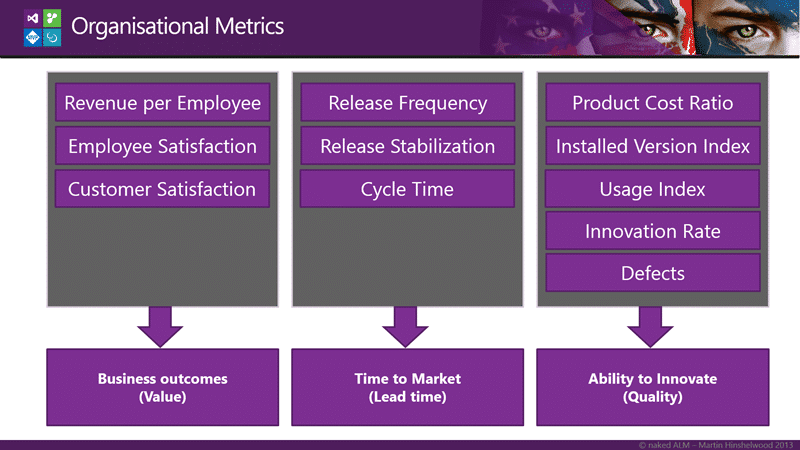 Figure: Organisational Metrics from Agility Index
{ .post-img }

There are few metrics that follow the evidence-based approaches described in “The Leaders Guide to Radical Management by Steven Denning” but one such emerging dataset is the Agility Index from Scrum.org. It looks at a number of areas shown above and concentrates on Value, Lead Time, and Quality.

Within each area we have a number of data points that we collect. Each one brings a specific balance to the equation of wither we are providing value and how quickly that value can be implemented. And very specifically, each one is a leading metric. They are metrics that are directly related to the outcome and can often precede any negative results that we are trying to avoided.

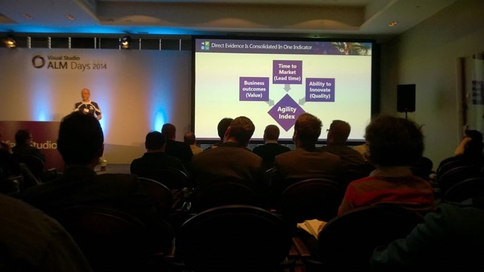 Figure: Direct Evidence is Consolidated into one indicator
{ .post-img }

The dataset that is the outcome of collecting the previous stats are then rolled up into a single indicator called the Agility Index. Scrum.org provides a tool for capturing the data and calculating the Agility Index in a consistent manor.

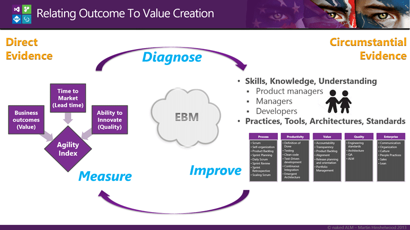 Figure: Relating outcome to value creation
{ .post-img }

There are really two types of evidence available to us:

> Evidence, broadly construed, is anything presented in support of an assertion:
>
> - Strongest type of evidence is that which provides direct proof of the validity of the assertion.
> - Weakest type of evidence is that which is merely consistent with the assertion, but doesn’t rule out contradictory assertions, as in circumstantial evidence.

This is Evidence-based Management (EBM) and while new in the world of software delivery it has been round for quite a while in the medical world.

While we have the direct, strong, type of evidence from the left we still need  to look at the softer evidence of the right. These are the more circumstantial pieces that may or may not provide us with an assertion of affect on the strong evidence.

If we look at the Skills, Knowledge, and understanding of the participants and the Practices, Tools, Architectures, and Standards that they have implemented to try and gain some insight into what might be limiting the direct evidence that we have on the value delivery. We can then take a look at things that we might change. Just as a doctor would gather some data before making a diagnosis.

So what sorts of things might we want to take a look at?

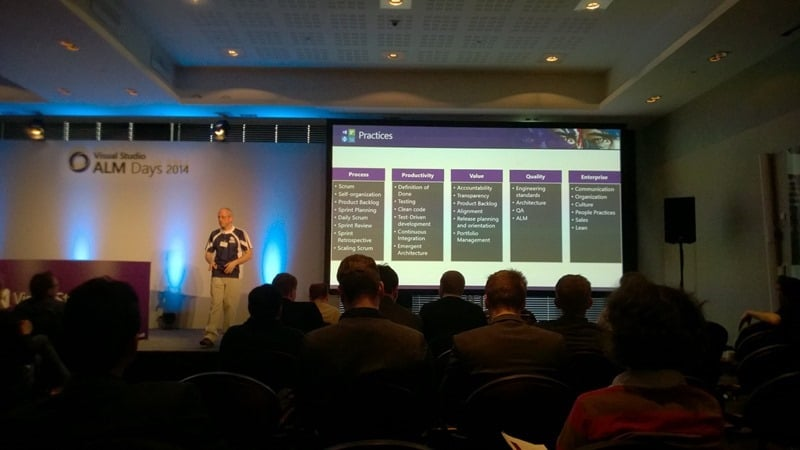 Figure: Practice domains of Agility Index
{ .post-img }

Out of these broad domains above Scrum.org have identified over 300 practices that have been ordered and provide an organisation with a deeper, if circumstantial, understanding of where they might want to spend some investment.

What would you want to do? Try something random or that is hot in the market? Or use Evidence-based Management to observe and analyse how work is done, asses the capabilities of the people doing the work and identify the most likely improvements to add value.

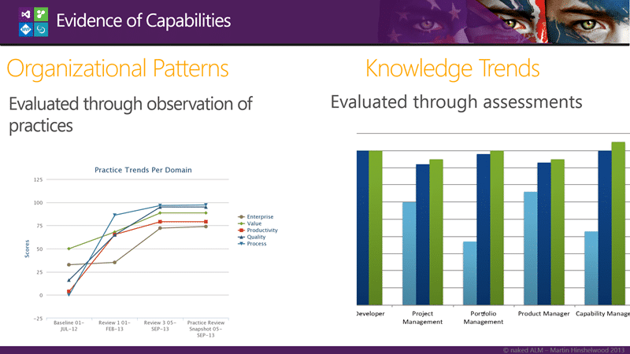 Figure: Trend analysis of evidence
{ .post-img }

If we go around that cycle of measure, diagnose, and then improve multiple times we can build up a picture of the trends within the organisation and a relationship between activates to improve and measureable results will emerge. This allows us to not only direct activity but to see the value derived for euros spent to implement improvements.

Have you ever been asked to justify continued spending on activities that are designed to improve your processes?

 Figure: Patterns within practices
{ .post-img }

We should then be able to delve into each of the domains and identify which practice areas are improving and which are not to more explicitly diagnose additional improvements.

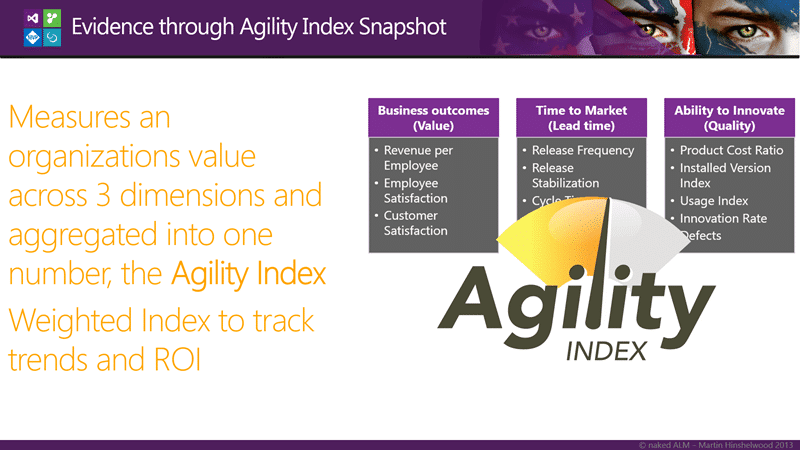 Figure: The Agility Index Calculator
{ .post-img }

The Agility Index calculator rolls all of the gathered evidence up and aggregates the values across all three dimensions into a single KPI to allow us to track trends and ROI.

## Conclusion

This is a game changer for the software industry at large and create a credible set of metrics for the first time that can be used to guide process improvement initiatives regardless of the framework used to deliver that improvement. Agility Path, SAFe, or Kanban can be measured equally.

Do you want to use Evidence-based Management to improve your processes?
