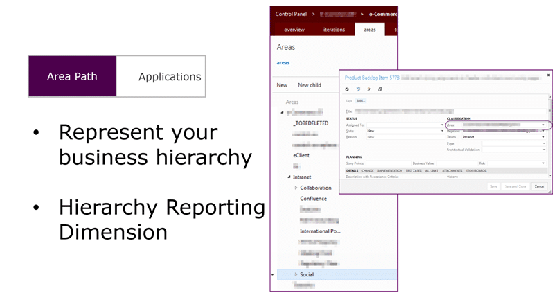
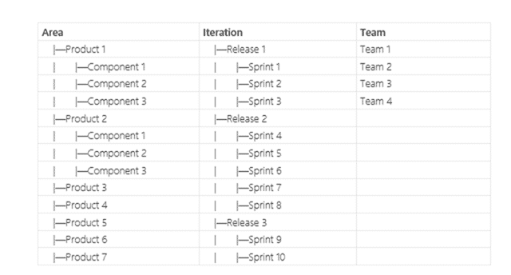
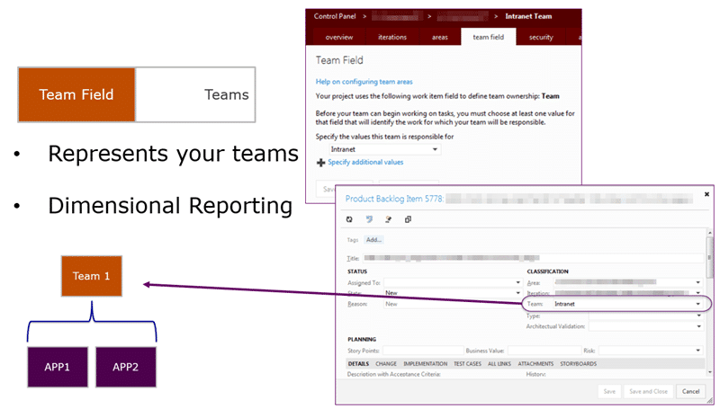

I was asked by current customer to come up with a solution, within TFS, to allow an entire division to work together in delivering software for a bank. This divisions made up of over 10 teams than work on many pieces of software. Some have simple requirements while others require harsh security and compliance. This is a standard problem and not unique to this company, however the perception still prevails with both TFS users and administrators, that one must have a single Team Project for each \[Project | Team | Product\] under way. This perception is not only incorrect but Team Foundation Server was designed to be used differently. The Developer Division (DevDiv) at Microsoft, who built the product, uses a single 20+ terabyte Team Project for their Work Items, Source Code and Builds for over 2k people. Team Foundation Server was designed and built to be used with fewer large Team Projects rather than many small Team Projects.

The group I am working with has many Team Projects, in many cases one for each application. The teams working against these Team Project generally own more than one application and they are running into a number of issues:

- **Moving work between \[Project | Team | Product**\] - Sometimes you find a bug in one application when testing another. Sometimes a work item is just created in the wrong place, or a Feature needs to be broken down into many Product Backlog Items that are for more than one \[Project | Team | Product\]. In order to move an item between team projects you must 'copy' the existing item to the other location and progress the original to the closed/removed state. Indeed, as not all fields and data are copied a link must be maintained between the new item in the new team project and the old item in another so that additional data, perhaps history, can be retrieved.
- **Query across \[Project | Team | Product\]** - While you can query across team project none of the tools that are built on top of TFS support this. Specifically a Team's backlog can only contain work from the current Team Project and if you load a cross team project query in Excel it will only display data from the connected Team Project. This created confusion.
- **Team Focus** - The Team entity within TFS exists only within a single team project and none of its features can cross the team project boundary. With features for Project Planning and Sprint Planning being invaluable for both Product Owners and Teams this can be decidedly crippling.
- **Individual focus** - As all of the tools built on top of Team Foundation Server allow an individual to be connected to only one Team Project at a time there is a large amount of context switching for a member of multiple Team Projects. They have to switch to see what work they have and they will have multiple priorities for that work. It is hard for an individual to focus on a single backlog as their work may be spread across many.

These issues are only those that have been presented by the teams using TFS and they have come up with a number of requirements to help facilitate the building of a solution suitable for their business line and potentially the others within the customer:

- Must be able to assign work to anyone within a division
- Must be able to reassign that item to anyone else within that division
- Simple Web UI for entering 'defects'
- Project Manager should be able to add/remove people from the correct projects
- Sharing of Test Cases between Applications

Note: There are a few asks for the ability to assign work to anyone within the organisation, but short of creating a single Team Project for the entire organisation (tens of offices from Singapore to London to New York.) This is just not feasible from a support perspective, especially backup/restore.

There are two separate but related things that should be implemented to both mitigate the issues above and to support the requirements describes. These are to move everyone within the division to a single Team Project and to implement Team Field within that team project.

A general rule of thumb: If there are shared resources (with resources defined as People, Work Items, or Source Code) then one should be in a single Team Project.

### Single Team Project

The first solution is to create a larger Team Project that contains many Application as well as Teams. In Team Foundation Server 2012 we can create multiple 'Teams' within a single Team Project to compartmentalize the work. As the 'Team' entity is built upon the security principles we can also use this to secure our application code and work items to one or more 'Teams'.

  
{ .post-img }
Figure: Using area path to represent products in Team Foundation Server

As there is a single Version Control repository in TFS for all Team Projects there is little change to the existing multiple Team Project functionality and we can use Area Paths mirrored with Source Control folders to identify Applications within the system.

As Area Path is a Dimension within the data Warehouse and cube we can using it to slice our data and report by application. As it is a tree we can also select which data from the tree to include and what to exclude. This is available as both published reports in Reporting Services and ad-hoc reports in Excel.

### Team Field

By default Team Foundation Server provides two dimensions for categorising work and representing it on backlogs. Iteration Path, which is for the teams cadence, and Area Path that is for categorizing work. For this division we need an additional dimension and this can be provided with Team Field.

  
{ .post-img }
Figure: Using team field as a third dimension in Team Foundation Server

Team Field adds the ability to have a separate list for team and frees up Area Path, used for Team by default, for a much-needed Product breakdown as described above.

  
{ .post-img }
Figure: Using team field to represent teams in Team Foundation Server

With Team Field in use to designate which 'backlog' items appear on we can create both a single team that owns many Applications and have multiple teams that own a single application. In addition if we want to create a roll up to a Product Owner that perhaps has many teams that work on one or more applications we can also represent that.

  
{ .post-img }
Figure: Using team field to create virtual team groupings

This can be used to create many levels however it does become a management nightmare the more levels that are added.

### Conclusion

All of the requirements of the customer will fulfilled with these solutions along with the use of reporting. There has been some concern about viewing data across Team Project and indeed across Collection if there is one collection per business line (we currently have 12 collections). However these fears are unfounded as all of the data from all of the collections ends up in a single data warehouse and cube. This will allow us to report across all of the business lines with ease.

Things are not all good and there are a few caveats to this approach:

- **More manual support and security management** - There will be some manual creation of Teams, Folders and permissions. This actually gives us more flexibility in their creation and does benefit the teams but could easily over whelm a support team that is not fluent in PowerShell. Currently we are creating everything manually, however once we have the process solidified PowerShell scripts can be created to automate the process.
- **Build list can get large** - When you get many hundreds of build definitions the list of them can get very unwieldy within Team Explorer and Team Web Access. However with the use of permissions to hide other teams build definitions as well as judicious use of team favourites this can be easily mitigated.
- **Test Management lists all Test Plans** - Instead of plans being filtered by team on the web (which is not supported anyway in MTM) all are listed. This can make the list long and with use of keywords and tagging we can make it easier to find and connect to the Test Plans for each Team. For example we may begin the name of each plan with the name of the Team to which it pertains. While this is more of a pain than it needs to be for now I believe that TFS v.Next will resolve this issue.

These issues however are small in comparison to the benefits that are gained by the single Team Project and Team Field approaches detailed above.

How have you solved your organisational requirements in Team Foundation Server?
