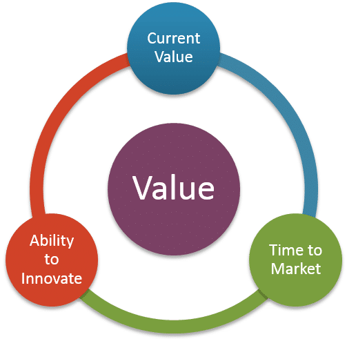
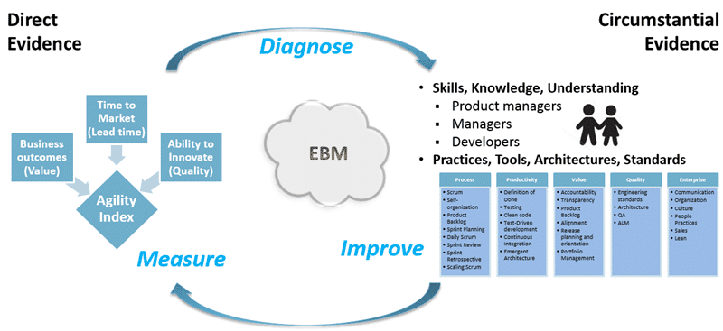
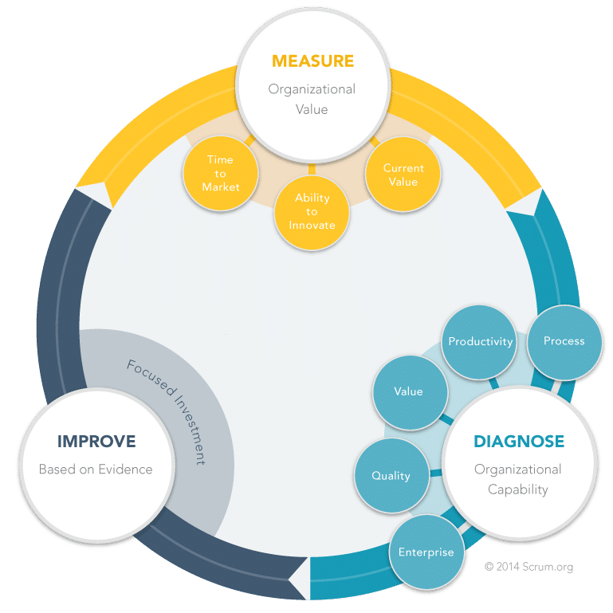

A few weeks ago I headed out to the Scrum.org offices in Boston to participate in training to hone my skills as an Evidence-based Management Consultant. I was talking to my father about it when I got back and was surprised that he recognised many of the practices and tools.

In the 1990's my father (John Hinshelwood) was a regional director of a large estate agency (realtor) in the UK. For many years he worked from a single shop in Glasgow running his own business. In 1988 he sold his business to a large Insurance company that was trying to get its ailing Estate Agency business to turn a profit. It was failing at this task, however it was not long before my father's talent for detail was noticed and within a few short months was appointed a directorship. Using evidence-based practices he turned a lossmaking business into a profiting business for over 5 years. Three months after he left they were making a loss again! They had not changed to embrace Evidence-based Management as an organisation and without my father's stewardship they slumped back into the old ways.
{ .post-img }

A few weeks ago I headed out to the Scrum.org offices in Boston to participate in training to become an Evidence-based Management Consultant with Scrum.org. Evidence-based Management is a new approach to looking at the value you are delivering with your organisation that is based on evidence rather than the traditional 'gut feelings' of managers. It  allows you to really look at what you need to improve to make the most of your investments in agility.

Organisations spend a lot of time trying to understand the value that they are getting in their pursuit to agility and often spend time pouring money into areas that are seeing minimal improvements. There may be other areas where they could get much more value for money but they either don't know or don’t understand where and what they are. These large organisations struggle to move towards agility no matter how much they might want it. Some of this is a people issue but often it is the reality of scale that gets in the way.

There is lots of help for these organisation but how can they be sure not only that they are on the right path but that the help that they are getting is providing the value that is advertised. For this we need to do something and then look at the result to determine the value. This is what Evidence based Management is all about.

Evidence-based Management (EBM or EBMgt)'s roots are in Evidence-based Medicine and evidence based policy. The idea is to bring scientific methods to the front of the way we do things and EBM's goal is to bring it front and centre in management of organisations.

> Evidence-based management entails managerial decisions and organizational practices informed by the best available scientific evidence.[http://en.wikipedia.org/wiki/Evidence-based_management](http://en.wikipedia.org/wiki/Evidence-based_management)

In order to even begin to understand where we need to go we need to understand where we are right now. If management can effectively understand where we currently are then you can much more easily prevent backsliding to the old ways once you improve. This is in essence why scientific and proven practices should replace the more traditional 'gut feeling' used prolifically in management.

Evidence-based Management and how it applies to general organisational improvements as well as software development organisations is described well in “The Leaders Guide to Radical Management by Steven Denning”.

We, as the software industry, have been focusing in the wrong place. The revelation from The Standish Groups research that success, as measured by traditional PBI metrics, does not equate to value to the customer, is damming. Couple that with Forester's salient advice to focus on measuring the value delivered to the customer, it is obvious that things need to change. Steven Denning looked at many successful organisations across the world, even companies that were once successful, to see if there were any commonalities between them. He found that when companies focus on the products or services that they deliver they are rarely successful. In instances when they are successful, that success tends to be very short lived, no more than 5-10 years. You only have to look at the rise and decline of many companies in the FUTSI 500 to see the impact of focusing on products and services only.

So what is the secret? The secret is to focus on your customers. Focus on what you can do to delight them. And then identify metrics of leading or lagging indicators of customer delight. If you focus on measuring and optimising these measure of customer delight then you will create the most relevant products and services to make your company a success. And if you continue to focus on your customer, you will sustain that success for many more years that your competitors that don’t.

While the leading metrics and evidence of high quality value delivery for an Estate Agency differ from a Software Company, there are similarity's. In fact I was once asked by a customer what the industry standard metrics were in the software industry. I had no answer at the time, and in fact failed to come up with my own that would provide the desired leading measures. But even with the proliferation of measurement systems popping up everywhere, there are few that follow the evidence-based approaches described in “The Leaders Guide to Radical Management by Steven Denning”. One such emerging dataset is the Agility Index from Scrum.org. Scrum.org have identified three key areas that we need to focus on.

{ .post-img }

Figure: Agility Index from Scrum.org for leading evidence for the impact of change

We need focus on value (Business Outcomes) to make sure that we are producing something that our customers value while not alienating our employees or spending too much money doing it.

We need to focus on lead time (Time to Market) to make sure that we can take those things of value that we are producing and quickly get them, in short order, into the hands of our customers.

We focus on quality (Ability to Innovate) to make sure that what we do deliver works, is easy to use, has useful features, and does not have a high maintenance cycle.

These three groups of metrics and merged into a single agility index using a weighted calculation to gives us a consistent idea of where we are now. We can then look at the trends of these figures over time and make sure that we are heading in the desired direction. This figure gives your organisation a value for return-on-investment in your process improvement efforts.

 Figure: Agility Index from Scrum.org shows Measure, Diagnose, Improve in action
{ .post-img }

The goal now that we have our direct evidence is to diagnose, as a doctor would, what changes are most likely to bring the most value to our organisation. To do that we need some extra circumstantial evidence that we can use to diagnose which improvements will provide your organisation with the most value. There are two tools in our arsenal to help us gather that circumstantial evidence:

- **Practice Backlog** - a indicator we can use if the maturity of the practices, tools, architectures, and standards that your organisation is using. To help measure this Scrum.org has created a practices backlog of things that we know, through long experience with software organisations, helps them become more effective at delivering value. This practices backlog contains more than 300 practices that are ordered as there are many dysfunctions that can arise from skipping over certain practices. This gives us an understanding of your organisation's practice maturity.
- **Assess People** - another good piece of circumstantial evidence is the skills, knowledge, and understanding of the people that are involved in the delivery of the value. This can be assessed individually and Scrum.org has created assessments that it already uses to evaluate knowledge after training. Scrum.org has over 3 years of experience in measuring individuals knowledge of agility and what it takes to be agile. We can leverage that knowledge and use their existing assessments for Developers, Scrum Masters, and Product Owners to gain visibility of their maturity of knowledge.

[Find out more on how Agility Index can help you business](http://nkdagility.com)

Using the circumstantial evidence or organisational maturity from the practice backlog and the assessments we can better diagnose where to focus investment. With the leading direct evidence we can understand the impact of our changes. These together from the backbone of Scrum.org's implementation of Evidence-based Management for Software Organisations.

{ .post-img }

> Evidence-based Management for Software Organisations: A framework within which people can address complex organizational change, while productively and creatively improving the enterprise and its products.
>
> You can find out more about Evidence-based Management for Software Organisations on [http://ebmgt.org](http://ebmgt.org)

Your organisation probably has metrics that you use now. However ask yourself if these metrics can tell you how much value that their projects delivered last year. If not the should focus on value… and agility path includes a bunch of tools that are optimised to help you to understand and optimise that value.
