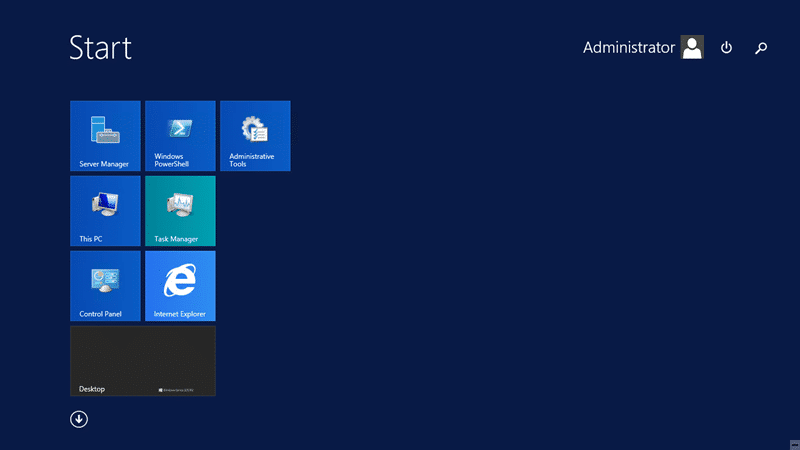

With the release of Windows Server 2012 R2 Update 2 I wanted to make sure that all of my demo machines are up to date. I have a Domain Controller and a TFS server that are separate boxes but which are both running Windows Server 2012 R2.

The new update became available yesterday for MSDN subscribers and will be generally available next Tuesday (8th April 2014). I have already completed these updates on my Surface 2 Pro and Surface 2, both of which were running Windows 8.1. Today I want to concentrate on getting all of my demo boxes up to snuff as I have some demos & presentations next week.

Updating these boxes should be trivial, and you know that I like to make sure that I have documentation so here we go. If you download the update from MSDN you get a zip archive called "mu_windows_8.1_windows_server_2012r2_windows_embedded_8.1industry_update_x64_4046913" that contains 6 Updates that can be used on Windows Server as well as Windows. There is a separate update for Windows ARM based architectures. It is recommended to install them in the following order:

1. KB2919442
2. KB2919355
3. KB2932046
4. KB2937592
5. KB2938439
6. KB2949621

Although KB2919355 contains the real meat at over 700mb and with most of the other updates are described as 'feature updates' you may or may not need to install KB2919442. KB2919355 can take a while to install and on my Surface 2 Pro it took around 30 minutes. On my Domain Controller only around 20 minutes.

  
{ .post-img }
Figure: More than one update needs to be applied

Although all of my Windows 8.1 systems already had KB2919442 installed I did need it run it on all of my Windows Servers. You should run each update in the order listed above.

  
{ .post-img }
Figure: Each update can take some time to complete

Each update takes various lengths of time to complete and I did notice that the times were pretty consistent with the physical size of the update. It’s a little annoying, and time consuming, to have to run each update manually and there really should be an installer for this. However it may not be worth It for the team to take the time when there updates will be going out to general release over Windows Update next Tuesday.

  
{ .post-img }
Figure: If asked to restart then ignore

All of the updates (except KB2919442) requested a restart at the end of each install. I ignored this and relied on the update to decide if the pending restart required to be actioned before proceeding. All of the updates installed in one go with no required reboots in between. That has been true on all of my systems, Windows 8.1 (x64), Windows 8.1 (ARM), and Windows Server 2012 R2.

  
{ .post-img }
Figure: Final reboot can take some time

After you have completed all of the updates restart your server and wait for a while… it may reboot a couple of times, however eventually it will be back. Took my VM’s around 3-5 minutes to reboot and configure the updates…

  
{ .post-img }
Figure: Windows Server 2012 R2 Update 1

Not only did all of the updates install with no issues, all of the machines came back up and all services (those I changes anyway) are functional. Now that I have my Domain Controller and Team Foundation Server upgraded to Windows Server 2012 R2 Update 1 I can continue to updating TFS to Visual Studio Team Foundation Server 2013 Update 2 which was also released yesterday.
