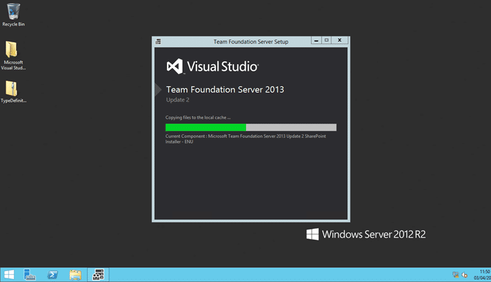
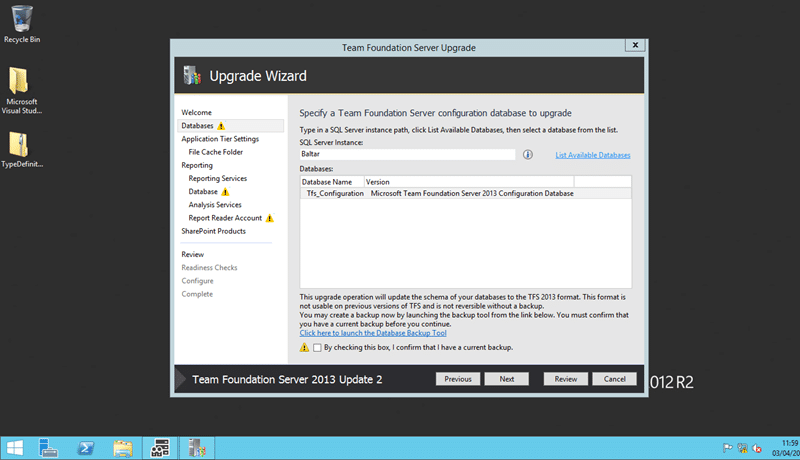
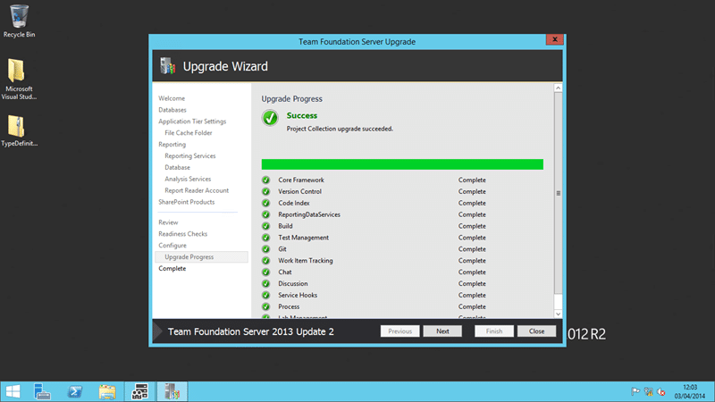

With the launch at Build of Team Foundation Server 2013 Update 2 I wanted to make sure that the update goes seamlessly. So I am upgrading my demo box to both [Windows Server 2012 R2 Update 1](http://nkdagility.com/upgrade-server-windows-server-2012-r2-update-1/) and Team Foundation Server 2013 Update 2.

Recently the TFS updates have become so run of the mill that it has not been worth talking about updates. I don’t mean that the features added as part of the update are simple, it is that the install and upgrade process is so straightforward that it is a non-event. I have customers that are on some of the craziest domain and network configurations that I have ever seen and still TFS is the one system that cuts through the complexity and delivers a flawless experience. But why would I take even this non-existent risk… one word… features:

## Backlog Management features in TFS 2013 Update 2

In addition to general performance and navigation improvements the TFS team has been hard at work adding value to our backlog management.

- **REST API for Tags** - I don't know how many times recently I have done either Integration Platform or even simple Excel migration of work items and hear the fateful words "but where did my tags go?". Now with Team Foundation Server 2013 Update 2 the TFS team have finally finished off tagging with an API that allows editing and management of Tags. You can now edit tags in Excel as well as through the API.
- **Query on Tags** - With the addition of the API is now possible to create queries that target the tags.
- **Tagging in Visual Studio** - You can apply tags to work items in Visual Studio.
- **Tagging Permissions** - You can apply permissions for who can add new tags
- **Non-working days** - You can configure non-working days, and these are excluded from burndown charts
- **Cumulative Flow Start Date** - Cumulative Flow Diagram start dates are configurable
- **Pinning Charts** - Lightweight charts can be pinned to project or team homepages

These changes while small are things that my current customers have been clamouring for. Unfortunately they are stuck on IE8 and thus TFS 2012 is the most recent version that they can use.

## Test Management features in TFS 2013 Update 2

While I go head to head with the Test team often (sorry Ravi), I only do so because I love the tools and I want them to be better. Don't tell them that they make the competition look like a bunch of bumbling buffoons who could not test their way out of a paper bag.

- **Test Export** - This update provides to testers and test leads the ability to export test artefacts so that these can be sent by using email or as printouts and shared with stakeholders who do not have access to TFS.
- **Shared Parameters** - This update provides to testers and test leads the ability to manage test parameter data at one place by using Shared Parameters. Any subsequent changes to parameter data can be updated at one place and all the test cases referencing the Shared Parameter are automatically updated.

Where there are gaps in the tests tools Microsoft has many partners to step in and take up the slack by building against a world class API.

## Release Management features in TFS 2013 Update 2

Release management, while new to TFS, is an awesome tool and these additions go a long way to making it enterprise ready. I have been using it at a number of organisation and the clone deployment are probably the most powerful features.

- **Release Tags** - The tags are designed to perform the same operation across the servers. If there are server specific actions, the user can always add the specific server and the corresponding actions at that level in the deployment sequence.
- **Shared Variables** - To configure a group of server by using same tag implies that you can set values for the whole group and all the servers in the group therefore share common values for all variables.
- **Cluster Support** - You can easily deploy to identical or clustered servers without having to repeat the deployment sequence on each server.
- **Clone deployment sequence** - You can Copy Tags across stages and across Templates. You can retain the same deployment sequence with all the tags and servers when copied to other stages or Release templates under the same environment.

I am looking forward to vNext and beyond in this space.

## Version Management features in TFS 2013 Update 2

As predicted most of the enhancements are within the Git space. While TFVC will be around for a very long time to come I firmly believe that Git is the way forward for version control. If you are not thinking of moving to Git then I can assure you that your developers are. If you need any form of audit, common to any enterprise, then TFS is the ONLY implementation of Git that will support you.

- **General Git additions** - Git tools have been updated to include an annotate (blame) view, reverting a commit, amending a commit, pushing to multiple remotes, and improved progress and cancellation ability for long running operations.

## Updating to TFS 2013 Update 2

As I said before the TFS install & upgrades have become so trivial that it is almost not worth mentioning… almost…

  
{ .post-img }
Figure: Upgrading to TFS 2013 Update 2

Upgrading TFS is simpley a case of installing the latest version. I would always recommend that you either take the opportunity to move to new hardware as this  gives you the ultimate rollback. If you have a single server instance that is virtual you should at least ‘Snapshot’ the server. Whatever your quick rollback solution make sure, and I mean really sure, that you have a current and up to date backup. If you are using the TFS backup tool that is built into the new

  
{ .post-img }
Figure: Laying down the new files

The Installer will automatically remove the old version of TFS and update you to the latest bits. If you have TFS 2005 you will need to go to TFS 2010 first (you can get that installer from MSDN) but if you have 2008, 2010, or 2012 you can just run the 2013 Update 2 installer to upgrade.

  
{ .post-img }
Figure: Make really sure that you have a backup before upgrading to TFS 2013 Update 2

Once the foundation has been laid you will be presented with screen asking you which database (configuration database) that you want to upgrade. You may have more than one TFS instance using the same SQL Server. To be honest I would not recomnned it, but I have seen it. You will have to check the box to say that you really do have a backup, and if you do not then go now and create a SQL backup of all of the TFS databases.

  
{ .post-img }
Figure: Review your upgrade to TFS 2013 Update 2

If you are upgrading you will probably not need to change any of the settings. In just hit ‘next’ until it asked me to re-enter the reporting account password an then reviewed the settings. If you are installing from scratch then you should hit the documenation, or a previous post for a full install guide.

- [Installing TFS 2013 from scratch is easy](http://nkdagility.com/installing-tfs-2013-scratch-easy/ "http://nkdagility.com/installing-tfs-2013-scratch-easy/")

After this you validate and then execute the configuration. After a while, say 5-10 minutes, you will see a bunch of green checkmarks. If you are upgrading from TFS 2008 or TFS 2010 you may have a much longer wait. Depending on the size of your database and the speed of the servers you upgrade could take minutes or hours.

  
{ .post-img }
Figure: All green ticks when upgrading to TFS 2013 Update 2

Not only did I get green ticks on the configuration, but you will get ticks for each of your collections. Even after the configuration has completed your collection updates will kick off in the background. My current customer has more than 10 collections and these will be upgraded individually. Once done you collections will be online and you can connect…

  
{ .post-img }
Figure: Only 13 minutes to upgrade to TFS 2013 Update 2

In only 13 minutes I have upgrade my demo environment from TFS 2013 RTM to TFS 2013 Update 2. This was a small environment however the process is the same regardless.

## Conclusion

While a full list of features in both Visual Studio and Team Foundation Server for Update 2 can be found on [http://support.microsoft.com/kb/2927432](http://support.microsoft.com/kb/2927432) the ones above are those that I think are most important and relevant for ALM. I am really looking forward to some of the features that I know are coming in the next version of TFS and these are just wetting our appetites and rounding out some of the itches that we have right now. At this time TFS 2013 Update 2 has RTM’ed however Visual Studio and some of the other update components are still RC. That said, they are coming with a go-live licence.

**Released to Manufacture (RTM):**

- TFS 2013 Update 2 RTM: [http://go.microsoft.com/fwlink/?LinkId=392762](http://go.microsoft.com/fwlink/?LinkId=392762)
- TFS Express Update 2 RTM: [http://go.microsoft.com/fwlink/?LinkId=392763](http://go.microsoft.com/fwlink/?LinkId=392763)

**Go-Live Release Candidate:**

- VS 2013 Update 2 RC: [http://go.microsoft.com/fwlink/?LinkId=390521](http://go.microsoft.com/fwlink/?LinkId=390521)
- Express for Windows Update 2 RC: [http://go.microsoft.com/fwlink/?LinkID=386598](http://go.microsoft.com/fwlink/?LinkID=386598)
- Ultimate Update 2 RC: [http://go.microsoft.com/fwlink/?LinkId=331030](http://go.microsoft.com/fwlink/?LinkId=331030)
- Professional Update 2 RC: [http://go.microsoft.com/fwlink/?LinkId=331031](http://go.microsoft.com/fwlink/?LinkId=331031)
- Premium Update 2 RC: [http://go.microsoft.com/fwlink/?LinkId=331032](http://go.microsoft.com/fwlink/?LinkId=331032)
- Agents Update 2 RC: [http://go.microsoft.com/fwlink/?LinkId=393087](http://go.microsoft.com/fwlink/?LinkId=393087)
- Release Management Update 2 RC: [http://go.microsoft.com/fwlink/?LinkId=393085](http://go.microsoft.com/fwlink/?LinkId=393085)
- Remote Tools Update 2 RC: [http://go.microsoft.com/fwlink/?LinkId=393086](http://go.microsoft.com/fwlink/?LinkId=393086)

For those that do not know what Go-Live is it means that the TFS team are happy to fully support its use in production but they don’t guarantee beyond RC quality. This is usually when these components have not seen a large enough install base for them to be as sue as they can be that there are no issues. Don;t be afraid of Go-Live… embrace it and go for it.

You should go ahead and install TSF 2013 Update 2 today. If you have any issues or you want to know more about how to make the most of the new and existing features then give us a shout.
