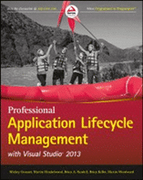

About 6 months ago I was approached by Mickey to help him on the third edition of Professional Application Lifecycle Management with Visual Studio 2013. I jumped at the chance, only to be in dismay at the amount of work, and now relieved that it is all over. I could not believe the amount of work that goes into producing a book of the calibre and while fun, deadlines were not...

Professional Application Lifecycle Management with Visual Studio 2013 is now available in the USA from [Amazon.com](http://nkdalm.net/ProALMwithVS13). It will be available on 29th April 2014 in the UK on [Amazon.co.uk](http://nkdalm.net/ProALMwithVS13uk) who is currently taking pre-orders. This was a monumental effort and I would not have been able to without the support from Brian and Mickey who had both been through the trauma of writing a book before.
{ .post-img }

It really was hard going mapping the new features in the 2013 version of the product to the previous editions as well as making sure that the recommendations stayed current. For example when the book was originally written the MSF for Agile Software Development process template was the default out of the box and there really was no implementation of Scrum in TFS. You know my [feelings on the MSF for Agile Software Development template](http://nkdagility.com/agile-vs-scrum-process-templates-team-foundation-server/). This changed with Visual Studio 2012 when the Visual Studio Scrum template became the default out of the box and I felt that it was high time that the foremost ALM book for Visual Studio reflected reality a little better and had a little more agility to it.

> **Ramp up your software development with this comprehensive resource**
>
> Microsoft's Application Lifecycle Management (ALM) makes software development easier and now features support for iOS, MacOS, Android, and Java development. If you are an application developer, some of the important factors you undoubtedly consider in selecting development frameworks and tools include agility, seamless collaboration capabilities, flexibility, and ease of use. Microsoft's ALM suite of productivity tools includes new functionality and extensibility that are sure to grab your attention. _Professional Application Lifecycle Management with Visual Studio 2013_ provides in-depth coverage of these new capabilities. Authors Mickey Gousset, Martin Hinshelwood, Brian A. Randell, Brian Keller, and Martin Woodward are Visual Studio and ALM experts, and their hands-on approach makes adopting new ALM functionality easy.
>
> - Streamline software design and deployment with Microsoft tools and methodologies
> - Gain a practical overview of ALM with step-by-step guides and reference material
> - Case studies illustrate specific functionality and provide in-depth instruction
> - Use new capabilities to support iOS, MacOS, Android and Java development
> - Discover this comprehensive solution for modeling, designing, and coordinating enterprise software deployments
> - Over 100 pages of new content, forward-compatible with new product releases
>
> _Professional Application Lifecycle Management with Visual Studio 2013_ provides a complete framework for using ALM to streamline software design and deployment processes using well-developed Microsoft tools and methodologies. _Professional Application Lifecycle Management with Visual Studio 2013_ is your guide to make use of newly-available ALM features to take your enterprise software development to the next level

If you liked the previous editions then this new revision has been updated for 2013 with new chapters on Git and Release Management. You can [buy on Amazon.com](http://nkdalm.net/ProALMwithVS13 "Buy Professional Application Lifecycle Management with Visual Studio 2013 on Amazon.com") if you are in the US (Kindle version available as well.) If you are in the UK you can [pre-order on Amazon.co.uk](http://nkdalm.net/ProALMwithVS13uk "Buy Professional Application Lifecycle Management with Visual Studio 2013 on Amazon.co.uk") for a 30th April release.
