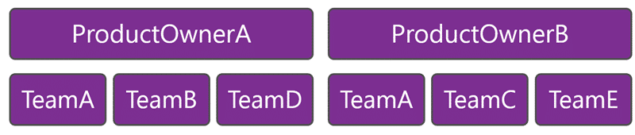
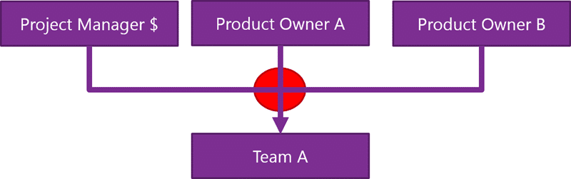

This is the dysfunction of teams with Project Managers as well as Product Owners. Does your organisation have both Project Mangers as well as Product Owners? If so, to whom do your teams report? What does it depend on? Because if it does depend then you are doing a disservice to your teams and will have difficulty moving towards greater agility. I have a customer right now that has this situation with cross application teams however there are additional complications.

  
{ .post-img }
Figure: Project Hierarchy

Project Managers are assigned projects that might operate against multiple products. Product Owners are given products. This results in often an application that while it has a single Product Owner could have multiple teams run by multiple project managers. Unless all of the team members have ADHD they are going to have issues with multi-tasking.

  
{ .post-img }
Figure: Team A supports two masters

Here is where it then gets a little tricky. We have Product Owners that want a view of the work that is under way from the perspective of the Product, which is reasonable. But they definitely do not want the same view as the Project Manager who cares about work done that achieves his project. Since budget is done at the 'project' level this means that funding is in the hands of the Project Manager and there is no way that a Product Owner can be accountable and responsible for value delivery. So while the Project Manager owns a budget and work breakdown the Product Owner owns the Application and breakdown. While the PO is supposed to be accountable and responsible for the delivery of value within the scope of the Product a 'Project' might have a scope that transcends product and is the responsibility of the Project Manager. Man what a mess…

   
{ .post-img }
Figure: Team has no idea who to listen to

The result is a dysfunctional situation where a team can have many masters. Not only are they beholden unto a project manager, they may have to serve more than one Product Owner. This breaks one of the few golden rules of agile software development: The team should have but one master. If you are moving towards agility then you need to avoid having more than one person in the role of Product Owner as much as possible. The Team will end up context switching and having to split time between Product Owners backlogs even if they use one combined view to make it seam like they have one order.

   
{ .post-img }
Figure: Product Owner provides a single point of order

The only way to combat this is to reorganise the organisation so that the issue does not exist. You should reform the Teams around the Product Owners (and thus the products.) The Project Managers then become another set of stakeholders that the Product Owner must listen to. This is the only way to reach agility with all of those voices pulling the team is different directions.

However the customer is large, which is no excuse. However in large organisations these kinds of things do not change quickly. It will eventually, but that may take many years and a lot of courage from management to achieve. In the mean time you, like me, may still need still need to model this is TFS to allow Teams and Product Owners to work together and for Project Managers to understand the work that they are doing.
