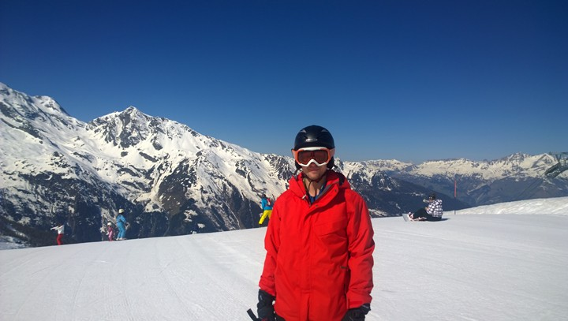
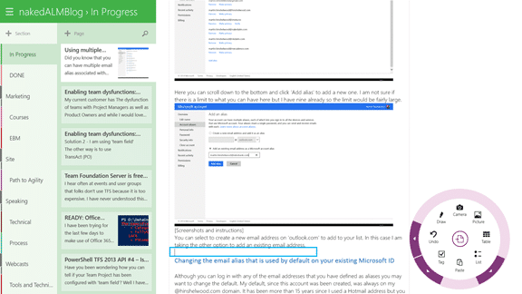
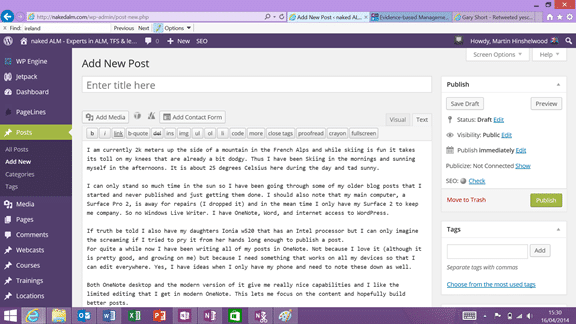

I am currently 2k meters up the side of a mountain in the French Alps and while skiing is fun it takes its toll on my knees that are already a bit dodgy. Thus I have been Skiing in the mornings and sunning myself in the afternoons. It is about 25 degrees Celsius here during the day and tad sunny.

{ .post-img }

I can only stand so much time in the sun at once so I have been going through some of my older blog posts that I started and never published and just getting them done. I should also note that my main computer, a Surface Pro 2, is away for repairs (I dropped it) and in the mean time I only have my Surface 2 to keep me company. So no Windows Live Writer. I have OneNote, Word, and internet access to WordPress.

{ .post-img }

If truth be told I also have my daughters Ionia w520 that has an Intel processor but I can only imagine the screaming if I tried to pry it from her hands long enough to publish a post.

For quite a while now I have been writing all of my posts in OneNote. Not because I love it (although it is pretty good, and growing on me) but because I need something that works on all my devices so that I can edit everywhere. Yes, I have ideas when I only have my phone and need to note these down as well.

{ .post-img }

Both OneNote desktop and the modern version of it give me really nice capabilities and I like the limited editing that I get in modern OneNote. This lets me focus on the content and hopefully build better posts.

{ .post-img }

Unfortunately the only way to post from OneNote is to proxy through Word with the "Send to Blog" option. Unfortunately Word is probably one of the worst blog editors as it speckles your posts with unnecessary with hard coded text sizes and fonts.

{ .post-img }

After publishing my most resent post it took about 10 minutes sitting editing the HTML before I could publish. But I could indeed publish. I would however like to be able to paste strait into WordPress from OneNote but you lose all of your pictures.

{ .post-img }

Don't get me wrong, if you look at the HTML generated from Word from even 5 years ago it would be far worse. It's better to the point it is even worth editing it to post rather than writing from scratch and drawing the pictures by hand.

Word: You can do better.
