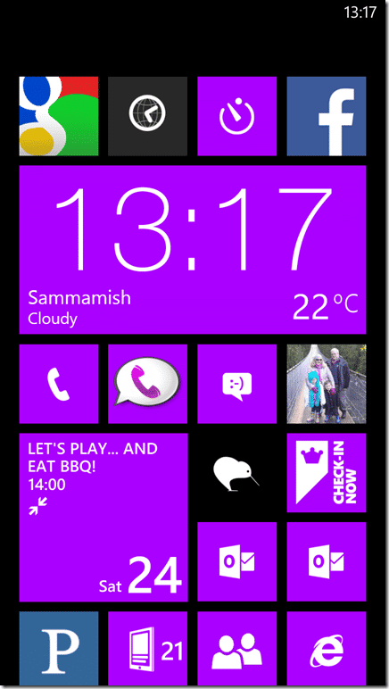
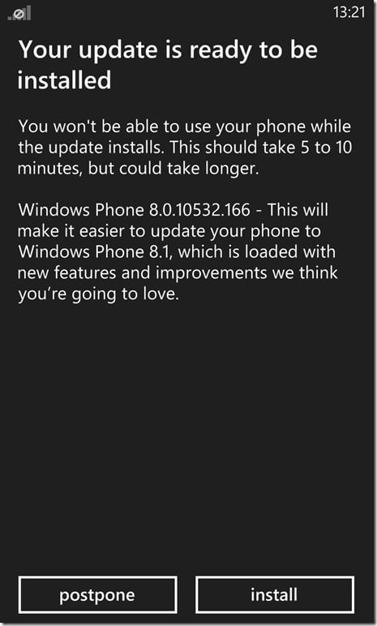
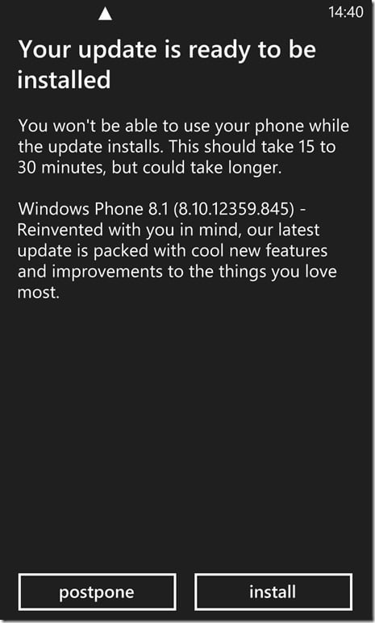
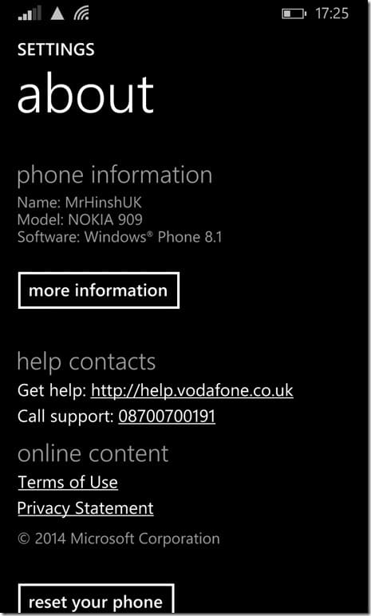

I love new things not just because they are new but because they are exiting. Discovery is something that we lose as we get older but it should be nurtured so be a kid again and upgrade to Windows Phone 8.1.

As with most people that use a Windows Phone I love it. I am however unusual in that I have had Windows running on my phone since the original Orange SPV (from HTC) arrived in 2001. That’s right… I have had a smartphone in my pocket for more than 10 years.

It may not have been perfect, in fact Windows Mobile was most defiantly not that. However I did have a browser, the internet and a camera. Apple copied this for their devices in 2009 and arguably perfected the interactive nature of these devices and propelled them into mainstream. Now as Apple and Android struggle to innovate the underdog (Microsoft for a change) have been slowly introducing us to Windows Mobile.

It has been a bumpy road and Windows Phone 8 was a vast improvement over Windows Phone 7. My mum still has a 7 device, that she still insists is new, and it is a stark contrast whenever I have to use it. I recently upgraded my dad to a Nokia 520 which he thinks is fabulous and I have been using a Nokia 1020 for a while now.

{ .post-img }

My home screen is pretty strait forward and I only really use a few apps. As an aside there is a fascination with the platform that has the most apps however in my experience you have to search through the sewer for the gems. The only apps I use are:

- **NextGen** - An awesome feedreader that has seen me through Google Reader and over seamlessly to Feedly.
- **Facebook** - You know… for posting crap and reading memes
- **Twitter** - Another app for posting crap.
- **Bufferapp** - This is a plugin for Windows Phone Sharing hub that adds the capability to post through Bufferapp. Bufferapp lets me share once and it schedules posts across multiple platforms like LinkedIn, Facebook, Twitter, and Google.
- **4th & Mayor** - For checking in to a location so someone can come and rob your house while you are out.
- **Amazon Mobile** - I see stuff, I scan it… I then get it delivered at home :) Perfect traveling companion.
- **Endamondo** \- For tracking those long runs…
- **Here Maps** - The best mapping app I have ever used comes from Nokia and rocks…
- **Audible** \- I listen to a lot of audio book and this little app has kept me sane when traveling. I spend an inordinate amount of time in airports and on trains…

And that’s really it. I have tones of other crap on there, mostly for the kids. Oh, did you know that Windows Phone has Kid Mode? Kid Mode is a little walled garden that you pick the apps and games that are listed. It has its own home screen that you can enable without entering your password. This feature was added with Windows Phone 8 but I find it so useful I thought it best to reiterate it.

{ .post-img }

If you are running Windows Phone 8 on your phone right now then you can get the developer preview of Windows Phone 8.1 (You do not need to be a developer):

1. Go register free at [http://appstudio.windowsphone.com](http://appstudio.windowsphone.com).
2. Then go to "Windows Phone Preview for Developers" and install the "Preview for Developers" app.
3. Go to Settings, then System Update and update your phone. You may need to do this more than once. My Nokia 1020 needed 2 updates before I was presented with the Windows Phone 8.1 Preview.

{ .post-img }

Although it says 5-10 on the first update and 15-30 on the 8.1 update you need to take this with a pinch of salt. It really depends on how much data you have on your phone and how fast your internet connection is. The first two updates on my Nokia 1020 took way longer than 10 minutes (more like the 15-30) however my connection speed was pretty slow in the Alps last week. WiFi was not much better as it was a satellite link with high latency.

{ .post-img }

If you update your phone to Windows Phone 8.1 Preview today you will at least get the RTM when it becomes available and likely there will be a couple of refreshes. Note though that this is a "Developer Preview" and don't expect everything to work. So far I have the following issues:

- **Facebook can't post pictures** - For some reason I have been unable to post pictures with the built in Facebook app. It just gets stuck on the send.. I have been able to post videos so I can only think it is a bug. Looks like this only affects slow connections like I had last week.
- **No Facebook Chat** - Not sure if it is just gone, or not yet implemented, but I have used the integrated chat for a while and I will miss it if it is gone.
- **Skype will not start** - Not sure if it is because I changed my default Microsoft ID alias or if it is just a little flakie but it just exists when it tries to get my details.
- **No Cortana** \- You can do some contortions with region and language to make it work. However who wants everything in American?

{ .post-img }

For me the downsides are worth it and I love the new features and home screen. I [agree with Scott Hanselman](http://www.hanselman.com/blog/WindowsPhone81HasMyAttentionNow.aspx) that this not only brings Windows Phone up to the level of iOS and Android but takes it beyond.

Go on, get Windows Phone 8.1 Preview today and influence it.
