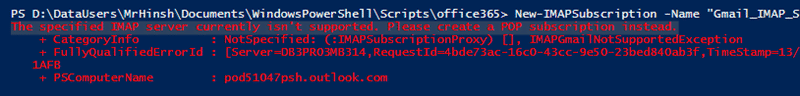

A few months ago I decided to make use of Office 365 but I have run into a bunch of roadblocks. Migrating to office 365 from Google Mail as it seams that Office 365 and Google Mail are not the best of friends. They seam to be in a state of cold war.

There are a number of options that are available for migrating / synching your email and data from one mail system to Office365.

- Add IMAP Account
- Add POP account
- Batch IMAP cutover

Of these options I would prefer the first IMAP option. There is no way I am going through the trauma of POP so IMAP it is…

## Attempt 1:  IMAP Subscription through the UI

In an ideal world I want to use IMAP between Office 365 and Gmail for a time so that I can review the new service but maintain the ability to return to the old one if its promises are not met. Unfortunately if you try and configure IMAP with Gmail you will get a message saying that the server is not supported. What? Its just an IMAP server like I use in Outlook with no problems. Delving into the documentation results in:

> Outlook Web App supports IMAP access for most services, **except** Gmail. So please use POP instead. To allow POP access from Gmail, see [Turn on POP Access Before Connecting to Your Gmail Account](http://help.outlook.com/en-US/140/dd181952.aspx).[IMAP with Gmail not working?](http://community.office365.com/en-us/forums/158/t/1944.aspx)

For some reason, and I am sure not a technical one, Office 365 will not support IMAP from Google.

## Attempt 2: IMAP Subscription through PowerShell

So if it will not work through the UI maybe it is an advanced feature that can only be done through command line. Really I was just hoping that whomever implemented the feature added the block in the UI rather than in the actual system. I spent quite some time figuring out how to execute the required PowerShell.

```
Import-Module MSOnline
$O365Cred = Get-Credential
$O365Session = New-PSSession –ConfigurationName Microsoft.Exchange -ConnectionUri https://ps.outlook.com/powershell -Credential $O365Cred -Authentication Basic -AllowRedirection
Import-PSSession $O365Session
Connect-MsolService –Credential $O365Cred
New-IMAPSubscription -Name "Gmail_IMAP_Subscription" -Mailbox "martin@nakedalm.com" -EmailAddress martin@nakedalm.com -IncomingUserName martin@hinshelwood.com -IncomingPassword (ConvertTo-SecureString -String 'notonyournelly' -AsPlainText -Force) -IncomingServer imap.gmail.com  -IncomingSecurity Ssl -IncomingPort 993

```

As with all PowerShell it is poorly documented but in the end I executed the above PowerShell and my hopes of a sucessfukll result were dashed.


{ .post-img }

So they did implement the block deep down in the software. Really I knew that they would have…

## Attempt 3: IMAP Migration through PowerShell

The third option is to do a PowerShell IMAP Migration. Yes, that is using IMAP to do a one-time move from Google Mail to Office 365. While some of the previous PowerShell was reusable but figuring it out was even more of a pain than for a single account. Here instead of creating a single thing we have to create an async batch session that we can then hook into and see how it is going. This may take a large amount of time to run if you have a lot of mail. I have over 7GB of mail in Google.

```
Import-Module MSOnline
$O365Cred = Get-Credential
$O365Session = New-PSSession –ConfigurationName Microsoft.Exchange -ConnectionUri https://ps.outlook.com/powershell -Credential $O365Cred -Authentication Basic -AllowRedirection
Import-PSSession $O365Session
Connect-MsolService –Credential $O365Cred
$IMAPMigrationEndPoint = New-MigrationEndpoint -IMAP -Name MrHinshIMAPMigration -MaxConcurrentMigrations 1 -RemoteServer imap.gmail.com -Port 993 -Security SSL
New-MigrationBatch -Name MrHinshIMAPMigration -SourceEndpoint $IMAPMigrationEndPoint.Identity -AutoRetryCount 4 -BadItemLimit 50 -CSVData ([System.IO.File]::ReadAllBytes(“C:\temp\test.csv”)) -AutoStart

```

Once you have executed this ommand Office 365 will connect to all of the accounts stored in the CSV and move them across to Office 365. Slowly… and because it is slowly you need some way to check up on its status.

```
#Get Status
Get-MigrationBatch | fl
```

When you execute the command you get a list of sync's and the number of accounts it is migrating.


{ .post-img }

This is really the only way to move from Google Mail to Office 365 and it does work. I say mail coming in almost immediately and it took maybe a few days for all 7gb to come across.

## Conclusion

Unfortunately Microsoft are not providing the service they should which results in my being unable to move more than just myself to Office365. I have a bunch of family member, only some of which will want to move… and I can't do a partial move.

I have now been over on Office 356 for about 3 months and I have been extremely happy with my business account. I would recommend Office 365 for both small and large organisations. I am using it for business and the integration of Lync, Outlook, and a SharePoint instance gives me lots of flexibility for only £40 for the year. Pretty good really and I believe it to be much cheaper for large organisations if they are running exchange properly.
