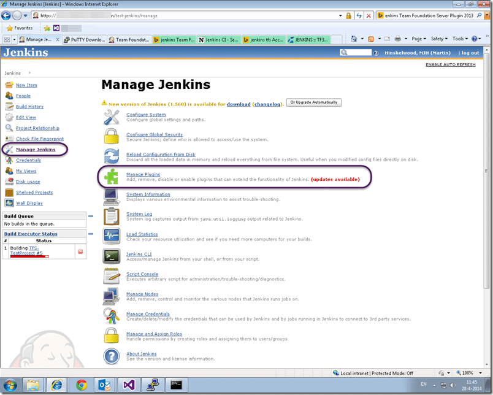
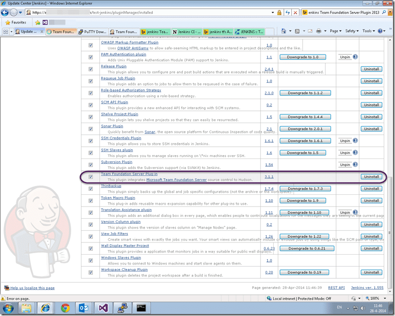
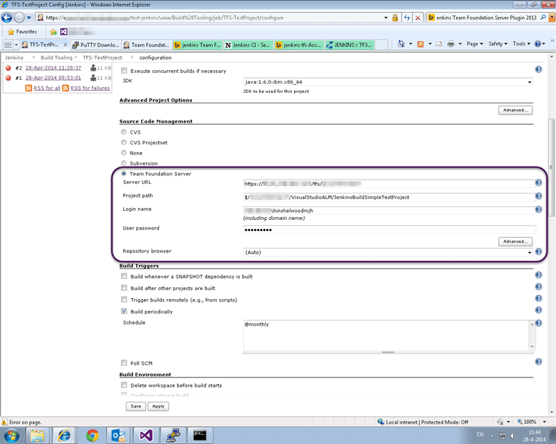

I am working quite a lot with some Java teams at the moment who are using SVN and Jenkins. We are moving them over to TFS and TF Build and we wanted to make sure that we were minimally disruptive to first I need to configuring Jenkins to talk to TFS 2013.

At the moment all of the source code, builds, and assets are owned outright by one individual and stored on a single Linux box. This will change over time as necessitates a scalable enterprise solution but for now I just want to move the source.

  
{ .post-img }
Figure: Jenkins connected to SVN

In order to begin the move I first need to reassure all of those involved that, yes, TFS can indeed store source code. That is even before I try to convince them that TFS can do builds. To that end I intend to only change one thing. Move the Source Code to TFS…

  
{ .post-img }
Figure: Jenkins connected to TFS

The teams that use this are already using TFS for Backlog and Test management along with other things so it’s a simple step for them.

## Installing the Team Foundation Server Plugin for Jenkins

It is worth noting that there is a plugin for Team Foundation Server for Jenkins. Although this plugin was built against, and is still tested against, TFS 2008 it works just fine with 2012. I have not checked for 2013, but as it just builds a command line it does not care itself. Indeed we are using the latest version of TE for Linux which was released just a few months ago…

  
{ .post-img }
Figure: TFS Plugin for Jenkins

The [Jenkins Plugin for Team Foundation Server](https://wiki.jenkins-ci.org/display/JENKINS/Team+Foundation+Server+Plugin) is old. Although it has been updated recently it has been around since the days of TFS 2005 and still works great.

  
{ .post-img }
Figure: Managing Plugins in Jenkins

If you login to Jenkins and head over to "Manage Jenkins | Manage Plugins" we can go ahead and get it installed.

  
{ .post-img }
Figure: Install the TFS Plugin for Jenkins

Nicely Jenkins has an adequate interface for installing plugins that are publically hosted. Makes things a little simpler than mucking about trying to get things installed yourself.

## Configuring your first TFS build from Jenkins

For the very first build I wanted a really simple app. The Java build team here had a "Test-Project" that they used to debug and test their own builds so I just reused that.

  
{ .post-img }
Figure: Check-in some Java code

First step is to get the source code and check it in. We already have a directive from management to ditch the history (good call) which makes it easy to move source. I was emailed a zip file, I unpacked it and checked it in. I should note that I have very little experience with Java and almost zero with compiling it. I am just taking what I have been given and checking it in.

  
{ .post-img }
Figure: Configure the Jenkins Build for TFS

Now head over to "Jenkins | Build Tools" and open the existing build (that used to work against SVN.) Scroll down to the "Source Code Management" section and select the radio button for Team Foundation Server. The new options will light up. Now this system does not understand what a collection is (introduced in 2010) and it really does not matter. Anywhere you previously (2005 or 2008) entered the 'server URL' you just enter the full URL to the collection. So here where it says 'Server URL' we just fill out the [https://my.fullyqualified.com/tfs/mycollection](https://my.fullyqualified.com/tfs/mycollection) in the box.

Note If you are using TFS Git you will need to install a Git plugin for Jenkins to get the source.

The project path is also fairly strait forward. It’s the full path to the folder that you want to get from TFVC. If you are used to TF Builds remember that you will not be able to configure complex mappings in here. Indeed the SVN tool has the same limitation so it looks like A Jenkins thing. For this scenario it makes things easy though. I just have one path to get.

You will need to set the username and password that you want to connect with but that’s about it. Save and build!

{ .post-img }

It actually took me 5 builds to get it right as I got the domain name wrong…

## Conclusion

It is so ridiculously easy to move your Source over to TFS when you are using Jenkins that there really is no reason not to. Once there however you really want to be looking at replacing Jenkins with TF Build.

Things we loose by not using TF Build:

- **Associated Change sets** – Team Build automatically associates a list of change sets that are included in the build
- **Associated Work Items** – Team Build analysis the relationships and also associates Work Items with a build. Indeed it walks the work item tree (parent) and maintains that association in the chain.
- **Test Impact Analysis** – When tests execute TFS collects paths through the code, even across multiple servers, and diffs this with the code changed for a new build. Giving you a list of tests that you MUST run. This works with both Manual and Automated tests (and unit tests). Designed to reduce your test matrix.
- **Unit Tests and Coverage associated with a build** – You can trend your quality over time.
- **Manual Tests associated with a Build** – If test results are associated with a build you can see, dynamically, the current state of your test plan, build on build.

If you only get your Source into TFS then that is just the first step. A necessary one, but only the first.
