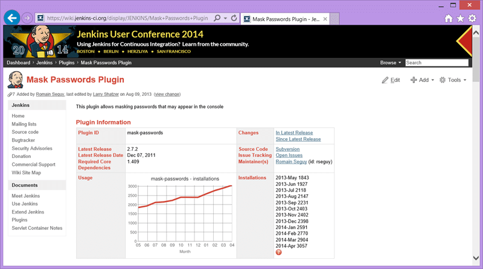
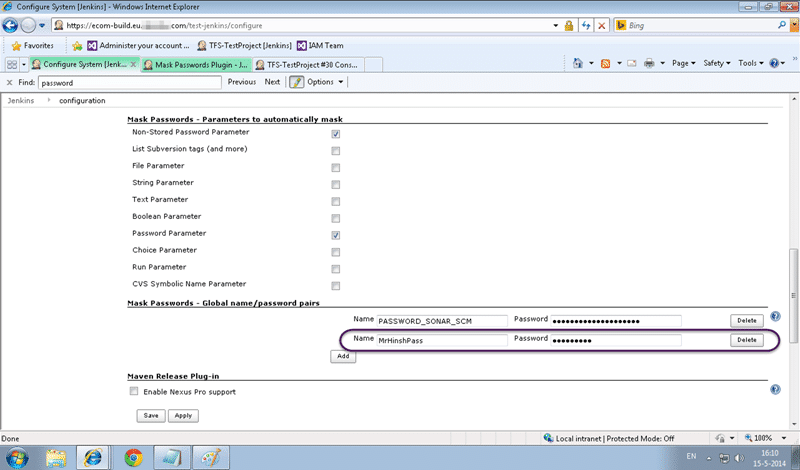
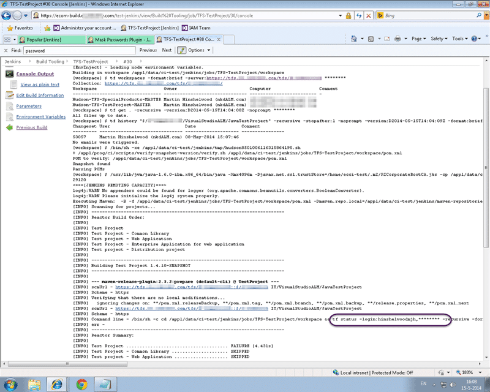

When you use the release build plugin in Jenkins to create a new release the plugin inadvertently leaves your password in clear text in the log files. We need to be able to mask password in Jenkins when calling Team Explorer Everywhere (TEE) so that we meet security requirements.

As you can imagine working at a bank, they get a little…squirmy… when they see or hear about passwords being stored on viewable in the clear. If you are using TFS to do builds from Jenkins then you are likely using the command line tools that come with Team Explorer Everywhere.

{ .post-img }

If you are also using the Release Plugin and you create a release build then you will see the SCM password that you enter written in the clear in the log. Bit of a shock to my banking colleagues I can tell you. So much so that they called "critical blocker" for the migration to TFVC.

{ .post-img }

However during the… conversation… they did say that they had a plugin installed that was supposed to [mask the passwords](https://wiki.jenkins-ci.org/display/JENKINS/Mask+Passwords+Plugin) when you do a build. Armed with that knowledge, and little other knowledge of Jenkins, I dived in to find a solution. Maybe it just needed more configuration…

{ .post-img }

So I looked through the documentation and found that you can set variables for passwords and send the variable instead. The plugin will then mask it correctly…. So I thought… that’s for me!

{ .post-img }

So I dutifully created a global password veriable called "MrHinshPas" (yes, I am testing with my own account) and once saved I should be able to use "$(MrHinshPass)" in places where I want the password replaced.

{ .post-img }

Running another build and, wohoo, the password gets replaced.

However why do I need to create a variable for this occurrence when it usually replaced things for other passwords in the list. So I went hunting around… I looked at server configuration. I looked at plugins and documentation.

Eventually I looked in the build configuration and I found this…

{ .post-img }

So for each specific job you can activate the "Mask passwords" option in the Build Environment section and all passwords are magically hidden in your builds. Awesome! How did I miss that…

