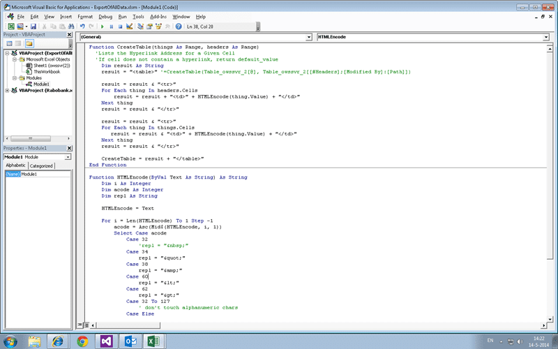
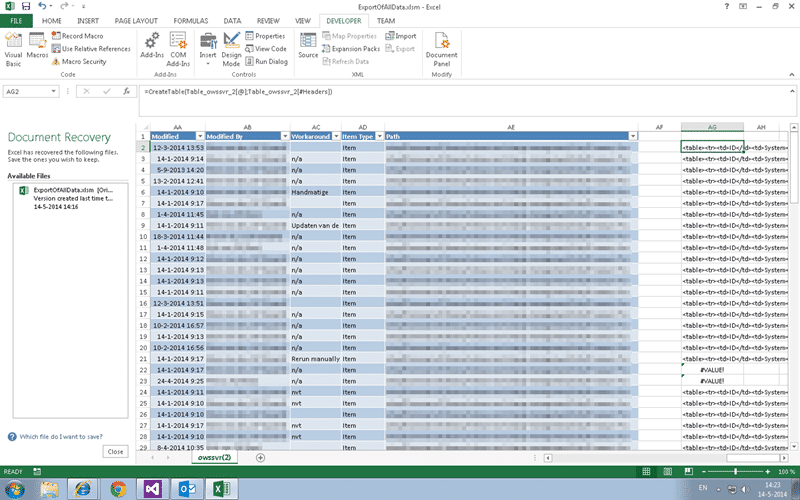

Have you ever tried to push data into TFS with Excel? I have, and it can often be the opposite of sweetness and light. The idea is to import Excel data into TFS with History.

I was working with a team this week who used a SharePoint list to store their Requests for Change (RFC). I was easily able to export them from SharePoint by using the built in functionality to export to Excel. I did however want to make sure that there was no data loss when I pushed that data into TFS. Now, short of adding all of the columns that they had into the RFC work item the only way to do this would be to add all of the data to the history.

Note: I usually use a custom CSV adapter that I created for the TFS Integration Tools but there were only 120 items and that can be a lot of overhead.

I looked at a few tricks to use the existing functions to create my data but it just really became too complicated. It was too easy to make mistakes in the complicated mess that is excel nested functions. If I was using my CSV adapter it creates an HTML table for all of the fields and values and writes it into the history for… well… history.


{ .post-img }

I wanted to do the same so I cracked open one of my long forgotten skills… VBA. I know, I know.. It filled me with dread as well. However it was Farley simple to create a table by iterating over the columns and rows to get at the juicy data and return a simple table.

```
Function CreateTable(things As Range, headers As Range)
  'Lists the Hyperlink Address for a Given Cell
  'If cell does not contain a hyperlink, return default_value

    Dim result As String
    result = "<table>"

    For i = 0 To headers.Cells.count - 1
    result = result & "<tr>"
    result = result + "<td>" + HTMLEncode(headers.Cells(i).Value) + "</td>"
    result = result & "<td>" + HTMLEncode(things.Cells(i).Value) + "</td>"
    result = result & "</tr>"
    Next i

    CreateTable = result + "</table>"
End Function

Function HTMLEncode(ByVal Text As String) As String
    Dim i As Integer
    Dim acode As Integer
    Dim repl As String
    HTMLEncode = Text
    For i = Len(HTMLEncode) To 1 Step -1
        acode = Asc(Mid$(HTMLEncode, i, 1))
        Select Case acode
            Case 32
                'repl = "&nbsp;"
            Case 34
                repl = "&quot;"
            Case 38
                repl = "&amp;"
            Case 60
                repl = "&lt;"
            Case 62
                repl = "&gt;"
            Case 32 To 127
                ' don't touch alphanumeric chars
            Case Else
                repl = "&#" & CStr(acode) & ";"
        End Select
        If Len(repl) Then
            HTMLEncode = Left$(HTMLEncode, i - 1) & repl & Mid$(HTMLEncode, _
                i + 1)
            repl = ""
        End If
    Next
End Function

```

I stole the second function from somewhere online (I think it was Stack Overflow) but the first was my own creation. If I was doing it again I would create a vertical rather than a horizontal table but I only had limited time to create this. The result of adding this custom function? A simple way to add this to just reference the cells, but I had my eyes set of a little awesome table work. Since my data was already in a table I cracked open the internet and trawled the documentation for Excel.

```
=CreateTable(Table_owssvr_2[@], Table_owssvr_2[#Headers])
```

You can easily reference the row of a table that you are on using the "@" symbol, and if you are outside the table you can go with "tableName\[@\]". It even works if you are on another sheet. If you are on line 5 you get row 5 from the table… weird.. But OK. Even better you can represent the headers row as "tablename\[#headers\]".

That sounds simple but it was a lot of documentation to wade through to get to that simple result.


{ .post-img }

Now that I have a way to create the history field all I have to do is create a query in TFS with the same columns as the ones I want to import, plus the History column of course.

1. Create copy of data to import on second sheet with only the columns we will map - You can use "tableNasme\[@\[columnName\]\]" to get each value.
2. Add the function to create the History column
3. Create Query in TFS that matches the list of columns
4. Create operational table linked to TFS on new sheet
5. Copy prepared 120 rows and insert them into the TFS linked table
6. Massage data click "Publish"

And you are done.

## Conclusion

The only thing I do not like about this method over the CSV adapter for the Integration Platform is that all of the new work items have to go through the official flow of the process template. With the CSV adapter I can bypass the work item rules and just write what data I want into there. That way I can progress the states to whatever I want even if they don't exist and fix the data afterwards… better integrity, but more effort.

Using Excel to import data into TFS is quick and easy. Took me about an hour to import the data and another hour to create and tests the data manipulation above.
