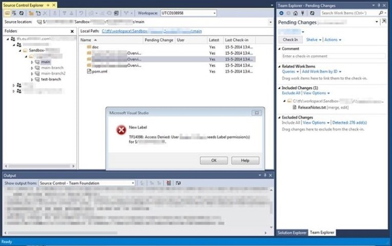
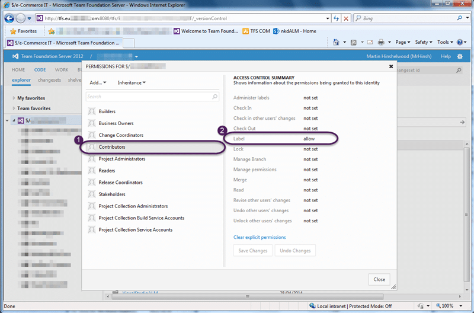

There is always something new to learn with TFS and today I learned something old. I had a user today that was constantly getting the message "Access denied user needs label permission in TFS".

Although I have configured "one-team-project" for many organisation my current customer is the first that has insisted on draconian security measures. In this case I have removed contributors from the root of the Team Project and each team is granted rights by sub-folder. If each sub-folder represents an application then this makes perfect sense. Until you try to add a label using the Visual Studio IDE.

{ .post-img }

I spent a little while trying to debug this and finding no issues with my configuration I emailed the champs list. In a timely manner Mr Jesse Houwing replied with a "Well duh Martin… that’s how it has always worked":

> Labels created within the graphical user interface are scoped to the root folder of the team project within which they are created. Labels created from the command line are scoped to the longest common path shared by the items specified in the label command. To specify the fully qualified name of a label, you must concatenate the label name, the '@' symbol, and the label scope, as in [Beta@$/TeamProject1](mailto:Beta@$/TeamProject1).
>
> \-[http://msdn.microsoft.com/en-us/library/ms181439(v=vs.80).aspx](<http://msdn.microsoft.com/en-us/library/ms181439(v=vs.80).aspx>)

Well… poo… That does not sound like a good idea. And then I realised that the TFS team also have to support the lowest common denominator. Those developers that you meet in 2014 who have no idea what a Unit Test is (or think that it is opening the app and clicking some buttons) or what automated builds are. So if they found that they could create Label with the same name but overlapping scopes!

Mind blown…

{ .post-img }

My solution was to just give contributors access only to labels at the root. This stops that pesky error from occurring in the IDE and really does not pose a security risk.
