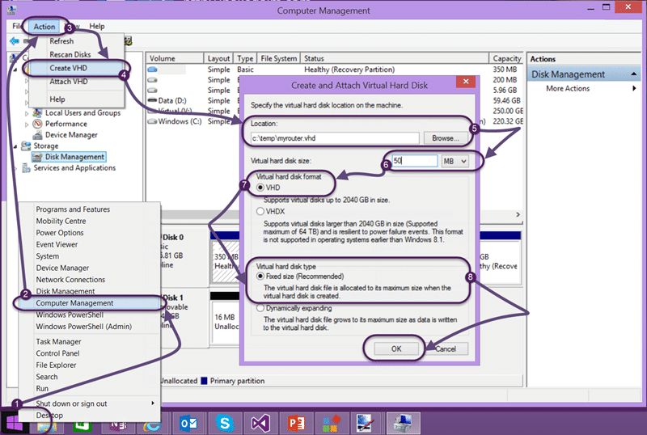
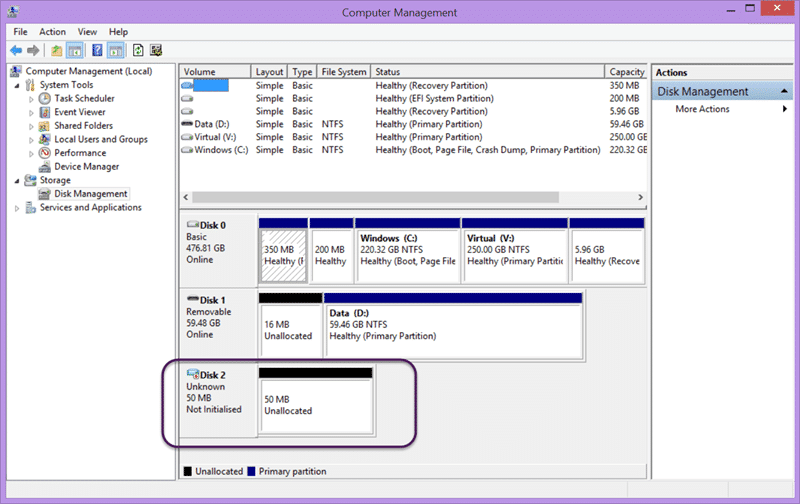
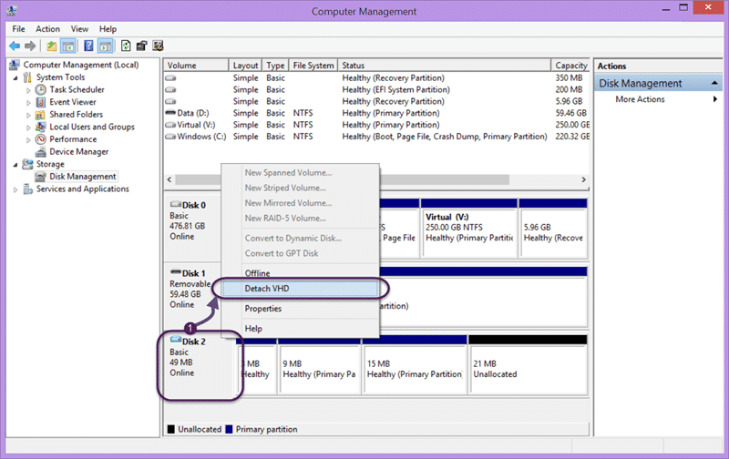
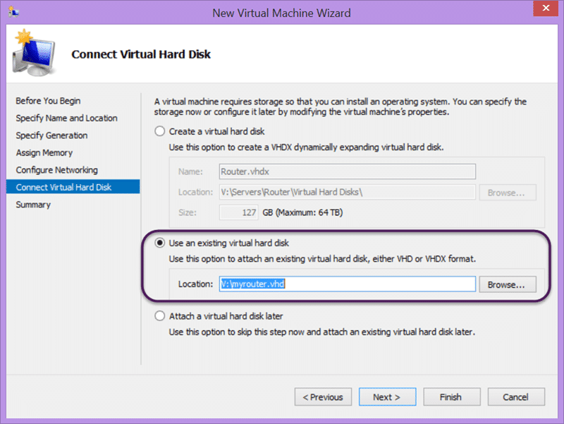
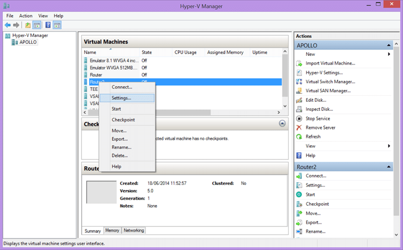
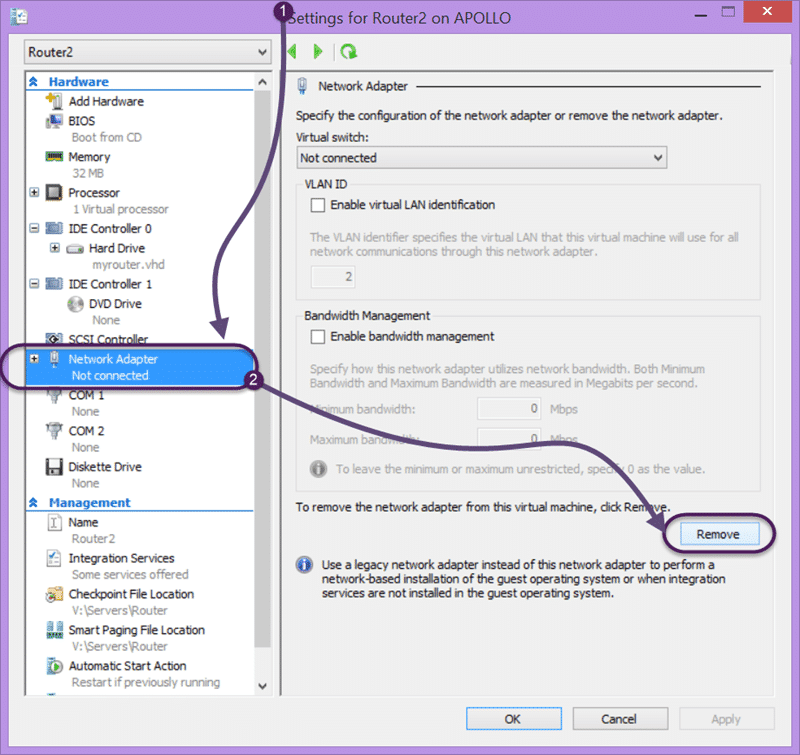
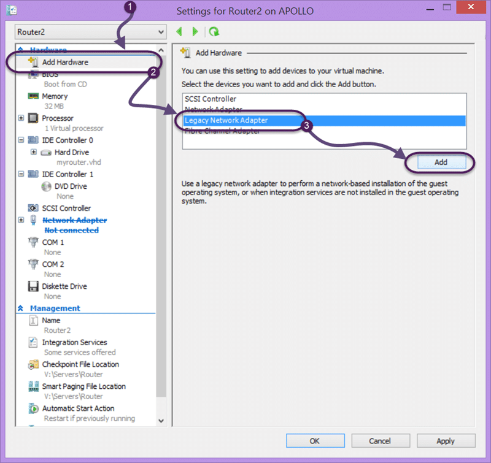
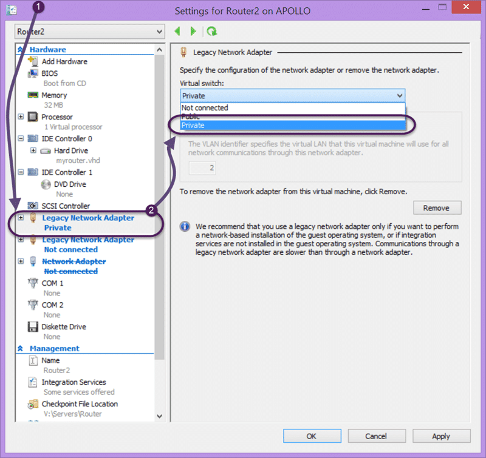
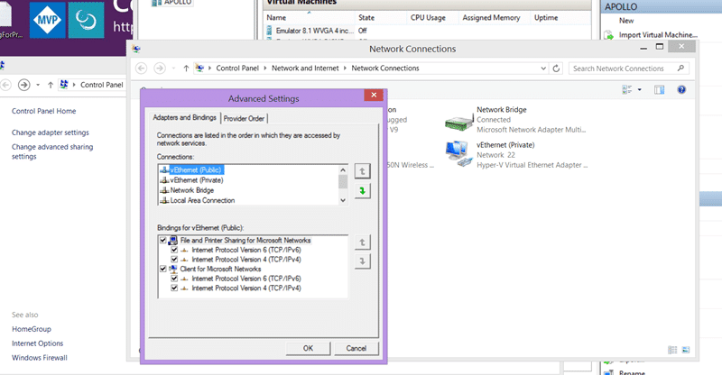

I want to run a router on Hyper-V so that I can run many VM's, each with internet access, on corporate and hotel networks. Microsoft touts Routing and Remote Access but there is no way I will go there. First it’s a total pain to setup and run. Second I need to run a whole Windows Server just to have basic DHCP and internet access. Overkill much! There must be a better way.

The problem is that on most networks that I connect to there is some sort of one-MAC-one-IP rule. I am often onsite at companies on their Guest Wi-Fi and in hotel's. I am not sure how it is implemented but if there is a pay-wall or even just a terms and conditions acceptance then I get kicked off the network as soon as I spin up a VM. When that VM requests an IP address the network kicks all of my machines off. Poo…no internet access for me.

{ .post-img }

For a while now I have been using an external solution. I have a little box called a [HooToo TripMate](http://nkdalm.net/HooTooTripMate). The HooToo TripMate is a bunch of things in one. First it is a battery pack, and a good one. Second it is a router, and not only a router, but it will do both network and wireless bridging. So I boot this little beauty up and connect my Surface. I can then connect to it and tell it to connect to "hotelWiFi1". I then open a browser on my Surface and sign-in, or pay, or whatever. As this little box has DHCP I can connect many devices behind it. Simples…

{ .post-img }

However there are limitations. If the network I am connecting to uses certificates or AD Credentials, as many companies do, then the HooToo TripMate will not connect. Poo again… I have been looking for another solution that might work. After scowering the web every now and again over the years I finally found an interesting idea. Why can't I run a router's firmware in a VM? Holy cow! Can that actually work…

I have been tinkering with this option for a while and I have almost gotten what I want working. Let's go through what I have gotten working first and then we can discuss where I think I can go.

1. Create a new VHD and write the Router firmware
2. Create a VM to Host our new router firmware

## Create a new VHD and write the Router firmware

The first thing that we need is a VHD with the appropriate settings. It should be a VHD, 50MB, and fixed size.

{ .post-img }

Above you can see how you create the VHD and apply the settings on Windows 8. Make sure that you create the VHD somewhere you can remember, and we will likely be moving it later to a more permanent home.

{ .post-img }

Once you have created your empty VHD you need to take note only of the disk number. In this case it is "Disk 2". This is where we will write the image from our firmware and we need a couple of things to move forward:

- [physdiskwrite](onenote:#CHECK%20Using%20a%20router%20to%20support%20Hyper-V&section-id={965C1CBE-C6B3-4425-B140-4B0EC0671288}&page-id={0F6DF006-4E9F-4670-8535-309194E75A43}&object-id={16DD4318-D6AD-0B9C-02B0-146BB0E9AA87}&77&base-path=https://nakedalm-my.sharepoint.com/personal/martin_nakedalm_com/Documents/nakedALMBlog/Blog/In%20Progress.one) - This is tool with both UI and Command line for taking an image and writing it to our VHD
- [DD-WRT image for x86](http://www.dd-wrt.com/site/support/router-database) - In the search box type x86 to see a list of downloads. Look for the one called dd-wrt_public_vga.image. At the time of writing the latest version was 3744 and available from [http://www.dd-wrt.com/routerdb/de/download/X86/X86///dd-wrt_public_vga.image/3744](http://www.dd-wrt.com/routerdb/de/download/X86/X86/dd-wrt_public_vga.image/3744)

And that’s all you need to get going. You can call physdiskwrite from the command line or you can use the UI. Either way works however the UI is in German and I have found that the command line give better feedback.

{ .post-img }

Make really sure the disk number that you are selecting is correct or you might inadvertently overwrite a disk that you need. If you need to reopen Disk Management and double and triple check the number.

Warning: I found that I get a bunch of errors the first time around and needed to recreate the VHD.

{ .post-img }

Once it is complete you should have a populated disk and not just Unallocated space now. If you right click on the Disk's left hand definition you can now detach it.

## Create a VM to Host our new router firmware

We can now go ahead and create a new VM to host out new router firmware. This is a simple process if you are looking at this solution anyway and you will likely have done this 100 times for your other VM's.

{ .post-img }

My sure that you select "Generation 1" as we created a VHD and not a VHDX and only give the machine 32MB of RAM. This VM should be so lightweight that we can run it 24x7 and no one will notice. Leave it unconnected for now as well will need to replace the default adapters.

{ .post-img }

When you are asked to connect to a virtual hard disk you should specify the VHD that we just created. If you like take a backup of that disk by copying it to another folder. This may save time alter when you want to reset the router. Remember that there is no 'reset' button and if you brick it then you need to refresh the image.

{ .post-img }

Let go change the settings now. If you right click on the "Router" VM and select settings…

{ .post-img }

In the settings dialog the first task is to remove the existing "Network Adapter" as it will not do the job. I am not sure why you need legacy adapters but it is likely that the version of Linux that DD-WRT is based on does not have Hyper-V drivers built in.

{ .post-img }

Adding the legacy adapters is easy and you will want two. The first, and the only one we will enable, will be the "LAN" port. Later we may want to have a "WAN" port as well. More on that later…

{ .post-img }

Once you have two adapters we need to configure one. You should wire one, and only one adapter into the "private" channel. I have two "Virtual Switches" configured. The first is called "Public" and is wired to my Wi-Fi adapter. This is the one that provides access to external network. The second I have called "Private" and it is configured as an "Internal" switch. When a Hyper-V switch is configured as Internal it can only be used for communication between guests and the host.

{ .post-img }

If you "Connect" to the console you will see the output of the Linux router start-up sequence. Once it stabilises you should see adapters on your "Private" network get assigned IP addresses and you can then connect to the routers admin page.

{ .post-img }

You can now configure your router as if it was a normal bit of kit on your network.

### WARNING: Binding preference may result in loss of connectivity

If you immediately loose internet when you connect up your router you may find that the router has taken priority in your bindings list. This will result in your computer trying to send internet traffic through this connection. Whenever you have two gateways listed you may need to tweak the order. Thanks to [Marcel de Vries](http://blogs.infosupport.com/author/marcelv/) for this one as it had me stumped.

Go to your Network Connections folder from the control panel and hit the "Alt" key to bring up the menu. Select "Advanced | Advanced Settings…" to bring up the Adapters and Bindings dialog and make your external interface have a higher priority.

{ .post-img }

## Conclusion

The result should be a stable DHCP that makes connecting to all of your VM's over RDP easy as you don’t have to manually set IP's. In addition your adapters will no longer be listed as "public" and will now be "Private". This is important as it changes the firewall protocols that are applied. "Private" networks are trusted a little, "Public" ones are not given an inch.

{ .post-img }

This works fantastically for private networks only. However as soon as you give the router above a public adapter as well we get into the same position as having all of your hyper-v servers connected to Public. This may only be two IP's on the public adapter but two is one more than most networks that I connect to will allow. At least this way if I do not add a public adapter to the router all of my Hyper-V machines all get IP addresses… however I want more. I want to be able to do the same things as the HooToo TripMate does but without requiring an additional device, oh and getting support for AD and certificate authenticated Wi-Fi networks.

It should be as simple as enabling the WAN port, and configuring the Public Virtual Switch to not allow the host access to the internet through it. That way the only device getting an external IP is the Router.

However I can't seem to figure out how to get the router online without taking me out with it so its the HooToo TripMate for now.. It’s a little difficult to debug when I am always on hotel and corporate networks with goodness knows what restrictions. I think I will need a couple of days on a non-limited network to figure out this last bit… I get a couple of days off next week so we will see.

Have you managed to get this working?

