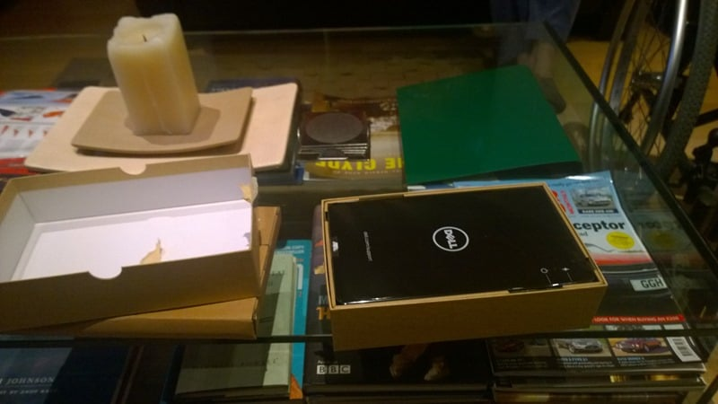

I travel a lot and I have been carting around both a Surface 2 Pro and a Surface 2 on my travels. I have been feeling recently that this was a little silly and I wanted to reduce my load and increase my flexibility. So just last week I purchased a Dell Venue 8.

When I say that I travel a lot I mean that I generally fly out to somewhere in Europe on Sunday afternoon and then back on Friday night. Every week... I have been doing this since November 2013 and apart from a few weeks it has been fairly constant. In my travels I have found a few things. The first is that stuff can be important and that its not when you travel occasionally. If I go for a few days I generally ditch all but the most essential of stuff. However if I, like now, am on my twenty-sixth back to back week away I tend to miss some of the home comforts. Home comforts for a geek tends to be cables and gadgets but as I have recently turned into a bit of a fitness guy as well it might also be other stuff. And thus I tend to pack heavy rather than light. I do however put that heavy bag in checked baggage and want my carry on to be light. Unfortunately there are things like Tablets, batteries, and hard disks that really can't go into checked baggage. So it has to go in my backpack. I have thus decided that the Surface 2, that I got at the MVP Summit last year, was just impractical when I also carry my Surface 2 Pro. My plan was to wait for the rumoured Surface Mini but as that did not happen my second choice was the Dell Venue 8.

{ .post-img }

I am however quite comfortable working in WinRT and don't have the same issue that many people seam to have. I have always looked at WinRT as analogous of the iPad or an Android and thus I have never expected it to be able to run Win32 apps and I don't really understand why anyone else did. To that end and as I was using the Surface 2 (even it is a crap-load lighter than the Pro) I have changed a few things in my workflow:

- **Moved to OneNote for all writing** - I now write all of my blog posts on OneNote and then switch to my Pro for Windows Live Writer as the only viable publishing tool. Which has no analogue in WinRT
- **Switched from SugarSync to OneDrive (was SkyDrive)** - this was a hard one for me as OneDrive is just as inferior as Box, DropBox, and all the other storage systems. The killer feature for me with SugarSync was the ability to sync any folder on my disk without needing to be in a single root. This allows me to sync my Signatures, templates, and other assorted stuff that applications insist in putting in locations other than that which you choose.
- **Run Visual Studio on Azure** - Not a big deal unless you can't get a data connection. As an MSDN user I get enough hours on azure to run a decent Visual Studio instance for as much time as I need.

As there are full versions of almost all of the office applicants (not Lync) on WinRT most other workflows stay the same. I think though, due to the general consumer misunderstanding of WinRT, that Microsoft will retire it slowly. But for devices like the Dell Venue 8 you really don't have to go half way. Reason being is that it is a fully fledged Intel device. The Dell Venue 8 has the latest generation of Intel's Atom processor and so far it is performing well. I am an impatient bigger at the best of times and most devices annoy me. Not so with this one so far.

{ .post-img }

Now I am not really sure why the Dell Venue 8 came with a 32 bit version of windows when it has 64 bit hardware but I will do a little research when I have time and see if it is worth upgrading. Knowing Dell it will likely be a driver or sum such issue that has not yet been resolved but it is worth looking into.

{ .post-img }

I also have a Acer Ionia W520 that has an Intel Atom processor and while I was impressed that it supported hyper threading on its dual core architecture this little beast actually has 4 cores. I am looking forward to getting Visual Studio on here, if only for fun.

Note The Acer is really painful to use as the drivers are a complete disaster. It freezes and won't start all the time. If you get one then think of it as an ARM device and never run a native app. My daughter uses it for modern apps all the time with no issues.

Now I am supposed to have a little pen for taking notes but it has not appeared. So two with the SIM card that was supposed to be in the box. I have checked and I only received two of the three expected packages so I guess a little bit is delayed. I received my packages last Friday so I have not had a response yet... I guess it will get sorted out. In the way only Dell can manage the manifest is totally incomprehensible:

- 460-BBHK 1 Dell Tablet Folio - Dell Venue 8 Pro Model 5830
- 750-AADT 1 Dell Active Stylus - Venue Pro tablets
- 203-47416 1 SM003TV8P9UKMBPRO
- 210-ABPB Dell Venue 8 Pro 5830
- 338-BDOZ Intel Atom processor Z3740D (2MB Cache, up to 1.8GHz Quad-Core)
- 391-BBKQ 8.0 inch IPS Display with HD (WXGA 1280 x 800) resolution with 10-pt capacitive touch
- 319-BBCO Integrated 1.2MP HD Webcam (front) / 5MP (back)
- 320-BBGK Black Cover for WWAN
- 340-ACEH English,French,German,Italian,Spanish,Dutch Shipping Docs
- 340-ACEN Placemats (English,French,German,Spanish,Brazilian Portugese)
- 340-ABJP Direct ship process
- 340-ACBW Additional Software 64GB Commercial
- 370-ABFN 2GB Single Channel DDR3L-RS 1600MHz
- 400-ACOV 64GB eMMC Hard Drive
- 450-ABLT Power adapter - UK type
- 451-BBGT 18Whr (4830mAh), 2-Cell Battery
- 389-BCZS Dell Wireless 1538 Dual-Band 2X2 802.11a/b/g/n WiFi + Bluetooth(R) 4.0
- 490-BBQG Intel HD Graphics
- 556-BBCQ Dell NetReady mobile broadband solution (HSPA+) with O2 sim card
- 619-ABGY Windows 8.1 Pro (32Bit) English
- 620-AAAU OS Media Kit Not Included
- 630-AAAU Software: Microsoft Office 2013 Trial
- 640-BBBT Amazon Kindle Metro App
- 525-10302 McAfee Security Center 30 day trial, Digital Delivery
- 525-10163 Not Selected in this Configuration 1 SR
- 525-10173 Dell Data Protection | Security Tools Digital Delivery/NB
- 525-10283 MY DELL
- 344-27772 1Yr Collect and Return - Minimum Warranty
- 755-10658 1 year Accidental Damage Protection
- 817-BBBC Not Selected in this Configuration
- 710-53767 1Yr ProSupport with Rapid Collect and Return
- 799-AAMQ Dell Order
- 998-23673 Fixed Hardware Configuration

I think that the three things with a '1' after the designation are the core packages. This should be a little simpler but really whatever floats their boat.

## Conclusion

I have only been using this device over the weekend and so far it has been fantastic. I have even been typing on the screen rather than an external keyboard and found it to be just right. I also have a Microsoft Wedge Keyboard in my pack and so far I have had no reason to bring it out.

I will be using the Dell Venue 8 for all of my note taking over the next wee while and we will see if it stands up to my lack of patience.
